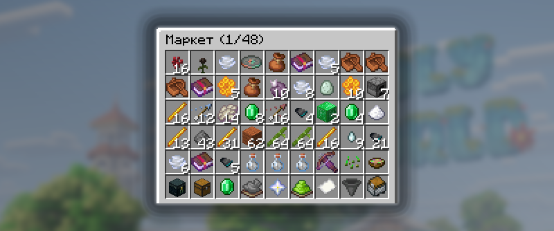

# Аукцион

**Аукцион** — это торговая площадка, где игроки могут покупать и продавать различные игровые предметы.

## Как открыть аукцион

<figure><figcaption>
Главное меню Аукциона /ah
</figcaption></figure>

Меню Аукциона можно открыть с помощью команды `/ah`.

## Как купить предмет

<figure><figcaption>
Пример, как выглядит товар на Аукционе
</figcaption></figure>

Чтобы приобрести предмет, выберите подходящий лот в меню Аукциона `/ah` и нажмите на его иконку. Если у вас достаточно монеток, покупка будет успешно совершена.

## Как продать предмет на аукционе

Чтобы выставить предмет на продажу, возьмите его в руку и пропишите команду `/ah sell <цена>`.


Если вы хотите, чтобы ваш товар можно было приобрести только целиком, добавьте `full` в конце команды: `/ah sell <цена> full`. Такие товары отмечаются специальной строкой в описании лота.


### Как снять предмет с продажи

Чтобы убрать предмет с продажи, откройте меню Аукциона `/ah` и нажмите на иконку «Товары на продаже». В открывшемся меню будут отображаться все товары, которые вы выставили на продажу.

### Как увеличить количество слотов для  продажи

Чтобы увеличить количество слотов для продажи, откройте меню Аукциона `/ah` и найдите иконку «Помощь по маркету». Здесь можно посмотреть текущее количество доступных слотов, а при наличии гемов приобрести дополнительные слоты.


Минимальная стоимость одного дополнительного слота на Аукционе составляет **149 гемов**.


## Поиск нужного предмета

### Поиск по названию

Чтобы быстро найти нужный предмет на Аукционе `/ah`, воспользуйтесь командой `/ah search <название>`, указав в ней название искомого предмета.

### Поиск по игрокам

Чтобы узнать, какие предметы выставил на продажу определённый игрок, воспользуйтесь командой `/ah player <никнейм>`, указав ник нужного игрока.
