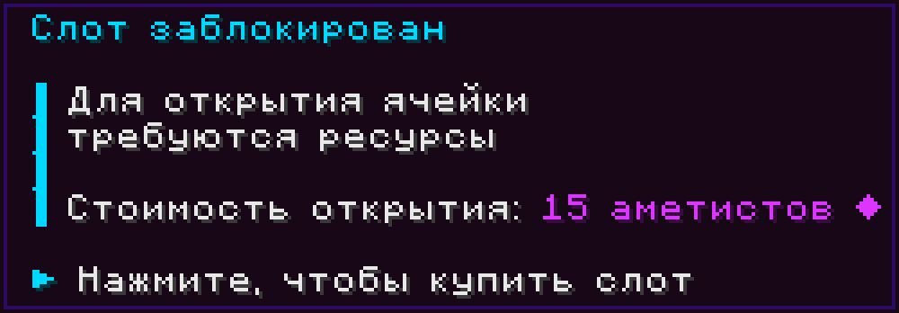
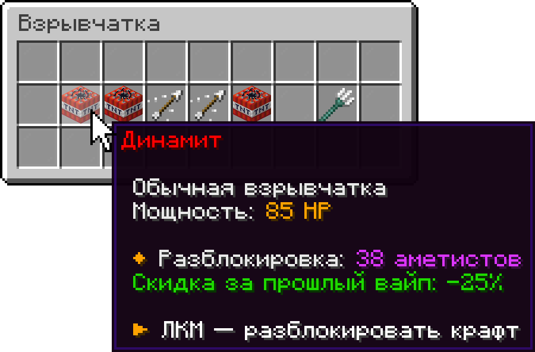

# Аметисты

<mark style="color:violet;">**Аметисты**</mark> — это **главная валюта** Альфа SMP. За них прокачивают спавнеры, открывают крафты взрывчатки, расширяют эндер-сундук и покупают товары у купцов.

## Баланс и команды

Аметисты бывают в двух видах, и это один и тот же ресурс.

**Предметом** — обычный кристалл в инвентаре. Его можно уронить, положить в сундук, отдать другому игроку или потерять при смерти. В стаке помещается до 99 штук.

**На балансе** — личный счёт, привязанный к вам. Он виден в борде.

При покупке считается **сумма обоих видов**: кристаллы в инвентаре плюс баланс. Платёж сначала забирает кристаллы из инвентаря и только недостающее снимает с баланса.

Переводить между видами можно в любой момент.

| Команда            | Что делает                                          |
| ------------------ | --------------------------------------------------- |
| `/am take [число]` | Снять аметисты с баланса предметами                 |
| `/am add`          | Положить аметисты из руки на баланс                 |
| `/am auto`         | Включить автообмен: поднятые с земли идут на баланс |
| `/am top`          | Топ 15 игроков по балансу                           |
| `/am help`         | Справка по аметистам                                |


Аметисты теряются, только если умереть **в броне**. Тогда снимается **5%** — считаются и баланс, и аметисты, выпавшие из инвентаря. Недостающее списывается с баланса и падает предметами на землю, где их может подобрать кто угодно. Смерть без брони не стоит ничего.

Выпавшие аметисты исчезают через 15 минут, если их не подобрать.


## Как получить аметисты

| Источник                  | Подробности                                                                 |
| ------------------------- | --------------------------------------------------------------------------- |
| **Рассадники испытаний**  | Награда за прохождение. Есть во всех локациях, где рассадники вообще стоят. |
| **Хранилища**             | Открываются ключами в Медном данже, Бастионе и Крепости Энда.               |
| **Контейнеры в локациях** | Сундуки, бочки, вазы, клады.                                                |
| **Утилизатор**            | Переработка вещей. Зачарованные предметы дают **втрое больше** аметистов.   |
| **Купцы**                 | Продажа им предметов.                                                       |
| **Кровавая луна**         | Только в это время аметисты падают с убитых мобов.                          |

## На что тратить

### Прокачка спавнеров

Каждая следующая ступень моба стоит аметистов и фрагментов [спавнера](spavner.md) одновременно — от <mark style="color:violet;">8 ❖</mark> за скелета до <mark style="color:violet;">235 ❖</mark> за крипера.

<figure><figcaption></figcaption></figure>

### Прокачка утилизатора

КПД утилизатора поднимается за аметисты: девять уровней, от <mark style="color:violet;">1 ❖</mark> за первый до <mark style="color:violet;">2025 ❖</mark> за девятый. Все вместе дают +45% к КПД и обходятся в <mark style="color:violet;">4917 ❖</mark>. Подробности — в статье [Утилизатор](utilizator.md).

### Слоты в эндер-сундуке

Докупить можно до девяти дополнительных слотов. Цена чередуется: одни слоты стоят опыта, другие — аметистов, и с каждым слотом дорожают.

<figure><figcaption></figcaption></figure>

### Взрывчатка

За аметисты открываются крафты взрывчатки: динамит, разрывные стрелы, C4 и трезубец-метатель. Аметисты идут и в сам рецепт: например, на трезубец уходит <mark style="color:violet;">25 ❖</mark>.

<figure><figcaption></figcaption></figure>

### Покупки у купцов

У купцов аметисты можно не только получить, но и потратить. Ассортимент обновляется раз в 15 минут.


Цены у купцов плавают: чем больше покупают, тем дороже становится товар. Лично у вас цена растёт вдвое быстрее, чем у сервера в целом.


<figure><figcaption></figcaption></figure>
