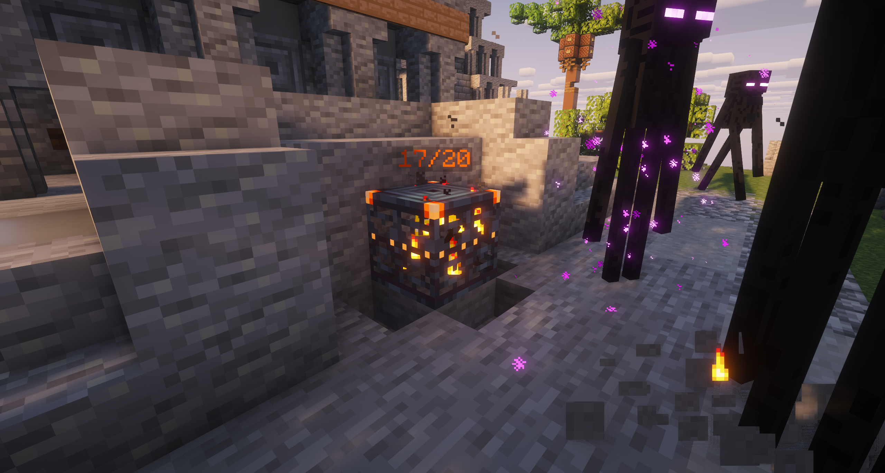

# Локации

**Локации** – это специальные структуры, разбросанные по острову Альфа СМП. Внутри локаций игроки могут добывать ценные ресурсы, сражаться с усиленными мобами и находить редкие предметы в хранилищах. Каждая локация имеет свои уникальные особенности, сложность и лут.

#### **Как попасть в локацию**

Локации генерируются по всему миру в случайных местах. Чтобы узнать, какие локации есть поблизости или найти нужную, используйте команду /gps. С помощью навигатора вы сможете направиться в нужную сторону.

#### **Особенности**

\- локации нельзя приватить, ставить свой регион

\- можно ставить лестницы и подмостки для более удобного перемещения.

\- часто в локациях спавнится топливо

#### Получение лута из хранилищ

_**Вагонетки**_: нужно нанести фиксированное количество урона, голограмма отображает текущее ХП.

_**Бочки, полки, зельеварки**_: требуется нанести определённое количество ударов, которое отображает голограмма.

_**Сундуки**_: игрок открывает хранилище и забирает лут, после закрытия сундук исчезает, а оставшийся лут выпадает на пол.

_**Вазы**_: ломаются с одного удара, лут выпадает на землю.

_**Клады**_: особый тип хранилищ с высокой прочностью и лучшими ресурсами. В разных локациях имеет разный облик.

#### **Рассадники испытаний**

<figure><figcaption></figcaption></figure>

**Рассадники испытаний** – это особые спавнеры, расположенные внутри локаций. Они активируются при приближении игрока и выпускают несколько волн мобов. После прохождения испытания спавнер выдаёт ценный лут и уходит на перезарядку.

## <mark style="color:$success;">Деревня</mark>

<figure><figcaption></figcaption></figure>

_Сложность_ ★☆☆☆☆

<mark style="color:$success;">**Деревни**</mark> – это поселения, разбросанные по поверхности мира. В отличие от подземных локаций, здесь нет агрессивных мобов высокого уровня, а упор сделан на сбор базовых ресурсов, идеальное место для новичков.

\- В локации можно добыть пшеницу и морковь с грядки, а в домах найти кровати, которые можно сломать.

Хранилища здесь представлены в основном сундуками, бочками и вазами.

Чаще всего _содержат_:

* Еду
* Базовые ресурсы
* Инструменты, броню и оружие низкого тира

## <mark style="color:yellow;">**Мельница**</mark>

<figure><figcaption></figcaption></figure>

_Сложность_ ★☆☆☆☆

<mark style="color:yellow;">**Мельницы**</mark> – это небольшая локация, расположенная на поверхности. Здесь почти нет опасных мобов. Отличное место для новичков, чтобы быстро запастись едой и материалами для крафта.

\- Рядом с мельницей можно добыть пшеницу с грядки или найти стог сена, его можно сломать, чтобы получить пшеницу.

\- В домах найти кровати, которые можно сломать и поставить в разрешенном месте.

**Рассадник испытаний: спавнит чаще всего мирных и нейтральных мобов (свиней, овец, куриц и т.д.), но иногда и враждебных (зомби, паук и т.д).**

**За прохождение чаще всего выпадает:**

* Еда
* Аметисты
* Инструменты, броню и оружие низкого тира&#x20;

Хранилища здесь представлены в основном сундуками, бочками и вазами.

Чаще всего _содержат_:

* Еду
* Ресурсы для крафта
* Инструменты, броню и оружие низкого тира

## <mark style="color:blue;">**Маяк**</mark>

<figure><figcaption></figcaption></figure>

_Сложность_ ★☆☆☆☆

<mark style="color:blue;">**Маяки**</mark> – прибрежные локации, которые появляются на пляже и в воде. Место, где можно быстро собрать еду, ресурсы и собрать базовую броню и оружие. На маяке часто есть утилизатор, где можно переработать свои инструменты, оружие и др., получив за них другие ценные ресурсы.

**Виды маяков:**

<table data-header-hidden><thead><tr><th valign="top"></th><th valign="top"></th></tr></thead><tbody><tr><td valign="top"><strong>Водный</strong></td><td valign="top"><strong>Утилизатор с кпд 30%</strong></td></tr><tr><td valign="top"><strong>Неводный</strong></td><td valign="top"><strong>Утилизатор с кпд 25%</strong></td></tr></tbody></table>

Хранилища здесь представлены в основном сундуками, бочками и вазами.

Чаще всего _содержат_:

* Еду
* Ресурсы для крафта
* Инструменты, броню и оружие низкого тира

## <mark style="color:green;">**Промзона**</mark>

<figure><figcaption></figcaption></figure>

_Сложность_ ★★☆☆☆

<mark style="color:green;">**Промзона**</mark> – это индустриальная локация на поверхности, состоящая из нескольких зданий и хозяйственных построек. На территории промзоны можно найти полезные ресурсы и контейнеры с лутом. Уровень опасности здесь невысокий.

\-  в локации есть **утилизатор** с КПД 33%

**Рассадник испытаний: спавнит чаще всего враждебных мобов (зомби, скелет, паук, крипер и др.)**

**За прохождение чаще всего выпадает:**

* Аметисты
* Инструменты, броню и оружие среднего тира
* Ресурсы для построения своей базы

Хранилища - сундуки, бочки, вазы, а также клад.

Чаще всего _содержат_:

* Инструменты, броню и оружие среднего тира
* Ресурсы для крафта
* Руды
* Еду
