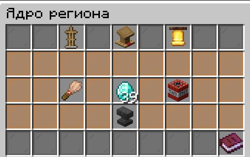

# Система приватов и рейдов

**Приват** (регион) — это защищённая территория вокруг специального блока-ядра. Ядро хранит всю информацию о регионе и задаёт его размер, а блоки внутри региона со временем теряют прочность, поэтому базу нужно регулярно чинить и подпитывать ресурсами.

Меню региона открывается правой кнопкой мыши по ядру или командой `/ps menu`.

## Установка привата

* Приват можно установить только в разрешённом месте, вне локаций.
* Между блоками ваших приватов должно быть не менее 10 блоков.
* На количество установленных приватов действует лимит.
* При установке ядро получает лишь 25% от максимального запаса прочности.


Границы своего региона можно увидеть командой `/ps glow`.


## Виды блоков привата

Блок привата — это ядро региона, его можно получить обычным крафтом. Ядро нельзя подвинуть поршнем или сломать киркой чужаку — только взорвать динамитом или разрывной стрелой.

Размер защищённой зоны зависит от материала ядра.

| Блок привата     | Размер (радиус × высота) | Максимальная прочность | Прочность при установке | Ресурс для питания |
| ---------------- | ------------------------ | ---------------------- | ----------------------- | ------------------ |
| Железный блок    | 5 × 5                    | 250 HP                 | 10%                     | Железный слиток    |
| Алмазный блок    | 15 × 15                  | 2500 HP                | 25%                     | Алмаз              |
| Незеритовый блок | 25 × 25                  | 7500 HP                | 25%                     | Незеритовый слиток |

## Меню привата

<figure><figcaption>
Меню привата с основной информацией о регионе
</figcaption></figure>

| Предмет в меню       | Для чего нужен                                                                                                          |
| -------------------- | ----------------------------------------------------------------------------------------------------------------------- |
| **Кафедра**          | Информационное табло: название региона и таймер его жизни. Установщик может нажать на кафедру, чтобы переименовать регион. |
| **Стойка для брони** | Управление участниками: список, статус онлайна и роль каждого.                                                            |
| **Наковальня**       | Статистика прочности региона и глобальный ремонт.                                                                         |
| **Барьер**           | Привязка к Telegram-боту, чтобы отслеживать состояние региона.                                                            |


Как подключить оповещения, описано в статье «Как настроить Telegram-оповещения о начале рейда».


## Роли участников региона

| Роль               | Как получают             | Права                                                                                                                                    |
| ------------------ | ------------------------ | ---------------------------------------------------------------------------------------------------------------------------------------- |
| **Установщик**     | Установил блок привата   | Добавляет и удаляет участников, меняет их роли, переименовывает и ломает регион. Не может быть удалён из участников.                       |
| **Соруководитель** | Назначается установщиком | Добавляет и удаляет участников. Не может сломать регион.                                                                                   |
| **Участник**       | Приглашён в регион       | Взаимодействует со всеми блоками внутри региона, кроме самого ядра. Может чинить регион и пополнять ресурсы.                              |

### Управление участниками

Участниками управляют через стойку для брони в меню региона.

* **Добавить участника** — нажмите на <mark style="color:$success;">**лаймовый краситель**</mark> и в течение 10 секунд напишите ник игрока в чат.
* **Назначить соруководителя** — нажмите ЛКМ по участнику в списке.
* **Удалить всех участников** — нажмите на <mark style="color:red;">**красный краситель**</mark>. Доступно только установщику.

## Прочность и ремонт

Каждый блок, поставленный в регионе, имеет свою прочность — она зависит от материала блока. При установке блок получает 25% от максимальной прочности (железо — 10%), а дальше прочность со временем падает. Чтобы база не разрушилась, блоки нужно чинить: точечно кистью или сразу всем регионом.

### Ремонтная кисть

<mark style="color:orange;">**Ремонтная кисть**</mark> — инструмент для точечной починки, когда нужно восстановить конкретный блок. Кисть выдаётся над ядром при установке первого привата с момента вайпа, также её можно скрафтить.



### Возьмите кисть в руку

Убедитесь, что в инвентаре достаточно ресурсов для починки блока.



### Наведите курсор на блок и зажмите ПКМ

Кисть сама заберёт нужные материалы из инвентаря, а прочность блока начнёт расти.



### Дождитесь максимума

Когда голограмма HP покажет максимальную прочность, можно переходить к следующему блоку.




Чтобы починить блок до 100%, нужно потратить столько же материалов, сколько ушло на его крафт или установку. Блоки разрешается чинить производными материалами, но с пересчётом.


### Глобальный ремонт

Глобальный ремонт — это массовая починка всех блоков региона. Откройте меню привата и наведите курсор на **наковальню**: там показана статистика прочности региона и ресурсы, необходимые для ближайшего шага ремонта. Если все ресурсы есть в инвентаре, глобальный ремонт увеличивает прочность всей базы на 2%.

## Питание региона

Чтобы строить и ставить блоки внутри региона, его нужно **запитать**. Ресурсы кладутся в отдельный слот в меню привата, и пополнять его нужно постоянно.

Например, для алмазного блока:

| Ресурс в слоте | Время жизни региона |
| -------------- | ------------------- |
| 1 алмаз        | +20 минут           |
| 64 алмаза      | +24 часа            |


Если ресурсы в слоте закончились, приват переходит в состояние **Истощено**: запускается ускоренное гниение региона, а новые блоки защиты ставить нельзя. Слот нужно пополнить как можно скорее.


## Команды

| Команда    | Описание                        |
| ---------- | ------------------------------- |
| `/ps menu` | Открыть меню привата            |
| `/ps glow` | Показать границы своего региона |
