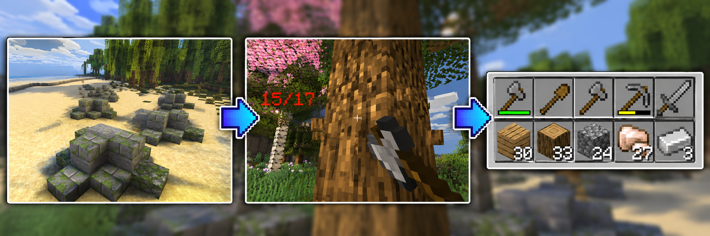

# Как начать играть


Такой порядок развития на острове совсем не обязателен, но если вы не знаете с чего начать, то эта последовательность поможет вам быстрее найти ценный лут, при этом закрепиться на острове.




## <mark style="background-color:yellow;">**Начните с добычи залежей**</mark> [<mark style="background-color:yellow;">**руд**</mark>](../dobycha-resursov/rudy.md) <mark style="background-color:yellow;">**и дерева**</mark>

Осмотритесь, рядом с пляжем есть **залежи руд**. Добывайте их: вам могут попасться различные виды руд, включая [<mark style="color:violet;">**аметисты**</mark>](../ekonomika/ametisty.md). Найдите самые простые руды - каменные, их можно рубить без кирки. Затем найдите **деревья** и срубите их, зажмите ЛКМ и держите, пока не иссякнет прочность дерева.&#x20;

Из полученных ресурсов, скрафтите **простую броню и инструменты** на первое время.

<figure><figcaption></figcaption></figure>



## <mark style="background-color:yellow;">Лутайте легкие</mark> [<mark style="background-color:yellow;">локации</mark>](../dobycha-resursov/lokacii.md)

Доберитесь до **Маяка**, **Мельницы или Деревни**. С помощью [карты ](karta.md)или команды [/gps](navigator.md), например <mark style="background-color:violet;">/gps Деревня</mark>, вы узнаете направление и расстоние до нужной локациии.

* **Маяки** стоят почти по всему периметру пляжа. Мобы там слабые, а в хранилищах вы найдете базовую еду и оружие.
* **Мельницы** – место для сбора еды в хранилищах, в спавнере с животными. В локации есть большое количество пшеницы для крафта хлеба.
* **Деревни.** Собирайте с грядки пшеницу и морковку, получая еду на первое время. А также ищите в деревне кровати,  которые поставите в своем регионе.

Когда первые ресурсы собраны, в том числе и железо, пора ставить свой **первый приват** и обустраивать базу.

<figure><figcaption></figcaption></figure>



## <mark style="background-color:yellow;">Поставьте свой первый</mark> [<mark style="background-color:yellow;">приват</mark>](../privaty/sistema-privatov-i-reidov.md)

Выберите безопасное, незаметное место, поставьте **железный блок** (ядро привата), он небольшой, но с него начинают все.

* **Активируйте** приват, положив <mark style="color:$info;">**железные слитки**</mark> в меню привата _/ps menu_, чтобы начать строить защиту.


Питание региона не отменяет гниение привата. Ядро привата и все блоки в нем гниют и в запитанном регионе, просто медленнее! Необходимо постоянно повышать здоровье (HP) свое базы с помощью ремонта.


* **Чинить приват** нужно в меню привата наковальней.



## <mark style="background-color:yellow;">Сделайте вашу базу крепкой</mark>

Обставьте базу **прочными блоками**. Чем выше прочность, тем сложнее рейдерам её взломать.

* Самые **популярные блоки** для начальной базы: **камень, булыжник, дерево, сланец**.
* Двери, люки и сундуки тоже имеют прочность, учитывайте это. Их тоже нужно чинить.



## <mark style="background-color:yellow;">Установите вашу точку респавна –</mark> [<mark style="background-color:yellow;">кровать</mark>](../privaty/krovati.md)

Установите **кровать** в безопасном месте (например, в вашем регионе). После возрождения вы сможете **телепортироваться** на неё и продолжить игру рядом с домом.



## <mark style="background-color:yellow;">Отправляйтесь в более опасные</mark> [<mark style="background-color:yellow;">локации</mark>](../dobycha-resursov/lokacii.md)

Когда первая база готова, вам нужны ресурсы для более **прочной** базы. Вам подойдут следующие локации: в заброшеной шахте, цветущей и мрачной пещере уже можно добыть хорошую **зачарованную броню и инструменты**, убивая мобов в спавнере.&#x20;

И только подготовленным отправляйтесь на <mark style="color:orange;">**рудный карьер**</mark>, идеальное место, чтобы добыть медь и обсидиан или другие ресурсы!



## <mark style="background-color:yellow;">Экономьте место в инвентаре</mark>

Если у вас накопилось много ненужных инструментов и брони одного материала, то смело **объедините их в** [**вещмешки**](../prokachka/veshmeshki.md)**.** Но уже **безвозвратно**!&#x20;

Перерабатывайте вещмешки и обычные инструменты, броню, оружие в [**утилизаторе** ](../prokachka/utilizator.md)в Заброшенной Шахте, на Маяке, в Промзоне. Вы сможете получить исходный материал этих предметов, медные слитки от медных предметов, и даже <mark style="color:violet;">**аметисты**</mark>. Утилизатор – это верстак наоборот.&#x20;



## <mark style="background-color:yellow;">Прокачайте ваш приват</mark>

Когда накопились нужные ресурсы, поставьте **второй приват** или сломайте железный (сломайте только ядро) и **замените** на <mark style="color:cyan;">**алмазный**</mark> или <mark style="color:$info;">**незеритовый**</mark>. Они больше по радиусу и прочнее.\
<mark style="color:$info;">**Незеритовый приват**</mark> самый большой и самый дорогой в содержании.

Чтобы защищаться от рейдов, сделайте базу **прочнее и безопаснее** с помощью медных или незеритовых блоков по периметру региона. Не забывайте повышать прочность региона в меню привата наковальней.



## <mark style="background-color:yellow;">Начинайте рейд чужих баз</mark>

Для этого вам нужна взрывчатка, а для нее нужен порох. Первым шагом идите в <mark style="color:$info;">**Серный Карьер**</mark> и добывайте **серную пыль**. Из нее в печке скрафтите порох. Вторым шагом откройте [**меню взрывчатки** <mark style="color:$danger;">**/tnt**</mark> ](../privaty/gnienie-i-reidy.md), разблокируйте рецепты за <mark style="color:violet;">**аметисты**</mark>, чтобы скрафтить **динамит А, разрывные стрелы и C4**.

Теперь вы готовы к найтоящему рейду. Находите **чужие базы** и взрывайте их защиту. Для з**ахвата привата** взорвите ядро чужого привата и поставьте свой блок привата, вся уцелевшая часть и хранилища с лутом перейдут к вам.


