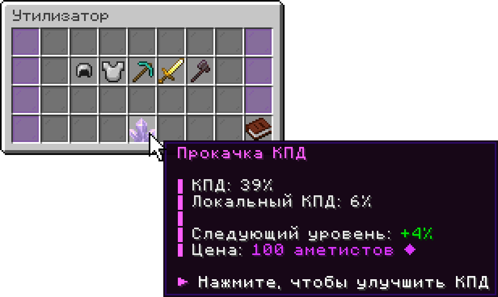

# Утилизатор

**Утилизатор** — это блок в локациях, который перерабатывает ненужные вещи в ресурсы, аметисты и опыт. Свой поставить нельзя: пользуются тем, что нашли в локации.

## Где найти

Утилизатор предусмотрен не в каждой локации, и даже там, где он есть, появляется не всегда. Базовый КПД зависит от [локации](lokacii.md):

| Локация           | Базовый КПД | Как часто встречается |
| ----------------- | ----------- | --------------------- |
| Маяк (неводный)   | 25%         | Примерно на трети     |
| Маяк (водный)     | 30%         | Примерно на половине  |
| Промзона          | 33%         | Почти в каждой        |
| Заброшенная шахта | 40%         | Примерно в половине   |
| Медный данж       | 45%         | В большинстве         |
| Бастион           | 45%         | В большинстве         |
| Крепость Энда     | 50%         | В большинстве         |

## Что получится

За переработку дают три вещи: **материалы**, **аметисты** и **опыт**.

Количество материалов зависит от двух вещей — прочности предмета и КПД утилизатора. Сильно сломанная кирка даст меньше целой, а утилизатор с низким КПД — меньше прокачанного.


Зачарованные вещи перерабатывать выгоднее: каждое зачарование добавляет и аметистов, и опыта. Дороже всего ценится **Починка**, за ней идёт **Шёлковое касание**, следом **Удача** и **Добыча**.


Переработка идёт не мгновенно: чем богаче результат, тем дольше работает утилизатор.

## КПД

Общий КПД складывается из **базового**, который зависит от локации, и **прокачки**, которую вы оплачиваете аметистами. Выше 100% он не поднимается.

### Прокачка

<figure><figcaption></figcaption></figure>

Кнопка прокачки находится в меню утилизатора. Уровней девять: каждый следующий прибавляет на процент больше предыдущего, а стоит квадрат набранного локального КПД.

<table data-search="false"><thead><tr><th>Уровень</th><th>Прибавка</th><th>Локальный КПД</th><th>Цена в аметистах</th></tr></thead><tbody><tr><td>1</td><td>+1%</td><td>1%</td><td><mark style="color:violet;">1 ❖</mark></td></tr><tr><td>2</td><td>+2%</td><td>3%</td><td><mark style="color:violet;">9 ❖</mark></td></tr><tr><td>3</td><td>+3%</td><td>6%</td><td><mark style="color:violet;">36 ❖</mark></td></tr><tr><td>4</td><td>+4%</td><td>10%</td><td><mark style="color:violet;">100 ❖</mark></td></tr><tr><td>5</td><td>+5%</td><td>15%</td><td><mark style="color:violet;">225 ❖</mark></td></tr><tr><td>6</td><td>+6%</td><td>21%</td><td><mark style="color:violet;">441 ❖</mark></td></tr><tr><td>7</td><td>+7%</td><td>28%</td><td><mark style="color:violet;">784 ❖</mark></td></tr><tr><td>8</td><td>+8%</td><td>36%</td><td><mark style="color:violet;">1296 ❖</mark></td></tr><tr><td>9</td><td>+9%</td><td>45%</td><td><mark style="color:violet;">2025 ❖</mark></td></tr></tbody></table>

Все девять уровней дают **+45% к КПД** и обходятся в <mark style="color:violet;">**4917 ❖**</mark>. Прокачка останавливается на девятом уровне или на общем КПД в 100% — смотря что наступит раньше.
