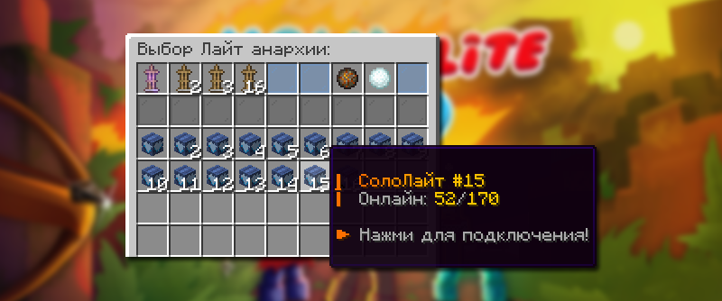

# 🏠 О режиме Лайт Анархия

**HolyWorld** — это один из самых популярных серверов Майнкрафт с тематикой анархии. Здесь вы можете делать почти что угодно: от простых убийств до захвата огромных баз с ресурсами. В игре вас ждут новые и увлекательные механики, которые изменят ваш игровой опыт.


Лайт Анархия — это упрощенная Анархия, но с захватывающим развитием и увлекательным процессом. Здесь можно полностью уничтожать регионы, получать невозможные зачарования, приобретать донат с топовым набором и соревноваться с лучшими игроками.


<table><thead><tr><th width="202"></th><th></th></tr></thead><tbody><tr><td>Айпи адрес</td><td><kbd>lite.holyworld.ru</kbd> (Для игроков из России) <kbd>lite.holyworld.me</kbd> (Для игроков из других стран)</td></tr><tr><td>Версия игры</td><td>1.16.5-1.21.8</td></tr></tbody></table>

## Типы серверов

<figure><figcaption></figcaption></figure>

Режим Лайт Анархия включает в себя более чем 65 доступных серверов для игры, а чтобы сбалансировать как одиночную, так и командную игру, сервера поделены на типы:

<table><thead><tr><th width="202">Тип</th><th>Количество игроков в команде</th></tr></thead><tbody><tr><td>СолоЛайт</td><td>Только один игрок</td></tr><tr><td>ДуоЛайт</td><td>Группа из двоих игроков</td></tr><tr><td>ТриоЛайт</td><td>Группа из троих игроков</td></tr><tr><td>КланЛайт</td><td>Большая группа от четырех игроков</td></tr></tbody></table>


Вы можете играть на любом сервере Лайт Анархии от первого до шестидесятого. Ваш инвентарь и опыт будут одинаковыми на всех серверах. Однако ваши базы останутся неизменными и будут находиться на выбранной анархии.


## Когда проходят вайпы

Промежуток времени между вайпом составляет не менее 5 недель (\~35 дней). За дней 5 до вайпа администрация режима уведомляет о будущем вайпе в соцсетях Лайт Анархии.


Если по каким-то причинам вайп проводится раньше, то вам начислится Кэшбэк в сапфирах, которые вы потратили в Шопе `/shop` (включая Бустеры и Киты)\
\
Например: вайп длился 4 недели, а значит все игроки получат возврат 20% (именно на столько быстрее прошёл вайп) Сапфиров, которые тратили на протяжении всего вайпа.


## Ссылки на соцсети

<a href="https://vk.com/holylite" class="button primary" data-icon="vk">Открыть ВКонтакте</a>Группа ВКонтакте с новостями режима: [vk.com/holylite](https://vk.com/holylite)

<a href="https://t.me/hwlite" class="button primary" data-icon="telegram">Открыть Телеграм</a>Телеграм-канал Лайт Анархии с всеми новостями [t.me/hwlite](https://t.me/hwlite)

<a href="https://holyworld.me/" class="button primary" data-icon="globe-pointer">Открыть сайт</a> Официальный сайт где можно приобрести донат [holyworld.me/](https://holyworld.me/)
