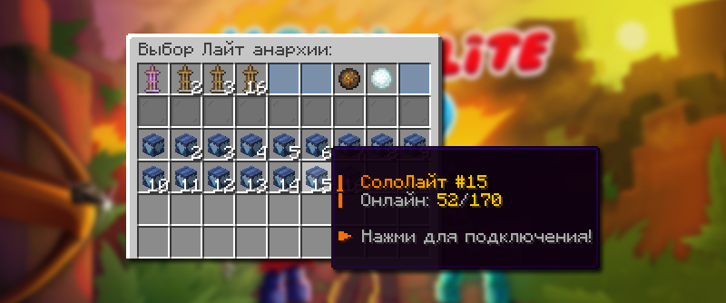

---
layout:
  width: default
  title:
    visible: true
  description:
    visible: true
  tableOfContents:
    visible: true
  outline:
    visible: true
  pagination:
    visible: true
  metadata:
    visible: true
  tags:
    visible: true
  actions:
    visible: true
---

# 🌎 О режиме Лайт Анархия

## Что за Лайт Анархия?

**Лайт Анархия** — это упрощенная Анархия, но с захватывающим развитием и увлекательным процессом. Здесь можно полностью уничтожать регионы, получать невозможные зачарования, приобретать донат с топовым набором и соревноваться с лучшими игроками.

<table data-header-hidden data-header-sticky><thead><tr><th width="202"></th><th></th></tr></thead><tbody><tr><td>Айпи адрес</td><td><code>mc.holyworld.ru</code> (Для игроков из России) <code>mc.holyworld.me</code> (Для игроков из других стран)</td></tr><tr><td>Версия игры</td><td>1.16.5-1.21.11</td></tr></tbody></table>

## Особенности Лайт Анархии



### Огромный онлайн

На **Лайт Анархии** постоянно играет около **10 000+ игроков**, так что заскучать здесь точно не получится. Столько игроков вокруг — это неожиданные встречи и самое настоящая Анархия, где никогда не знаешь, что произойдёт в следующую минуту.



### Режим с очень крутыми вещами

Если хочется чего-то помощнее — можно обзавестись мечом с **Остротой X**, а киркой-буром буквально **всрывать огромные туннели** и значительно ускорять добычу ресурсов.



### Обновленный баланс игры

* Кристаллы Энда сносят намного больше урона. Защита от взрывов на броне сильно помогает от этого.
* В одном чанке можно разместить до 16 спавнеров.
* Опыт при смерти не выпадает. Единственное исключение — охотник: в этом случае остается 50%.
* Незеритовые слитки выпадают с противника, если вы ему поломали броню. Чем сильнее поломка - тем больше выпадет. Работает только с броней Stinger, Eternity, Infinity



## Типы серверов

<figure><figcaption>
Кнопка, чтобы зайти на одну из Лайт анарахий
</figcaption></figure>

Лайт Анархия — это более **50 серверов на 200+ слотов**, так что места для игры здесь хватит всем. А чтобы было комфортно как любителям одиночного выживания, так и тем, кто предпочитает собираться в команды, сервера разделены на несколько типов:

<table><thead><tr><th width="202">Тип</th><th>Количество игроков в команде</th></tr></thead><tbody><tr><td>СолоЛайт</td><td>Только один игрок</td></tr><tr><td>ДуоЛайт</td><td>Группа из двоих игроков</td></tr><tr><td>ТриоЛайт</td><td>Группа из троих игроков</td></tr><tr><td>КланЛайт</td><td>Большая группа от четырех игроков</td></tr></tbody></table>


Вы можете играть на **любом сервере Лайт Анархии — от первого до шестидесятого**. При этом ваш **инвентарь и опыт будут общими для всех серверов**, поэтому при переходе между ними ничего не придётся собирать заново.


## Когда проходят вайпы

Промежуток между вайпами составляет **не менее 5 недель (\~35 дней)**, поэтому у игроков достаточно времени, чтобы освоиться, построить базу и успеть реализовать свои планы. А за **5 дней до вайпа** администрация заранее предупреждает игроков о предстоящем обновлении в социальных сетях Лайт Анархии.


Если по каким-то причинам вайп проводится раньше, то вам в некоторых случаях могут начислить Кэшбэк в сапфирах, которые вы потратили в Шопе `/shop` (включая Бустеры и Киты)\
\
Например: вайп длился 4 недели, а значит все игроки получат возврат 20% (именно на столько быстрее прошёл вайп) Сапфиров, которые тратили на протяжении всего вайпа.


## Ссылки на соцсети



Группа ВКонтакте с новостями режима: [vk.com/holylite](https://vk.com/holylite)

<a href="https://vk.com/holylite" class="button primary" data-icon="vk">Открыть</a>



Телеграм-канал Лайт Анархии с всеми новостями: [t.me/hwlite](https://t.me/hwlite)

<a href="https://t.me/hwlite" class="button primary" data-icon="telegram">Открыть</a>



Официальный сайт где можно приобрести донат: [holyworld.me](https://holyworld.me/)

<a href="https://holyworld.me/" class="button primary" data-icon="globe-pointer">Открыть</a>



Телеграм-канал по википедии: [t.me/hwwiki](https://t.me/hwwiki)

<a href="https://t.me/hwwiki" class="button primary" data-icon="telegram">Открыть</a>


