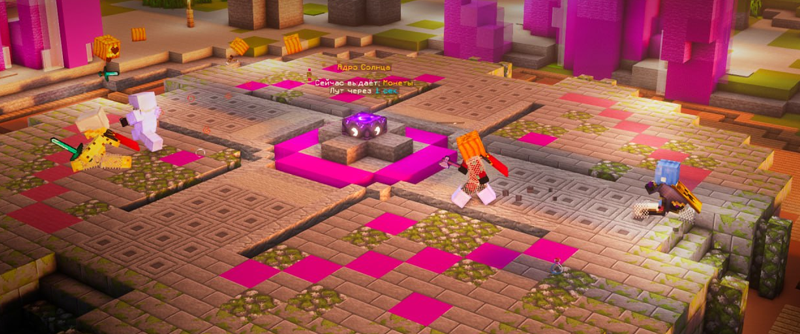

# ☀️ Ядро Солнца

Ядро Солнца — это блок (Якорь возрождения), расположенный в центре PvP-арены (/warp pvp) на верхнем ярусе, с которого через определённые промежутки времени (20–60 секунд) выпадают ресурсы.

## Где находится Ядро Солнца

<figure><figcaption></figcaption></figure>

Локация с Ядром Солнца находится на верхнем ярусе PvP-арены `/warp pvp`

## Ивенты Ядра Солнца

### Получение ресурсов

Каждые 20–60 секунд с Ядра Солнца выпадают редкие ресурсы: станы, трапки, тотемы бессмертия, растительность, инструменты, броня, мечи, ресурсы из шахты и многое другое.

### Заработок денег

В радиусе 12 блоков от Ядра Солнца вы будете получать монетки или опыт — они меняются местами в среднем каждые 25 минут.
