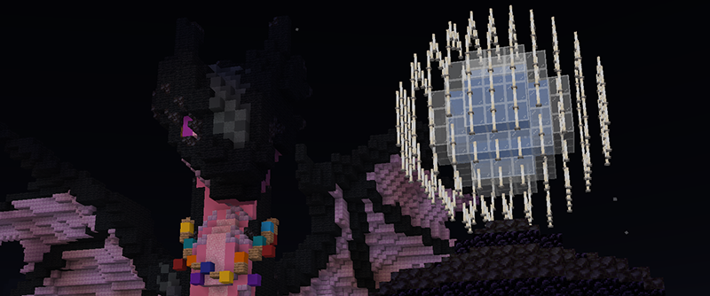
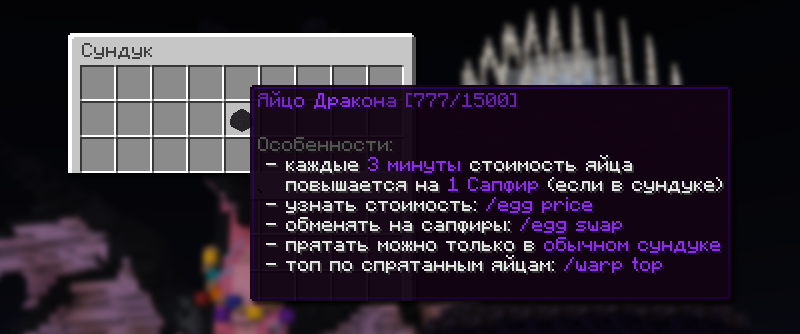
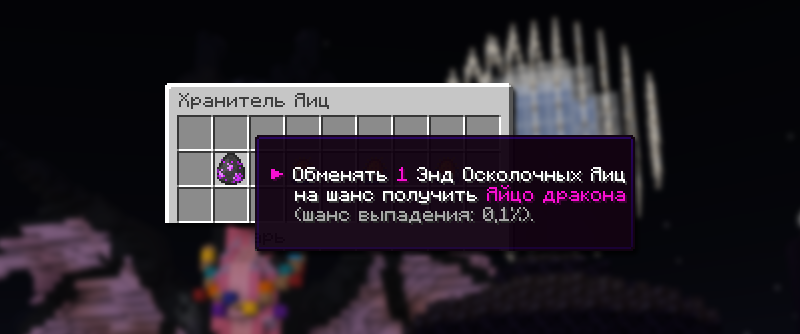

# 🌠 Захват Энда

**Захват Энда** — это еженедельное событие, во время которого измерение Края становится доступным для всех игроков. Ивент проходит каждое воскресенье и предоставляет доступ к уникальным ресурсам и активностям.

## Когда начинается Захват Энда

<figure><figcaption></figcaption></figure>

Захват Энда начинается каждое воскресенье абсолютно на всех Анархиях ровно в 16:00 по МСК и продолжается 90 минут (до 17:30 по МСК). В это время вы также можете исследовать мир Энда.


Портал в Энд находится на спавне по варпу `/warp end`


## Особенности мира

### Убийство дракона

Вознаграждение за убийство дракона получает только один игрок, который нанес больше всего урона по дракону. По итогу лучший игрок получает в инвентарь Яйцо дракона.

### Яйцо дракона

#### Ценность яиц дракона

<figure><figcaption></figcaption></figure>

Ценность яйца дракона вырастает каждые три минуты на 1 Сапфир, если вы храните его в сундуке у себя на базе. Но будьте внимательны, все яйца дракона отображаются вместе с координатами сундука в топе `/warp top.`

Для того чтобы узнать стоимость вашего яйца дракона, возьмите его в руку и пропишите команду `/egg price`. Обменять яйцо дракона можно по команде `/egg swap`.


Максимальная цена: фиксированная — 1500 сапфиров.
\
Начальная цена: разная в зависимости от источника:

* Захват Энда: за убийство дракона (топ 1 по урону) – 777 сапфиров.
* Куплено в Магазине БП `/bpshop` – 250 сапфиров (доступно для обладателей [PREMIUM](https://holyworld.ru/payment/lite/premium-pass))
* Обменено у Хранителя Яиц в `/eggkeeper` – 250 Сапфиров


#### Осколочные яйца Энда

<figure><figcaption></figcaption></figure>

**Осколочные яйца Энда** – особенные предметы, получаемые из специальных структур, спрятанных в мире энда. В Эндер мире доступны как кастомные, так и ванильные подземелья с уникальными наградами.

Сдачей одного такого Осколочного яйца у Хранителя яиц `/eggkeeper`, вы каждый раз получаете 0.1% шанс получить яйцо дракона.

Как получить осколочные яйца Энда:

* Выпадает при разрушении чёрного сухого бетона в структурах выпадает осколочное яйцо.
* Выпадает при убийстве дракона.
* Можно найти в ванильных и особых данжах в Эндер-мире.

