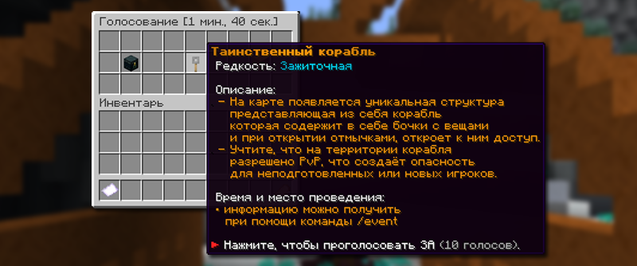

# 🗓️ Ивенты

Ивенты — это небольшие события, которые происходят в случайных местах мира. На ивентах можно найти редкие предметы.

## Какой сейчас ивент проходит

Информация об активных ивентах на вашей Анархии доступна по команде `/event`. Вы получите все необходимые данные об активном ивенте и на каких координатах он находится.


Воспользуйтесь [ботом в Телеграм](https://t.me/liteeventbot), чтобы получать уведомления о начинающихся ивентах, а также узнавать о тех, что идут прямо сейчас.

<a href="https://t.me/liteeventbot" class="button primary" data-icon="telegram">Открыть Телеграм</a>



## Голосование за ивенты

<figure><figcaption></figcaption></figure>

Чтобы проголосовать за следующий ивент, используйте команду `/vote`. В определённый момент каждые 65 минут на вашей Анархии может начаться голосование за новый ивент. Вам предложат три случайных ивента с разной редкостью.


По умолчанию каждый игрок добавляет +1 голос за выбранный ивент.

* Имея [PREMIUM-подписку](https://holyworld.ru/payment/lite/premium-pass), вы получаете +2 дополнительных голоса.
* Имея какую-нибудь звезду статуса, вы также получаете дополнительные голоса.


Дополнительные голоса для обладателей звезды статуса

| Уровень звезды | Дополнительные голоса |
| -------------- | --------------------- |
| I              | +1                    |
| II             | +2                    |
| III            | +3                    |
| IV             | +4                    |
| V              | +5                    |
| VI             | +6                    |
| VII            | +7                    |
| VIII           | +8                    |
| IX             | +9                    |
| X              | +10                   |

## Список ивентов

Таинственный груз

**Груз** — это серверный ивент, во время которого игроки могут получить ценные ресурсы из шалкеровых ящиков на территории события. Доступ к хранилищам открывается через определенное время после начала ивента.

## Редкости грузов

| Тип             | Особенность                                        | Механика открытия                        |
| --------------- | -------------------------------------------------- | ---------------------------------------- |
| **Мирный**      | PvP отключено в радиусе, отмеченном синими блоками | Отбрасывает игроков при открытии         |
| **Взрывной**    | Происходит взрыв при открытии                      | Взрыв наносит урон и отбрасывает игроков |
| **Смертельный** | Хранилища в яме, выход только через паркур         | Наносит урон и отбрасывает при открытии  |


Ценность лута зависит от типа груза. Смертельный груз содержит наиболее редкие и ценные предметы, мирный - базовые ресурсы, взрывной занимает промежуточное положение.


Таинственный корабль

**Таинственный корабль** — это серверный ивент, где игроки открывают бочки с ценным лутом в трюме корабля, используя отмычки, получаемые у капитана. Ивент имеет систему редкости как для отмычек, так и для самого события.

## Редкости корабля

| Тип        | Особенность                                        |
| ---------- | -------------------------------------------------- |
| Обычный    | Обычная скорость появления и редкость предметов    |
| Зажиточный | Более лучшая скорость появления редкость предметов |
| Роскошный  | Самая лучшая скорость появления редкость предметов |

## Как получать отмычки

Отмычки можно забрать у капитана, который находится в центральной части корабля. Скорость появления новых отмычек зависит от редкости самого ивента.


Отмычки бывают четырех видов. Чем круче отмычка, тем лучше предметы можно получить в бочках.

* Обычная
* Редкая
* Секретная
* Уникальная


## Пиратский клад

Пиратский клад находится в задней части корабля и представляет собой особое хранилище с наиболее ценными наградами. Чтобы забрать Пиратский клад, необходимо 4 отмычки Уникальной редкости.

Цветочная поляна

**Цветочная поляна** — это серверный ивент, представляющий собой локацию с большим деревом в центре, где периодически появляются специальные цветы. Для сбора цветов требуются особые ножницы. Каждый собранный цветок дает игроку случайную награду из пула ценных предметов.

## Как собирать цветы

Цветы можно сломать только специальными ножницами, которые можно получить у NPC на ивенте. При разрушении цветка игрок получает ценные предметы. Цветы появляются на поляне через случайные интервалы времени. Количество и типы цветов варьируются в зависимости от фазы ивента.


**Специальные ножницы** – единственный способ собрать вырастающие цветы с поляны. Обычные инструменты не работают с ивентовыми цветами.


Опытный Тыпо

**Опытный Тыпо** — это серверный ивент в виде NPC-жителя, который периодически создает пузырьки опыта. Игроки могут собирать эти пузырьки для получения постоянного потока опыта в течение ивента.


Тыпо остается активным **15-25 минут**. После завершения ивента на его месте появляется сундук с ценными предметами.


## Редкости Опытного Тыпо

| Редкость        | Интервал появления пузырьков |
| --------------- | ---------------------------- |
| **Обычный**     | 70 секунд                    |
| **Эпический**   | 60 секунд                    |
| **Легендарный** | 50 секунд                    |

## Спавн пузырьков

При создании нового пузырька Тыпо:

* Издает характерный звук
* Телепортируется в новое место в радиусе ивента
* Сбрасывает таймер до следующего пузырька

## Система перемещения Тыпо

Тыпо постоянно меняет свое местоположение в пределах области ивента, заставляя игроков следовать за ним для поддержания потока опыта.

## Зона активности

Игроки должны находиться в радиусе 12 блоков от Тыпо для:

* Получения опыта от собранных пузырьков
* Сохранения уже собранных пузырьков
* Участия в ивенте

## Потеря прогресса

При выходе за пределы зоны активности игрок теряет все накопленные пузырьки и прекращает получать опыт.

Контейнер

**Контейнер** – структура, появляющаяся в мире и представляющая собой шалкеровый ящик с механикой работы контейнера из `/container`. Ивент может быть выбран через голосование.

## Возможные награды

Контейнеры могут содержать:

* Кастомные предметы
* Редкие ресурсы
* Игровую валюту (монеты, сапфиры, коины)
* Взрывчатые вещества
* Зачарованные предметы

## Альтернативное открытие контейнеров

Каждый игрок может купить для себя свой личный контейнер, который откроет только он [на сайте](https://holyworld.ru/payment/lite/38). Открыть контейнер можно по команде `/container`.

Посылка

**Посылка** — это серверный ивент, представляющий собой пьедестал с блоком посылки, который необходимо сломать определенное количество раз для получения ценного лута. Ивент имеет три уровня редкости.

## Редкости посылок

| Редкость        | Блок              | Требуемые удары |
| --------------- | ----------------- | --------------- |
| **Обычная**     | Сундук            | 3000            |
| **Редкая**      | Шалкер            | 4000            |
| **Легендарная** | Якорь возрождения | 500             |

## Процесс вскрытия

Игрок должен наносить удары по блоку посылки до достижения требуемого количества ударов. Прогресс отображается в голограмме над блоком.

## Эффекты во время вскрытия

При разрушении блока посылки игрок получает случайные эффекты:

* **Положительные эффекты**: скорость, спешка, сила, сапфиры, монеты и опыт
* **Отрицательные эффекты** — свечение, моментальный урон

## Промежуточные награды

Каждый удар по посылке может дать:

* Сапфиры
* Монеты
* Опыт
* Временные эффекты

## Финальная награда

После полного разрушения посылка выбрасывает основную награду, качество которой зависит от редкости посылки.

Смертельная шахта

**Смертельная шахта** — это серверный ивент, представляющий собой подземную область, заполненную ценными блоками. Участники могут добывать эти блоки для получения редких ресурсов, но ивент имеет особые ограничения и риски.

## Наполнение шахты

Область ивента полностью заполнена тремя типами блоков:

* **Обсидиан**
* **Плачущий обсидиан**
* **Древние обломки** — наиболее ценный ресурс

## Особенности ивента и система наград

При добыче каждого блока игрок получает ценные предметы и ресурсы, качество которых зависит от типа добытого блока. Особенность ивента заключается в том, что помимо ценных ресурсов шахта может выдавать и негативные эффекты, такие как моментальный урон или **при добыче блока кирка автоматически перемещается в другой слот инвентаря**. Это создает дополнительную сложность и требует постоянного контроля.

## Запрещенные предметы

На территории смертельной шахты не работают:

* **Эндер-жемчуг** — телепортация заблокирована
* **Плоды хоруса** — перемещение ограничено

Золотая лихорадка

**Золотая лихорадка** — это серверный ивент, который проходит в замке на координатах 0,0. Во время события все шалкеры в замке становятся золотыми и содержат повышенное количество ценного лута.

## Локация ивента

Ивент проходит в замке, расположенном в центре карты на координатах 0,0. По всей территории замка находятся места спауна шалкеров, отмеченные плачущим обсидианом.

## Механика ивента

Во время Золотой лихорадки в замке появляются особые золотые шалкеры. Каждый такой шалкер нужно сломать 16 раз, чтобы получить лут. Важно помнить, что содержимое есть не в каждом шалкере — при неудаче шалкер просто взрывается и исчезает без награды. Новые золотые шалкеры появляются каждые 60-90 секунд на местах с плачущим обсидианом.

При успешном разрушении шалкер выбрасывает ценные ресурсы, которые может забрать любой игрок поблизости. Если попытка неудачная, шалкер взрывается и наносит урон всем игрокам в радиусе поражения.

Трофейная охота

**Трофейная охота** - это серверный ивент, где один игрок становится целью для охоты, получая при этом особое снаряжение и возможность заработать опыт. Цель охоты меняется после каждого успешного убийства.

## Как принять участие в Трофейной охота

Принять участие в Трофейной охоте можно по команде `/hunt join` во время активного ивента Трофейная охота.

## Механика ивента

### Начальная цель

В начале ивента система случайным образом выбирает одного игрока в качестве "ханта" - основной цели для охоты.

### Экипировка ханта (охотника)

Выбранный игрок получает специальный шлем:

* **Тип:** Нерушимый эквивалентен шлему Infinity по зачарования
* **Автоматическая экипировка:** надевается принудительно

### Заработок опыта

Пока игрок является хантом, он непрерывно получает опыт на свой баланс. Накопленный опыт можно забрать после завершения ивента командой `/hunt exp`.

## Система смены цели

### Механика передачи

После убийства текущего ханта его убийца автоматически становится новой целью для охоты.

### Процесс смены

1. Старый хант погибает
2. Специальный шлем автоматически передается убийце
3. Новый хант начинает получать опыт
4. Система объявляет смену цели всем участникам

## Награды и мотивация

### Для ханта

* **Постоянный доход опыта** во время нахождения в роли цели
* **Защитное снаряжение** высокого уровня
* **Накопленный опыт** забирается после ивента

### Для охотников

* **Возможность стать хантом** при успешном убийстве
* **Участие в динамичном PvP** с постоянно меняющимися целями

## Особенности игрового процесса

### Риск и награда

Роль ханта предоставляет высокий доход опыта, но делает игрока постоянной целью для всех остальных участников.

### Динамичность

Постоянная смена цели создает непредсказуемый и активный игровой процесс, где каждый участник может стать как охотником, так и жертвой.

Трофейная охота представляет собой высокодинамичный PvP ивент с элементами риска и награды, где успех зависит как от боевых навыков, так и от способности выживать под постоянным давлением.

