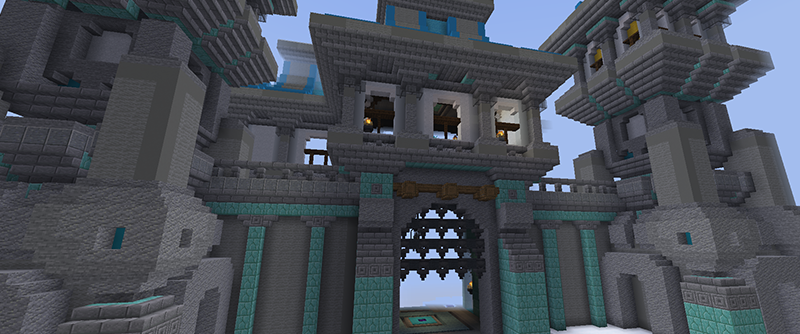
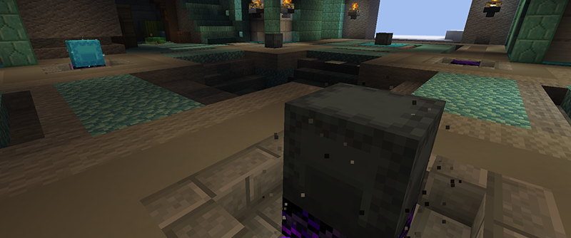
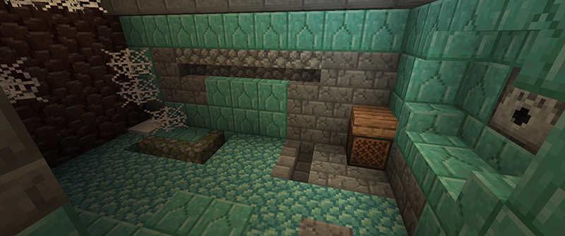
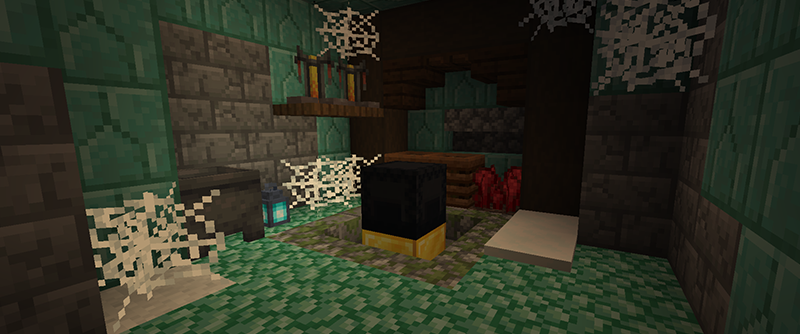

# 🏰 Замок с бункером

**Замок** — это постоянная структура, расположенная на нулевых координатах (x: 0, z: 0) каждого сервера анархии. В замке регулярно появляются шалкеровые ящики различной редкости, содержащие ценные ресурсы.

## Где находится замок

<figure><figcaption></figcaption></figure>

Замок всегда расположен на координатах x:0, z:0 на каждой анархии в течение всего вайпа. Любой игрок может добраться до него.


На территории замка запрещено строить и приватить территории, также здесь всегда включен PvP.


## Шалкеры с лутом в замке

<figure><figcaption></figcaption></figure>

На территории замка появляются шалкеры с редким лутом. Всего здесь может появиться 22 шалкера. Их места появления отмечены плачущим обсидианом, а сам шалкер выделяется частицами вокруг него.


Частота появления шалкеров зависит от текущего онлайна сервера. Чем больше игроков онлайн, тем чаще появляются новые шалкеры.


Для получения ресурсов из шалкера необходимо сломать его определенное количество раз. Количество требуемых ударов зависит от редкости шалкера. Количество выпадаемого лута зависит от редкости шалкера.

| Редкость шалкера | Цвет обозначения | Количество раз, чтобы сломать |
| ---------------- | ---------------- | ----------------------------- |
| Обычный          | Серый            | 5 раз                         |
| Редкий           | Голубой          | 7 раз                         |
| Эпический        | Фиолетовый       | 12 раз                        |

Ресурсы, которые могут выпасть из шалкеров

* **Руды и материалы**: Древние обломки, Незеритовый лом, Незеритовые слитки, Железо, Алмазы, Изумруды, Обсидиан, Нить, Порох, Паучий глаз, Незерский нарост.
* **Еда**: Золотая морковь, Золотое яблоко, Золотое зачарованное яблоко, Картофель.
* **Зелья и ингредиенты**: Зелье огнестойкости, Бутылочка, Огненный стержень.
* **Оружие, инструменты и ценные предметы**: Незеритовая кирка, Тотем бессмертия, Звезда Незера, Боевые фрагменты.
* **Блоки и особые предметы**: Эндер-сундук, Тростник, Динамит, Эндер-жемчуг

## Бункер под замком

<figure><figcaption></figcaption></figure>

В лабиринтах под замком находится специальная места под названием "Бункер". Это место характерно большой стеной из древних обломков, обсидиана или плачущего обсидиана, и напротив стены раздатчика.


Ивент бункер имеет шанс заспавниться каждый час по МСК (то есть существует шанс, что ивент появится на всех анархиях. Проверка шанса случается каждый час по МСК, например в 11.00, 12.00 и т.д). Если шанс не случился, то ивент бункера просто не появится на анархиях.


### Как взорвать стену

Чтобы взорвать стену бункера, нужно много динамита. Положите его в раздатчик напротив. Раздатчик выстрелит по стене. У каждого динамита есть шанс разрушить стену:

Шансы от динамита, что вы сломаете стену бункера

| Динамит          | Шанс пробить |
| ---------------- | ------------ |
| Обычный динамит  | 0.4%         |
| Динамит А        | 0.8%         |
| Динамит В        | 2%           |
| С4               | 5%           |
| Разрывная волна  | 12.5%        |
| Динамит Б2       | 0.4%         |
| Стиллер          | 0.4%         |
| Надежный стиллер | 0.4%         |
| Ледяная волна    | 0.4%         |


Стена может быть из разных стадий прочности:

* самая слабая стена — из обсидиана.
* средняя стена — из плачущего обсидиана.
* самая прочная стена — из древних обломков.

Если вы разрушите стену из древних обломков, она перейдет в состояние плачущего обсидиана и затем полностью станет обсидианом.


### Награда за взрыв бункера

<figure><figcaption></figcaption></figure>

После взрыва стены бункера вас ждет особый черный шалкер. Сломав его, вы получите случайный динамит. Однако есть шанс, что выпадут талисманы, броня или элитры.
