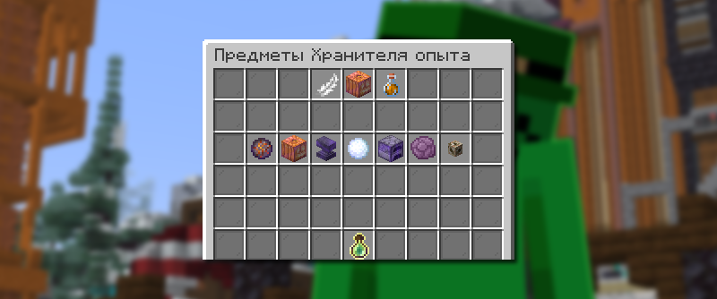
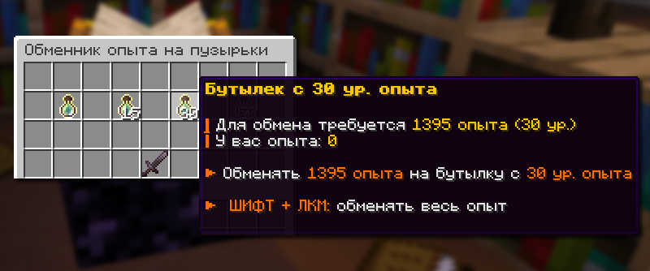

# 💫 Опыт

## Хранитель опыта

**Хранитель опыта** — это система торговли, доступная через команду `/expkeeper`, которая позволяет приобретать временные эффекты, предметы и постоянные эффекты за накопленный опыт или сапфиры.

### Как открыть Хранителя опыта

Меню Хранителя опыта доступно по команде `/expkeeper`, аа также через NPC на спавне с именем «Хранитель Опыта».

### Категории товаров

#### Эффекты Хранителя

<figure><figcaption>
Меню с постоянными эффектами Хранителя опыта /expkeeper
</figcaption></figure>

Эффекты Хранителя предоставляют постоянные пассивные эффекты и могут быть приобретены как разовые предметы или как постоянные улучшения на весь вайп.

| Эффект             | Описание                                                                                               | Стоимость предмета           | Стоимость на вайп             |
| ------------------ | ------------------------------------------------------------------------------------------------------ | ---------------------------- | ----------------------------- |
| **Охотник**        | 50% опыта при убийстве игрока                                                                          | 100 ур. опыта / 100 сапфиров | 165 ур. опыта / 275 сапфиров  |
| **Снеговик**       | 2% шанс замедления на 5 сек при ударе                                                                  | 110 ур. опыта / 110 сапфиров | 175 ур. опыта / 300 сапфиров  |
| **Иллюминатор**    | 5% шанс свечения на 15 сек при ударе                                                                   | 110 ур. опыта / 110 сапфиров | 175 ур. опыта / 300 сапфиров  |
| **Эндермен**       | 50% шанс сохранения эндер-жемчуга                                                                      | 125 ур. опыта / 150 сапфиров | 200 ур. опыта / 400 сапфиров  |
| **Анти-фантом**    | Мгновенная смерть атакующих фантомов                                                                   | 125 ур. опыта / 150 сапфиров | 200 ур. опыта / 400 сапфиров  |
| **Телекинез**      | 3 сек. эксклюзивного подбора ресурсов при убийстве                                                     | 150 ур. опыта / 225 сапфиров | 250 ур. опыта / 600 сапфиров  |
| **Гравитация**     | Отсутствие урона от падения                                                                            | 150 ур. опыта / 225 сапфиров | 250 ур. опыта / 600 сапфиров  |
| **Вампиризм**      | 2% шанс регенерации 2 при ударе                                                                        | 175 ур. опыта / 300 сапфиров | 300 ур. опыта / 1000 сапфиров |
| **Справедливость** | Вы получаете защиту от дебафов (слепота, прыгучесть, отравление, иссушение, медлительность и слабость) | 175 ур. опыта / 300 сапфиров | 300 ур. опыта / 1000 сапфиров |

#### Предметы

<figure><figcaption>
Меню с предмета Хранителя опыта /expkeeper
</figcaption></figure>

| Предмет                  | Функция                                                                                                             | Стоимость                    |
| ------------------------ | ------------------------------------------------------------------------------------------------------------------- | ---------------------------- |
| **Взрывная штука**       | При ПКМ вызывает взрыв, способный убить игрока без брони на расстоянии 3 блоков. Урон получает и активирующий игрок | 100 ур. опыта / 150 сапфиров |
| **Светильник Джейка**    | При ПКМ всем игрокам в радиусе 15 блоков без шлема надевается тыква на 15 секунд и накладывается свечение           | 120 ур. опыта / 180 сапфиров |
| **Пузырь опыта**         | При ПКМ полностью ремонтирует надетую броню с зачарованием Починка                                                  | 80 ур. опыта / 120 сапфиров  |
| **Нерушимая наковальня** | Наковальня, которая не разрушается от использования                                                                 | 200 ур. опыта / 300 сапфиров |
| **Ком снега**            | При попадании накладывает медлительность 6 и слепоту на 10 секунд                                                   | 60 ур. опыта / 90 сапфиров   |
| **Быстрая печка**        | Печь, которая плавит ресурсы значительно быстрее обычной                                                            | 150 ур. опыта / 225 сапфиров |
| **Трапка**               | При взрыве наносит урон в радиусе 3 блоков и создает коробку в месте активации                                      | 130 ур. опыта / 195 сапфиров |
| **Артефакт**             | Пустой предмет для объединения с эффектами Хранителя                                                                | 150 ур. опыта                |


#### Артефакт — специальный компонент

**Артефакт** — это уникальный предмет, который может содержать сразу несколько эффектов Хранителя опыта.

**Применение:**

* По умолчанию артефакт пустой
* При соединении артефакта с эффектом Хранителя в наковальне за 10 уровней опыта артефакт получает эффект соединенного предмета
* Один артефакт может содержать множество разных эффектов
* Экономит место в инвентаре, объединяя несколько эффектов в одном предмете


#### Временные эффекты

<figure><figcaption>
Меню с временными эффектами Хранителя опыта /expkeeper
</figcaption></figure>

Эффекты приобретаются на 24 часа и предоставляют постоянные улучшения на время действия.

| Эффект                       | Описание                               | Стоимость (24 часа)          |
| ---------------------------- | -------------------------------------- | ---------------------------- |
| **Водное дыхание 1 уровня**  | Дыхание под водой                      | 100 ур. опыта / 100 сапфиров |
| **Ночное зрение 1 уровня**   | Видимость в темноте                    | 100 ур. опыта / 100 сапфиров |
| **Сытость 1 уровня**         | Постоянная сытость (не работает в PvP) | 100 ур. опыта / 100 сапфиров |
| **Огнестойкость 1 уровня**   | Иммунитет к огню                       | 110 ур. опыта / 100 сапфиров |
| **Спешка 1 уровня**          | Быстрое копание (не работает в PvP)    | 125 ур. опыта / 100 сапфиров |
| **Скорость 3 уровня**        | Увеличенная скорость передвижения      | 150 ур. опыта / 225 сапфиров |
| **Регенерация 1 уровня**     | Постоянное восстановление здоровья     | 175 ур. опыта / 300 сапфиров |
| **Сопротивление 1 уровня**   | Уменьшенный входящий урон              | 100 ур. опыта / 100 сапфиров |
| **Прилив здоровья 1 уровня** | +2 дополнительных сердца               | 200 ур. опыта / 400 сапфиров |


Эффекты Сытость и Спешка не работают в режиме PvP


## Пузырьки с опытом и бутылек с уровнем

<figure><figcaption>
Кнопка в обменнике опыта /exp для обмена опыта на бутылек с 30 уровнем
</figcaption></figure>

Имея достаточно опыта, вы можете обменять его на пузырьки с опытом или на бутылочку с уровнем, используя команду `/exp`. Также бутылочки с опытом можно найти на ивентах грузов и в сундуке после Опытного Тыпо.


Всего есть четыре вида бутыльков с уровнем:

* Бутылек с 15 уровнем (315 опыта)
* Бутылек с 30 уровнем (1395 опыта)
* Бутылек с 50 уровнем (5345 опыта)
* Бутылек с 100 уровнем (30971 опыта), нельзя обменять


## Покупка кейсов за уровни опыта

<figure><figcaption>
Кейсы, которые находятся на спавне по варпу /warp case
</figcaption></figure>

Имея достаточно большой уровень опыта, вы можете купить какой-нибудь кейс с вещами на спавне `/warp case`:

* Кейс с книгами за 40 уровень опыта
* Кейс с броней за 40 уровень опыта
* Кейс с оружием за 35 уровень опыта
* Кейс с талисманами за 100 уровень опыта
* Кейс с ресурсами за 35 уровень опыта
* Кейс со сферами за 75 уровень опыта
* Кейс с инструментами за 40 уровень опыта
