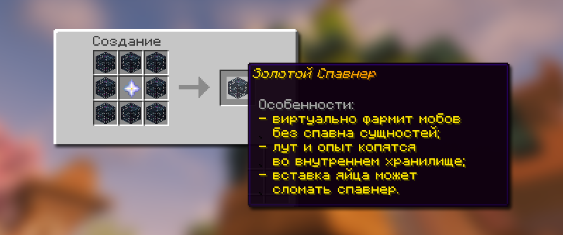
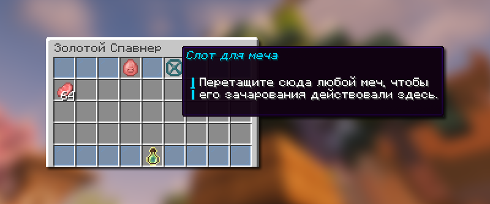

# 🌟 Золотой спавнер

Золотой спавнер – это спавнер, который вместо того, чтобы спавнить мобов - убивает их внутри себя.

## Как получить золотой спавнер?

<figure><figcaption>
Крафт Золотого спавнера
</figcaption></figure>

Золотой спавнер можно скрафтить из 8 любых спавнеров и одной звезды незера. Также вы можете забрать чужой спавнер, даже если он находится под чужим приватом, при помощи Золотой кирки Джейка.

## Как изменить моба в золотом спавнере?

Чтобы изменить моба, который будет фармиться в золотом спавнере, достаточно нажать желаемым яйцом призыва по спавнеру, тогда новый моб применится на этом спавнере.

В спавнер можно вставить любое яйцо призыва, даже Загадочное. Каждое яйцо имеет зарядов на 8-10 тысяч мобов, после чего нужно будет ставить новое яйцо.


При вставке каждого последующего яйца, шанс на поломку спавнера увеличивается, начиная с 0%: 1.9% 5.3% 9.7% 15% 21% 27.6% и т.д


## Особенности золотого спавнера

### Скорость спавна мобов

Спавнер убивает в среднем 10 мобов в секунду. Это в \~60 раз быстрее обычных спавнеров.&#x20;


Мобы спавнятся, только если есть подходящее место для их спавна (с учётом пространства и света). Например, чтобы заспавнился гаст, вокруг спавнера должна быть большая территория.


### Улучшение спавнера

<figure><figcaption>
Слот, куда можно положить меч в Золотом спавнере
</figcaption></figure>

Вы можете положить любой свой меч в «Слот для меча», и спавнер будет использовать его зачарования, чтобы убивать мобов. Это значит, что такие зачарования, как «Фармер» и «Добыча», будут влиять на лут и количество опыта.
