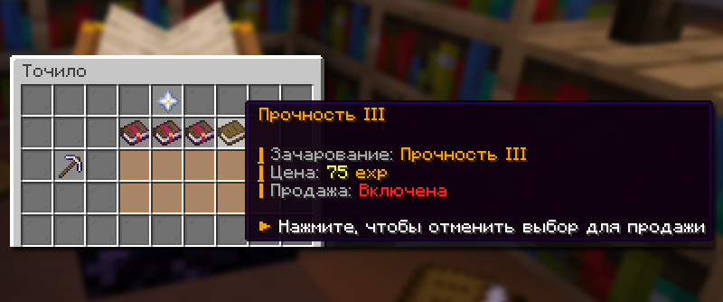
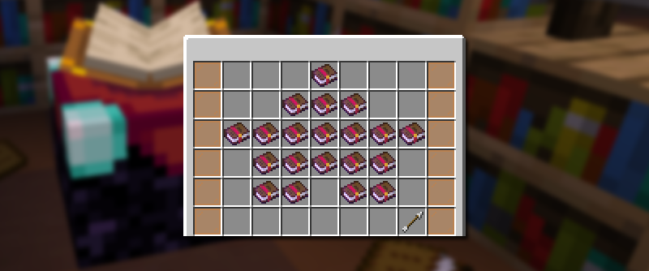

# 🪄 Зачарования

В режиме Лайт анархия система зачарований предлагает как улучшенные ванильные варианты с повышенными уровнями, так и уникальные кастомные чары с особыми эффектами.

## Точило

<figure><figcaption>
Меню Точило на Лайт анархии с возможностью удалять определенные зачарования
</figcaption></figure>

Точило на режиме Лайт анархия изменено, и добавлена возможность снимать определенные зачарования. Чтобы снять зачарования, просто положите желаемый предмет в специальный слот Точило и выберите то зачарование, которое вы хотите убрать. После нажмите на зеленую кнопку «Продать всё».

## Список кастомных зачарований

<figure><figcaption></figcaption></figure>

Зачарования для брони

| Название (макс. уровень) | Приминение      | Описание                                                                                                                          | Где получить                                   |
| ------------------------ | --------------- | --------------------------------------------------------------------------------------------------------------------------------- | ---------------------------------------------- |
| **Непробиваемый I**      | Все части брони | 5% шанс получить на 20% меньше урона, эффекты с разных частей брони складываются.                                                 | Чародейский  стол, ивенты, кейс с книгами      |
| Лаваход II               | Ботинки         | 
Позволяет ходить по лаве, превращая её в обсидиан, при использовании тратится прочность.  1 ур. — 3х3 2 ур. — 5х5
 | Чародейский стол стол,  ивенты, кейс с книгами |

Зачарования для инструментов

| Название              | Применение      | Описание                                                                                                | Где получить                                                                     |
| --------------------- | --------------- | ------------------------------------------------------------------------------------------------------- | -------------------------------------------------------------------------------- |
| Магнетизм 1 ур.       | Все инструменты | При добыче ресурсов выпадаемый лут сразу попадает в инвентарь.                                          | Чародейский стол, кейс с книгами                                                 |
| Бур 1-2 ур.           | Кирка           | 
Ломает территорию вокруг вскопанного блока.  1 ур. — 3х3х1 2 ур. — 3х3х2
                | Магазин шахтера /miner, чародейский стол, ивенты, кейс с книгами                 |
| Мега-бур 1 ур.        | Кирка           | 
Ломает территорию вокруг вскопанного блока.  1 ур. — 5х5х2
                                 | Премиум-магазин /shop                                                            |
| Автоплавка 1 ур.      | Кирка           | При добыче руды автоматически переплавляет.                                                             | Чародейский стол, кейс с книгами                                                 |
| Опытный 3 ур.         | Все инструменты | Предоставляет на 30% больше опыта при добыче, если инструмент с зачарованием находится в активной руке. | Чародейский стол, ивенты, кейс с книгами                                         |
| Неразрушимость 1 ур.  | Все инструменты | Запрещает использовать инструмент, если его прочность меньше 10 единиц.                                 | Чародейский стол, ивенты, кейс с книгами                                         |
| Дровосек 2-3 ур.      | Топор           | 
Позволяет срубить больше блоков дерева за одно нажатие.  2 ур. — до 32 3 ур. — до 128
   | Чародейский стол, ивенты, кейс с книгами                                         |
| Деликатный 3 ур.      | Мотыга          | Не ломает невыросшие растения, при использовании инструмента                                            | Чародейский стол                                                                 |
| Фермер 2-5 ур.        | Мотыга, топор   | Кратно увеличивает количество выпадающих культур.                                                       | Выбить с контейнера /container, Магазин Скупщика /b shop, Улучшить книгу /create |
| Посев 4 ур.           | Мотыга, топор   | При сборе культур может повторно посадить росток на место сбора с определенном шансом                   | Чародейский стол, ивенты                                                         |
| Фильтр 1 ур.          | Все инструменты | Убирает выпадение предметов, выбранных через команду /setfilter                                         | Чародейский стол, ивенты                                                         |

Зачарования для оружия

| Название          | Применение           | Описание                                                                                           | Где получить                             |
| ----------------- | -------------------- | -------------------------------------------------------------------------------------------------- | ---------------------------------------- |
| Крушитель 1-7 ур. | Меч, топор, трезубец | Наносит на 70% больше урона боссам.                                                                | Чародейский стол, кейс с книгами         |
| Разрушитель 2 ур. | Меч, топор           | Ударом по противнику в броне, вы ломаете его доспехи на 25% быстрее                                | Чародейский стол, ивенты, кейс с книгами |
| Критический 2 ур. | Меч, топор           | Предоставляет 20% шанс нанести на 15% больше урона.                                                | Чародейский стол, ивенты, кейс с книгами |
| Богач 1 ур.       | Меч                  | Увеличивает количество монет, получаемых при убийстве мобов, до 40% за каждый уровень зачарования. | Чародейский стол, кейс с книгами         |
| Самонаводка 4 ур. | Трезубец             | Если игрок находится в радиусе действия зачарования, то наводит трезубец на него.                  | Чародейский стол, кейс с книгами         |
| Оглушение 2 ур.   | Лук, арбалет         | При попадании стрелой в игрока доступен 5% шанс наложить замедление 4 уровня и слепоту.            | Чародейский стол, ивенты                 |

## Ванильные зачарования

На режиме Лайт анархия» некоторые ванильные зачарования получили возможность более высокого уровня, чем в обычном майнкрафте.

| Название          | Максимальный уровень |
| ----------------- | -------------------- |
| Эффективность     | 10 уровень           |
| Острота           | 7 уровень            |
| Защита            |  5 уровень           |
| Небесная кара     | 7 уровень            |
| Бич членистоногих | 7 уровень            |
| Прочность         | 5 уровень            |
| Добыча            | 5 уровень            |
| Удача             | 5 уровень            |
| Починка           | 2 уровень            |


## Особенности зачарований Прочность и Починка

### Изменение свойств

В майнкрафте зачарование Прочность влияет на шанс не потратить прочность брони. Теперь шанс определяется следующим образом: 47+(уровень зачарования\*10).

### Что относится к броне?

Ботинки, поножи, нагрудник и шлем из любых материалов (алмазы, незерит и т.д). А также Элитры.

### Как сильно это влияет?

Например, для брони с Прочностью 5 уровня: шанс не сломаться составляет примерно 33,33%. Так было ранее. Теперь же шанс не потратить ее прочность будет 97%. Таким образом вся броня стала крепче примерно в 22 раза и прослужит вам гораздо дольше.

### В чём подвох?

* Нельзя наложить починку на броню
* Нельзя починить броню в наковальне (прочность остается прежней)
* Нельзя починить броню при помощи команды `/fix`
* Пузырь опыта удалён

