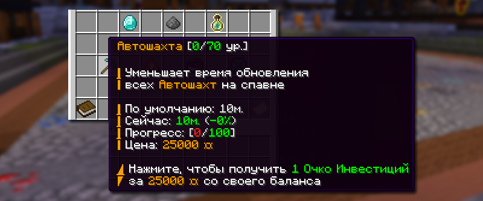
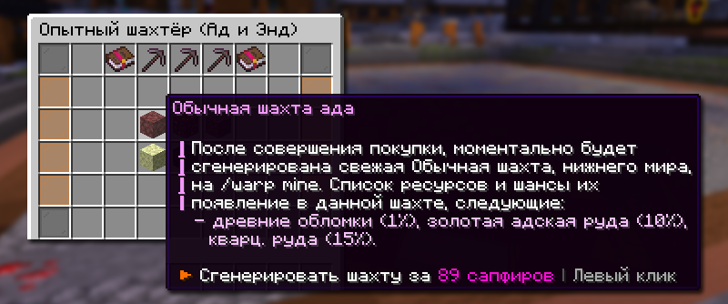

# ⛏️ Автошахта

Автошахта — это автоматически обновляемая зона добычи ресурсов, расположенная на спавне. Автошахта различных различается на три измерения и три уровня редкости, каждый из которых содержит определенный набор блоков.

## Как попасть на автошахту

Автошахту можно найти на спавне или телепортироваться по команде `/warp mine`, также есть альтернативные команды: `/warp mine1` — Шахта верхнего мира, `/warp mine2` — Шахта Нижнего мира и Энда.

## Классификация автошахт

### По измерениям

Автошахты разделены на три типа в зависимости от источника ресурсов:

* **Верхний мир** — содержит стандартные руды из обычного мира и взрывчатое вещество;
* **Нижний мир** — специализируется на адских блоках;
* **Энд мир** — предоставляет ресурсы из измерения Края.


В шахте 3969 блоков размером 21 на 21 на 9.


Список ресурсов, которые появляются в шахтах

| Шахта       | Ресурсы, которые можно найти                                                                                                                           |
| ----------- | ------------------------------------------------------------------------------------------------------------------------------------------------------ |
| Верхний мир | Алмазная руда, Золотая руда, Железная руда, Лазурит, Редстоун, Уголь, Камень, Булыжник, Осколки аметиста (1.20), Древние обломки, Взрывчатое вещество. |
| Нижний мир  | Древние обломки, Золотая адская руда, Кварцевая руда, Незерские кирпичи, Незеррак.                                                                     |
| Энд мир     | Блоки с эндер-перлами, Блоки с хорусами, Обсидиан, Эндерняк.                                                                                           |

### По уровню редкости

Каждое измерение имеет три варианта наполнения:

* **Обычная шахта** — базовый уровень содержания ресурсов;
* **Эпическая шахта** — повышенная концентрация ценных блоков;
* **Легендарная шахта** — максимальное содержание редких ресурсов.

Заполненность шахт определенным ресурсом в процентах

| Шахта       | Обычная                                                                                         | Эпическая                                                                                        | Легендарная                                                                                                                               |
| ----------- | ----------------------------------------------------------------------------------------------- | ------------------------------------------------------------------------------------------------ | ----------------------------------------------------------------------------------------------------------------------------------------- |
| Верхний мир | Алмазная руда 2%, золотые слитки 5%, железные слитки 5%, лазурит 7%, редстоун руда 8%, уголь 9% | Алмазная руда 5%,, золотые слитки 8%, железные слитки 8%, лазурит 5%, редстоун руда 5%, уголь 3% | Древние обломки 1%, алмазная руда 5%, золотые слитки 8%, железные слитки 8%, лазурит 5%, редстоун руда 5%, уголь 5%, взрывное вещество 1% |
| Нижний мир  | Древние обломки 1%, золотая адская руда 10%, кварцевая руда 15%                                 | Древние обломки 2%, золотая адская руда 20%, кварцевая руда 30%                                  | Древние обломки 4%, золотая адская руда 30%, кварцевая руда 50%                                                                           |
| Энд мир     | Блок с эндер-перлами 10%, блок с хорусами 10%, обсидиан 8%                                      | Блок с эндер-перлами 10%, блок с хорусами 10%, обсидиан 15%                                      | Блок с эндер-перлами 15%, блок с хорусами 15%, обсидиан 25%                                                                               |

## Обновление автошахты

### Автоматическое обновление шахты

Все шахты автоматически обновляются каждые 10 минут. Этот таймер может быть изменен при помощи системы Инвестиций.

### Ускорить обновление шахт через Инвестицию

<figure><figcaption></figcaption></figure>

Имея достаточно монеток, вы можете пожертвовать их в инвестицию «Автошахта» при помощи команды `/invest`. Данный множитель действует на всех игроков режима до конца вайпа.


Стартовая цена для пожертвования в инвестицию – 25.000 монеток



Каждый новый уровень инвестиции уменьшает время обновления шахт.


### Принудительное обновление шахта

<figure><figcaption></figcaption></figure>

Каждую шахту можно обновить за сапфиры и выбрать определенной уровень редкости.

* Обновить шахту Верхнего мира можно у НПС "Опытный шахтер", он находится около шахты Верхнего мира `/warp mine1`
* Обновить шахту Нижнего мира и Энда можно у НПС "Опытный шахтер", он находится около шахты Нижнего мира и Энда `/warp mine2`

Стоимость обновления шахт

| Измерение   | Обычная     | Эпическая    | Легендарная  |
| ----------- | ----------- | ------------ | ------------ |
| Верхний мир | 79 сапфиров | 99 сапфиров  | 119 сапфиров |
| Нижний мир  | 89 сапфиров | 109 сапфиров | 129 сапфиров |
| Энд мир     | 89 сапфиров | 109 сапфиров | 129 сапфиров |

