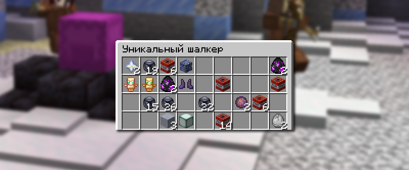

# 📦 Уникальный шалкер

Уникальный шалкер — особый шалкер, который находится на спавне, содержащий в себе множество как редких вещей, так и вещей для PvP.

## Где найти уникальные шалкер

Уникальный шалкер можно найти, просто гуляя по спавну, или прописать команду `/warp unique`.

## Как открыть уникальный шалкер

<figure><figcaption></figcaption></figure>

Чтобы открыть уникальный шалкер, вам необходимо иметь хотя бы один универсальный ключ. Нажмите универсальным ключом по шалкеру, тогда он откроется только для вас.

## Что выпадает из уникального шалкера

### Пурпурный шалкер

Броня

* Броня Infinity
* Броня Eternity

Оружие

* Меч Stinger
* Мечта Вупсеня

Инструменты

* Инструменты Stinger
* Золотая кирка Джейка

Особые предметы

* C4 Взрывчатка, Стиллер, Надежный стиллер, Динамит А, Динамит В, Разрывная волна, Взрывчатое вещество
* Боевой фрагмент
* Бутылек с уровнем
* Руна Бессмертие
* Сфера Eternity, Сфера Stinger, Сфера Armortality, Сфера Immortality, Легендарная сфера
* Талисман Eternity, Талисман Stinger
* Осколок сферы
* Зелье Победителя
* Стан, Трапка, Взрывная трапка
* Взрыная штучка, Ком снега, Снеговик, Светильник Джейка
* Артефакт
* Нерушимая наковальня

Обычные предметы

* Яйца призыва мобов
* Порох
* Золотое зачарованное яблоко, Золотое яблоко
* Чародейская книга
* Незеритовый блок
* Тотем бессмертия

### Красный шалкер

С вероятностью 10% после открытия Пурпурного шалкера может появиться Красный шалкер. Все вещи в красном шалкере удваиваются, кроме инструментов, брони и оружия.
