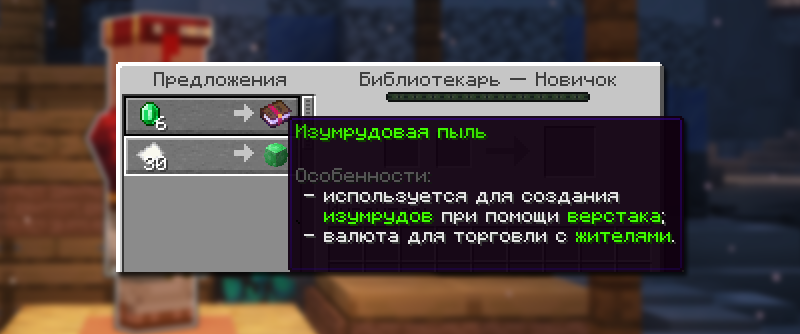
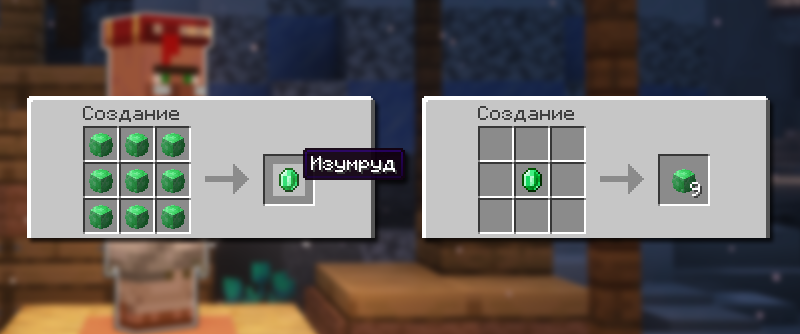

# ℹ️ Особенности Лайт анархии

Особенности торговли с жителями

Торговля с жителями на Лайт Анархии отличается от стандартной. Появилась новая валюта — Изумрудная пыль. Также в продаже доступны уникальные предметы.

## Особенности новой торговли с жителями

1. Жители с кастомными торгами предлагают уникальные товары, недоступные через стандартную систему торговли.
2. Цены и ассортимент отличаются от базовой игры.
3. **Скидки нельзя получить** заражением жителя в зомби-жителя и последующим лечением.
4. Кастомные торги могут иметь ограниченное количество использований и требовать времени для обновления

## Список профессий измененных жителей

| Профессия    | Блок            |
| ------------ | --------------- |
| Фермер       | Компостница     |
| Рыбак        | Бочка           |
| Библиотекарь | Кафедра         |
| Бронник      | Плавильная печь |
| Священник    | Зельеварка      |
| Лучник       | Стол лучника    |
| Мясник       | Коптильня       |

## Изумрудовая пыль

<figure><figcaption>
Пример того, что жители продают Изумрудовую пыль у себя
</figcaption></figure>

При торговле с жителями, которым изменили свои предметы, вы увидите новую валюту — Изумрудовую пыль. С её помощью можно продолжать торговлю и получать уникальные вещи.

### Создание изумрудовой пыли

<figure><figcaption>
Создание Изумруда и Изумрудовой пыли
</figcaption></figure>

Чтобы создать Изумрудовую пыль, положите один изумруд в верстак. Вы получите девять единиц Изумрудовой пыли. Если вам нужно вернуть изумруд, просто разместите девять единиц Изумрудовой пыли в верстаке.

### Способы получения изумрудовой пыли

| Источник                | Описание                                             |
| ----------------------- | ---------------------------------------------------- |
| **Разборка изумрудов**  | 1 изумруд = 9 единиц пыли                            |
| **Ивенты сервера**      | Награды за участие в различных активностях           |
| **Торговля с жителями** | Некоторые жители могут давать пыль в обмен на товары |



## Урон кристаллов Энда

Кристаллы Энда сносят намного больше урона. Защита от взрывов на броне сильно помогает от этого.



## Ограничение количества спавнеров

В одном чанке можно разместить до 16 спавнеров.



## Выпадение опыта при смерти

Опыт при смерти не выпадает. Единственное исключение — охотник: в этом случае остается 50%.


