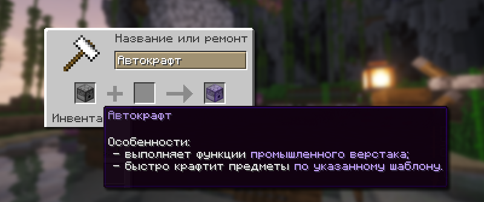
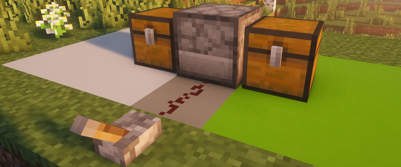
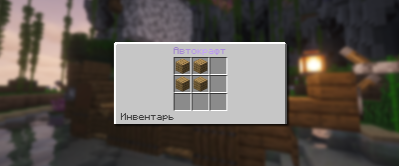

# 🏭 Автокрафт

Автокрафт — это специальный функциональный блок, который позволяет создавать предметы в автоматическом режиме при помощи сигнала редстоуна.

## Как создать блок автокрафта

<figure><figcaption>
Создание блока Автокрафта на наковальне
</figcaption></figure>

Чтобы создать блок автокрафта, вам достаточно переименовать **раздатчик** на наковальне в «Автокрафт», при этом это будет стоит 1 уровень опыта.

## Как работает автокрафт

### Правильная установка

Работа автокрафта достаточно проста, чтобы правильно его установить, поставьте его лицевую часть блока в ту сторону, куда будет класться результат крафта, а противоположную сторону от куда будут браться материалы. И подведите сигнал редстоуна к блоку автокрафта любым способом.

<figure><figcaption>
Простой пример постройки системы автокрафта
</figcaption></figure>

### Рецепт крафта

<figure><figcaption>
Пример рецепта верстака на автокрафте
</figcaption></figure>

Чтобы выбрать рецепт для крафта, откройте меню автокрафта и поместите туда предметы, как на обычном верстаке.

### Работа автокрафта

Если вы правильно установили все блоки и выложили рецепт, то вам достаточно просто провести сигнал редстоуна к блоку автокрафта.


Вы можете активировать автокрафт любым способом: любой кнопкой или рычагом, наблюдателем или же вовсе сложными цепочками редстоуна.

