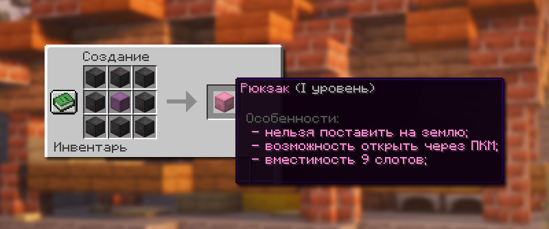
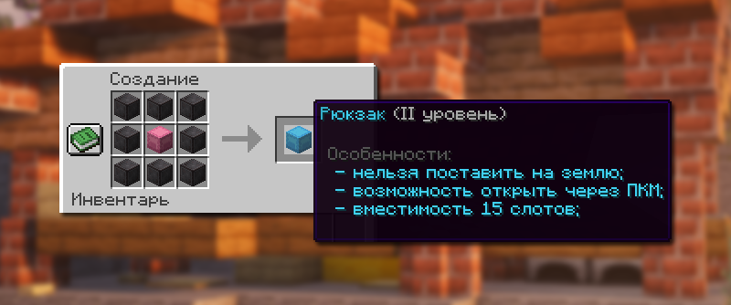
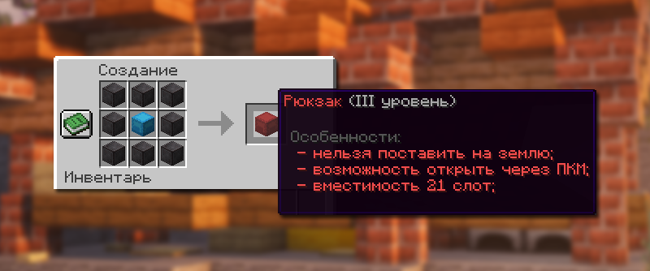
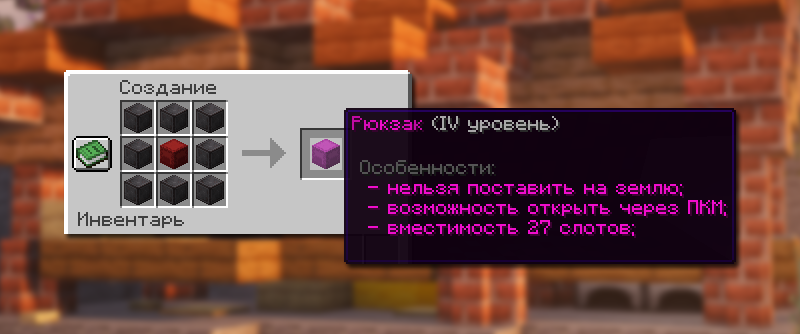
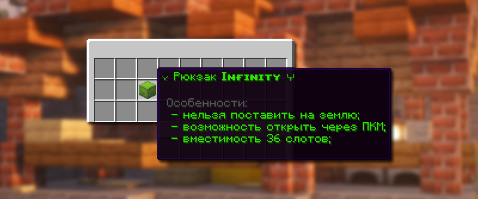

# 🎒 Рюкзак

Рюкзак – специальный шалкер, позволяющий хранить определенное количество предметов, открытие которого доступно в любом месте правой кнопкой мыши.

## Как открыть рюкзак

Чтобы открыть рюкзак, нажмите правую кнопку мыши, удерживая его в руке.

## Виды рюкзаков

### Рюкзак 1 уровня

<figure><figcaption>
Крафт рюкзака 1 уровня
</figcaption></figure>

| Количество слотов | Ингредиенты для крафта                 | Как получить |
| ----------------- | -------------------------------------- | ------------ |
| 9 слотов          | Шалкеровый ящик и 8 незеритовых блоков | Скрафтить    |

### Рюкзак 2 уровня

<figure><figcaption>
Крафт рюкзака 2 уровня
</figcaption></figure>

| Количество слотов | Ингредиенты для крафта                 | Как получить |
| ----------------- | -------------------------------------- | ------------ |
| 15 слотов         | Рюкзак 1 уровня и 8 незеритовых блоков | Скрафтить    |

### Рюкзак 3 уровня

<figure><figcaption>
Крафт рюкзака 3 уровня
</figcaption></figure>

| Количество слотов | Ингредиенты для крафта                 | Как получить |
| ----------------- | -------------------------------------- | ------------ |
| 21 слот           | Рюкзак 2 уровня и 8 незеритовых блоков | Скрафтить    |

### Рюкзак 4 уровня

<figure><figcaption>
Крафт рюкзака 4 уровня
</figcaption></figure>

| Количество слотов | Ингредиенты для крафта                 | Как получить |
| ----------------- | -------------------------------------- | ------------ |
| 27 слотов         | Рюкзак 3 уровня и 8 незеритовых блоков | Скрафтить    |

### Рюкзак Infinity

<figure><figcaption>
Рюкзак Infinity
</figcaption></figure>

| Количество слотов | Ингредиенты для крафта | Как получить                      |
| ----------------- | ---------------------- | --------------------------------- |
| 36 слотов         | Нельзя скрафтить       | Купить в премиум-магазине `/shop` |

## Особенности рюкзаков

### Ограничение в PvP режиме

Во время PvP из рюкзаков нельзя вытащить тотемы бессмертия и талисманы.

### Режим шалкера

При наличии двух или более рюкзаков в инвентаре активируется «Режим шалкера». В этом режиме все шалкеровые ящики и рюкзаки выпадают из инвентаря при выходе с сервера.


Для избежания потери рюкзаков рекомендуется хранить в инвентаре не более одного рюкзака одновременно.

