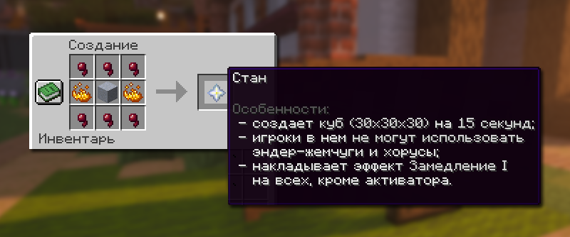
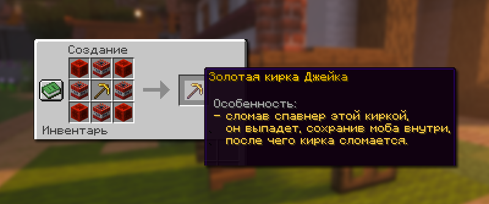
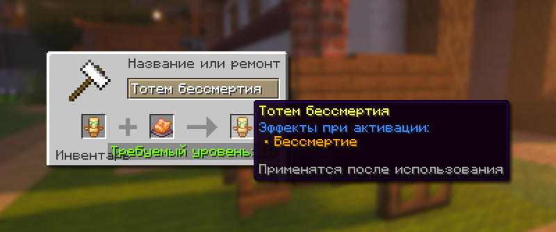
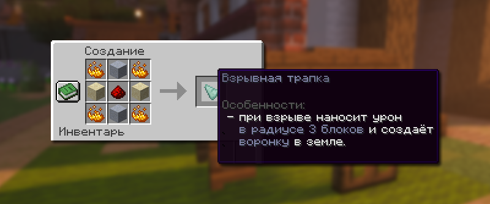
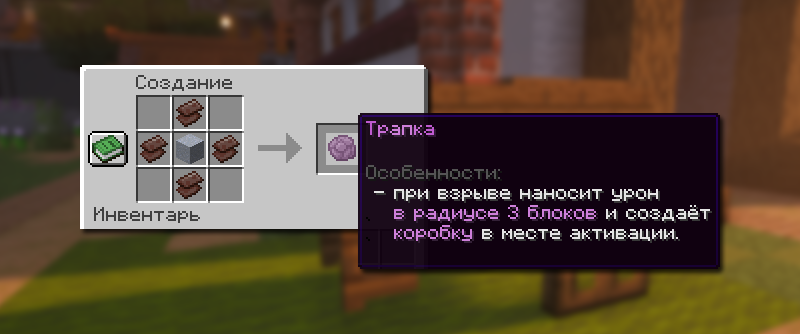

# ⚒️ Кастомные предметы

Кастомные предметы — это особые предметы с уникальными свойствами, они помогают, облегчают игру и дают полезные эффекты.

## Кастомные предметы

<table><thead><tr><th width="165">Предмет</th><th>Описание</th><th>Как получить</th></tr></thead><tbody><tr><td><strong>Стан</strong></td><td>При активации создает куб 30х30х30 на 15 секунд. Игроки в нём не могут использовать эндер-жемчуг и хорусы. Накладывает эффект Замедления 1 уровня на всех, кроме активатора.</td><td>
Скрафтить из 6 паучьих глаз, 2 огненных порошков и 1 взрывчатого вещества.

</td></tr><tr><td>Особый компас</td><td>Указывает на ближайшую или случайную сокровищницу после нажатия ПКМ. Используется раз в 8 часов.</td><td>Получить с ивентов, найти в сокровищницах, выбить из уникального шалкера <code>/warp unique</code>, купить в премиум-магазине <code>/shop</code>.</td></tr><tr><td>Золотая кирка Джейка</td><td>Сломав спавнер этой киркой, он выпадет, сохранив моба внутри, после чего кирка сломается.</td><td>
Скрафтить из 1 золотой кирки, 4 стиллеров, 4 редстоуновых блоков.

</td></tr><tr><td>Руна "Бессмертие"</td><td>После активации тотема с этим эффектом, вы получаете неуязвимость к урону продолжительностью 3 секунды. Возможность наложить эффект на тотем через наковальню.</td><td>Получить с ивентов, найти в сокровищницах, выбить из уникального шалкера <code>/warp unique</code></td></tr><tr><td>Взрывная трапка</td><td>Образует при взрыве временную сферическую структуру из льда.</td><td>
Получить с ивентов, найти в сокровищницах, выбить из уникального шалкера <code>/warp unique</code>. Скрафтить из 1 редстоуновой пыли, 2 взрывчатых веществ, 2 песка, 4 огненных порошков.

</td></tr><tr><td>Трапка</td><td>При активации наносит урон в радиусе 3 блоков и создает временную коробку. Не работает на заприваченных территориях.</td><td>
Получить с ивентов, найти в сокровищницах, выбить из уникального шалкера <code>/warp unique</code>. Скрафтить из 1 взрывчатого вещества, 4 незеритовых ломов

</td></tr><tr><td>Универсальный ключ</td><td>Позволяет открывать уникальный шалкер /warp unique, призывать боссов на ПВП-арене</td><td>Получить с ивентов, найти в сокровищницах, в ванильных данжах.</td></tr><tr><td>Нерушимые элитры</td><td>Элитры с бесконечной прочностью</td><td>Получить с ивентов, купить в премиум-магазине <code>/shop</code>.</td></tr><tr><td>Броневая элитра</td><td>Дает защиту как алмазный нагрудник, а также сохраняет функцию элитр.</td><td>Получить с ивентов, купить в премиум-магазине <code>/shop</code>.</td></tr><tr><td>Шлем солнца</td><td>Имеет свойства незеритового шлема, полностью нерушим, возможность накладывать зачарования. По умолчанию зачарован на: защита от снарядов 5 уровня, защиту 5  уровня, подводное дыхание 3 уровня, взрывоустойчивость 5 уровня, подводник, непробиваемый 2 уровня.</td><td>Получить с ивентов, найти в сокровищницах <code>/warp unique</code>, купить в премиум-магазине <code>/shop</code>, улучшить шлем Infinity в <code>/create</code> с шансом 15%.</td></tr><tr><td>Ботинки солнца</td><td>Имеет свойства незеритового шлема, полностью нерушим, возможность накладывать зачарования. По умолчанию зачарован на: защита от снарядов 5 уровня, защиту 5 уровня, невесомость 4 уровня, взрывоустойчивость 5 уровня, скорость души 3 уровня, подводная ходьба 3 уровня, огнеупорность 5 уровня, непробиваемый 2 уровня.</td><td>Магазин Скупщика <code>/b shop</code></td></tr><tr><td>Меч Цербера</td><td>Имеет свойства незеритового шлема. По умолчанию зачарован на: починка, небесная кара 7 уровня, добыча 5 уровня, бич членистоногих 7 уровня, заговор огня 2 уровня, разящий клинок 3 уровня, острота 9 уровня, прочность 5 уровня, разрушитель 3 уровня, богач 6 уровня, критический 2 уровня.  Самый сильный меч на данным момент на режиме.</td><td>Улучшить меч Infinity в <code>/create</code> c шансом 10%.</td></tr></tbody></table>


Данный список не включает абсолютно все кастомные предметы на Лайт анархии. Большинство предметов и их функционал расписан в других разделах википедии.


## Донатная броня и инструменты

Броня

| Предмет           | Описание                                                                                         | Как получить                                          |
| ----------------- | ------------------------------------------------------------------------------------------------ | ----------------------------------------------------- |
| Шлем Griefer      | Имеет свойства кольчужной брони. По умолчанию зачарован на: защита 1 уровня, прочность 1 уровня. | Имея привилегию Griefer получить набор `/kit griefer` |
| Нагрудник Griefer | Имеет свойства кольчужной брони. По умолчанию зачарован на: защита 1 уровня, прочность 1 уровня. | Имея привилегию Griefer получить набор `/kit griefer` |
| Штаны Griefer     | Имеет свойства кольчужной брони. По умолчанию зачарован на: защита 1 уровня, прочность 1 уровня. | Имея привилегию Griefer получить набор `/kit griefer` |
| Ботинки Griefer   | Имеет свойства кольчужной брони. По умолчанию зачарован на: защита 1 уровня, прочность 1 уровня. | Имея привилегию Griefer получить набор `/kit griefer` |

| Предмет           | Описание                                                                                       | Как получить                                                                                  |
| ----------------- | ---------------------------------------------------------------------------------------------- | --------------------------------------------------------------------------------------------- |
| Шлем Mustang      | Имеет свойства железной брони. По умолчанию зачарован на: защита 2 уровня, прочность 2 уровня. | Имея привилегию Mustang получить набор `/kit mustang`, улучшить шлем Griefer в `/create`      |
| Нагрудник Mustang | Имеет свойства железной брони. По умолчанию зачарован на: защита 2 уровня, прочность 2 уровня. | Имея привилегию Mustang получить набор `/kit mustang`, улучшить нагрудник Griefer в `/create` |
| Штаны Mustang     | Имеет свойства железной брони. По умолчанию зачарован на: защита 2 уровня, прочность 2 уровня. | Имея привилегию Mustang получить набор `/kit mustang`, улучшить штаны Griefer в `/create`     |
| Ботинки Mustang   | Имеет свойства железной брони. По умолчанию зачарован на: защита 2 уровня, прочность 2 уровня. | Имея привилегию Mustang получить набор `/kit mustang`, улучшить ботинки Griefer в `/create`   |

| Предмет         | Описание                                                                                       | Как получить                                                                              |
| --------------- | ---------------------------------------------------------------------------------------------- | ----------------------------------------------------------------------------------------- |
| Шлем Ghast      | Имеет свойства железной брони. По умолчанию зачарован на: защита 2 уровня, прочность 2 уровня. | Имея привилегию Ghast получить набор `/kit ghast`, улучшить шлем Mustang в `/create`      |
| Нагрудник Ghast | Имеет свойства алмазной брони. По умолчанию зачарован на: защита 1 уровня, прочность 1 уровня. | Имея привилегию Ghast получить набор `/kit ghast`, улучшить нагрудник Mustang в `/create` |
| Штаны Ghast     | Имеет свойства железной брони. По умолчанию зачарован на: защита 2 уровня, прочность 2 уровня. | Имея привилегию Ghast получить набор `/kit ghast`, улучшить штаны Mustang в `/create`     |
| Ботинки Ghast   | Имеет свойства алмазной брони. По умолчанию зачарован на: защита 1 уровня, прочность 1 уровня. | Имея привилегию Ghast получить набор `/kit ghast`, улучшить ботинки Mustang в `/create`   |

| Предмет          | Описание                                                                                       | Как получить                                                                              |
| ---------------- | ---------------------------------------------------------------------------------------------- | ----------------------------------------------------------------------------------------- |
| Шлем Wither      | Имеет свойства алмазной брони. По умолчанию зачарован на: защита 2 уровня, прочность 2 уровня. | Имея привилегию Wither получить набор `/kit wither`, улучшить шлем Ghast в `/create`      |
| Нагрудник Wither | Имеет свойства алмазной брони. По умолчанию зачарован на: защита 2 уровня, прочность 2 уровня. | Имея привилегию Wither получить набор `/kit wither`, улучшить нагрудник Ghast в `/create` |
| Штаны Wither     | Имеет свойства алмазной брони. По умолчанию зачарован на: защита 2 уровня, прочность 2 уровня. | Имея привилегию Wither получить набор `/kit wither`, улучшить штаны Ghast в `/create`     |
| Ботинки Wither   | Имеет свойства алмазной брони. По умолчанию зачарован на: защита 2 уровня, прочность 2 уровня. | Имея привилегию Wither получить набор `/kit wither`, улучшить ботинки Ghast в `/create`   |

| Предмет          | Описание                                                                                                                                                                                                                                                   | Как получить                                                                               |
| ---------------- | ---------------------------------------------------------------------------------------------------------------------------------------------------------------------------------------------------------------------------------------------------------- | ------------------------------------------------------------------------------------------ |
| Шлем Kraken      | Имеет свойства алмазной брони. По умолчанию зачарован на: защита 3 уровня, подводное дыхание 3 уровня, защита от снарядов 3 уровня, прочность 2 уровня, подводник, огнеупорность 2 уровня, взрывоустойчивость 2 уровня.                                    | Имея привилегию Kraken получить набор `/kit kraken`, улучшить шлем Wither в `/create`      |
| Нагрудник Kraken | Имеет свойства алмазной брони. По умолчанию зачарован на:  защита 3 уровня, защита от снарядов 2 уровня, прочность 2 уровня, огнеупорность 2 уровня, взрывоустойчивость 2 уровня.                                                                          | Имея привилегию Kraken получить набор `/kit kraken`, улучшить нагрудник Wither в `/create` |
| Штаны Kraken     | Имеет свойства алмазной брони. По умолчанию зачарован на: защита 3 уровня, защита от снарядов 2 уровня, прочность 2 уровня, огнеупорность 2 уровня, взрывоустойчивость 2 уровня.                                                                           | Имея привилегию Kraken получить набор `/kit kraken`, улучшить штаны Wither в `/create`     |
| Ботинки Kraken   | Имеет свойства алмазной брони. По умолчанию зачарован на: защита 3 уровня, подводная ходьба 3 уровня, защита от снарядов 2 уровня, скорость души 3 уровня, прочность 2 уровня, взрывоустойчивость 2 уровня, огнеупорность 2 уровня, невесомость 1 уровня.  | Имея привилегию Kraken получить набор `/kit kraken`, улучшить ботинки Wither в `/create`   |

| Предмет          | Описание                                                                                                                                                                                                                                                      | Как получить                                                                               |
| ---------------- | ------------------------------------------------------------------------------------------------------------------------------------------------------------------------------------------------------------------------------------------------------------- | ------------------------------------------------------------------------------------------ |
| Шлем Dragon      | Имеет свойства незеритовой брони. По умолчанию зачарован на: защита 3 уровня, подводное дыхание 3 уровня, защита от снарядов 3 уровня, прочность 3 уровня, подводник, огнеупорность 3 уровня, взрывоустойчивость 3 уровня.                                    | Имея привилегию Dragon получить набор `/kit dragon`, улучшить шлем Kraken в `/create`      |
| Нагрудник Dragon | Имеет свойства незеритовой брони. По умолчанию зачарован на:  защита 3 уровня, защита от снарядов 3 уровня, прочность 3 уровня, огнеупорность 3 уровня, взрывоустойчивость 3 уровня.                                                                          | Имея привилегию Dragon получить набор `/kit dragon`, улучшить нагрудник Kraken в `/create` |
| Штаны Dragon     | Имеет свойства незеритовой брони. По умолчанию зачарован на: защита 3 уровня, защита от снарядов 3 уровня, прочность 3 уровня, огнеупорность 3 уровня, взрывоустойчивость 3 уровня.                                                                           | Имея привилегию Dragon получить набор `/kit dragon`, улучшить штаны Kraken в `/create`     |
| Ботинки Dragon   | Имеет свойства незеритовой брони. По умолчанию зачарован на: защита 3 уровня, подводная ходьба 3 уровня, защита от снарядов 3 уровня, скорость души 3 уровня, прочность 3 уровня, взрывоустойчивость 3 уровня, огнеупорность 3 уровня, невесомость 2 уровня.  | Имея привилегию Dragon получить набор `/kit dragon`, улучшить ботинки Kraken в `/create`   |

| Предмет           | Описание                                                                                                                                                                                                                                                      | Как получить                                                                                 |
| ----------------- | ------------------------------------------------------------------------------------------------------------------------------------------------------------------------------------------------------------------------------------------------------------- | -------------------------------------------------------------------------------------------- |
| Шлем Stinger      | Имеет свойства незеритовой брони. По умолчанию зачарован на: защита 4 уровня, подводное дыхание 3 уровня, защита от снарядов 4 уровня, прочность 4 уровня, подводник, огнеупорность 4 уровня, взрывоустойчивость 4 уровня.                                    | Имея привилегию Stinger получить набор `/kit stinger`, улучшить шлем Dragon в `/create`      |
| Нагрудник Stinger | Имеет свойства незеритовой брони. По умолчанию зачарован на: защита 4 уровня, подводное дыхание 3 уровня, защита от снарядов 4 уровня, прочность 4 уровня, огнеупорность 4 уровня, взрывоустойчивость 4 уровня.                                               | Имея привилегию Stinger получить набор `/kit stinger`, улучшить нагрудник Dragon в `/create` |
| Штаны Stinger     | Имеет свойства незеритовой брони. По умолчанию зачарован на: защита 4 уровня, подводное дыхание 3 уровня, защита от снарядов 4 уровня, прочность 4 уровня, огнеупорность 4 уровня, взрывоустойчивость 4 уровня.                                               | Имея привилегию Stinger получить набор `/kit stinger`, улучшить штаны Dragon в `/create`     |
| Ботинки Stinger   | Имеет свойства незеритовой брони. По умолчанию зачарован на:  защита 4 уровня, подводная ходьба 3 уровня, защита от снарядов 4 уровня, скорость души 3 уровня, прочность 4 уровня, взрывоустойчивость 4 уровня, огнеупорность 4 уровня, невесомость 4 уровня. | Имея привилегию Stinger получить набор `/kit stinger`, улучшить ботинки Dragon в `/create`   |

| Предмет            | Описание                                                                                                                                                                                                                                                                                                        | Как получить                                                                                    |
| ------------------ | --------------------------------------------------------------------------------------------------------------------------------------------------------------------------------------------------------------------------------------------------------------------------------------------------------------- | ----------------------------------------------------------------------------------------------- |
| Шлем Eternity      | Имеет свойства незеритовой брони. По умолчанию зачарован на: защита 5 уровня, подводное дыхание 3 уровня, защита от снарядов 5 уровня, прочность 5 уровня, подводник, огнеупорность 5 уровня, взрывоустойчивость 5 уровня, [непробиваемый 1 уровня](#user-content-fn-1)[^1].                                    | Имея привилегию Eternity получить набор `/kit eternity`, улучшить шлем Stinger в `/create`      |
| Нагрудник Eternity | Имеет свойства незеритовой брони. По умолчанию зачарован на: защита 5 уровня, защита от снарядов 5 уровня, прочность 5 уровня, огнеупорность 5 уровня, взрывоустойчивость 5 уровня, [непробиваемый 1 уровня](#user-content-fn-1)[^1].                                                                           | Имея привилегию Eternity получить набор `/kit eternity`, улучшить нагрудник Stinger в `/create` |
| Штаны Eternity     | Имеет свойства незеритовой брони. По умолчанию зачарован на: защита 5 уровня, защита от снарядов 5 уровня, прочность 5 уровня, огнеупорность 5 уровня, взрывоустойчивость 5 уровня, [непробиваемый 1 уровня](#user-content-fn-1)[^1].                                                                           | Имея привилегию Eternity получить набор `/kit eternity`, улучшить штаны Stinger в `/create`     |
| Ботинки Eternity   | Имеет свойства незеритовой брони. По умолчанию зачарован на: защита 5 уровня, подводная ходьба 3 уровня, защита от снарядов 5 уровня, скорость души 3 уровня, прочность 5 уровня, взрывоустойчивость 5 уровня, огнеупорность 5 уровня, невесомость 4 уровня, [непробиваемый 1 уровня](#user-content-fn-1)[^1].  | Имея привилегию Eternity получить набор `/kit eternity`, улучшить ботинки Stinger в `/create`   |

| Предмет            | Описание                                                                                                                                                                                                                                                                                                        | Как получить                                                                                      |
| ------------------ | --------------------------------------------------------------------------------------------------------------------------------------------------------------------------------------------------------------------------------------------------------------------------------------------------------------- | ------------------------------------------------------------------------------------------------- |
| Шлем Infinity      | Имеет свойства незеритовой брони. По умолчанию зачарован на:  защита 5 уровня, подводное дыхание 3 уровня, защита от снарядов 5 уровня, прочность 5 уровня, подводник, огнеупорность 5 уровня, взрывоустойчивость 5 уровня, [непробиваемый 2 уровня](#user-content-fn-2)[^2].                                   | Имея кастомную привилегию получить набор `/kit infinity`, улучшить шлем Stinger в `/create`       |
| Нагрудник Infinity | Имеет свойства незеритовой брони. По умолчанию зачарован на: защита 5 уровня, защита от снарядов 5 уровня, прочность 5 уровня, огнеупорность 5 уровня, взрывоустойчивость 5 уровня, [непробиваемый 2 уровня](#user-content-fn-2)[^2].                                                                           | Имея кастомную привилегию получить набор `/kit infinity`, улучшить нагрудник Eternity в `/create` |
| Штаны Infinity     | Имеет свойства незеритовой брони. По умолчанию зачарован на: защита 5 уровня, защита от снарядов 5 уровня, прочность 5 уровня, огнеупорность 5 уровня, взрывоустойчивость 5 уровня, [непробиваемый 2 уровня](#user-content-fn-2)[^2].                                                                           | Имея кастомную привилегию получить набор `/kit infinity`, улучшить штаны Eternity в `/create`     |
| Ботинки Infinity   | Имеет свойства незеритовой брони. По умолчанию зачарован на: защита 5 уровня, подводная ходьба 3 уровня, защита от снарядов 5 уровня, скорость души 3 уровня, прочность 5 уровня, огнеупорность 5 уровня, взрывоустойчивость 5 уровня, невесомость 4 уровня, [непробиваемый 2 уровня](#user-content-fn-2)[^2].  | Имея кастомную привилегию получить набор `/kit infinity`, улучшить ботинки Eternity в `/create`   |

Инструменты

| Предмет | Описание | Как получить |
| ------- | -------- | ------------ |
|         |          |              |
|         |          |              |
|         |          |              |

Оружие

| Предмет | Описание | Как получить |
| ------- | -------- | ------------ |
|         |          |              |
|         |          |              |
|         |          |              |

[^1]: 5% шанс получить на 20% меньше урона, эффекты с разных частей брони складываются.

[^2]: 5% шанс получить на 20% меньше урона, эффекты с разных частей брони складываются.\
    \
    Второй уровень зачарования только на броне Infinity.
