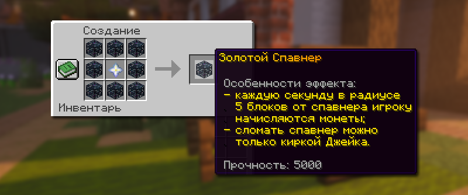

# ⚒️ Кастомные предметы

Кастомные предметы — это особые предметы с уникальными свойствами, они помогают, облегчают игру и дают полезные эффекты.

## Кастомные предметы

<table><thead><tr><th width="165">Предмет</th><th>Описание</th><th>Как получить</th></tr></thead><tbody><tr><td><strong>Стан</strong></td><td>При активации создает куб 30х30х30 на 15 секунд. Игроки в нём не могут использовать эндер-жемчуг и хорусы. Накладывает эффект Замедления 1 уровня на всех, кроме активатора.</td><td>
Скрафтить из 6 паучьих глаз, 2 огненных порошков и 1 взрывчатого вещества.

</td></tr><tr><td>Золотой спавнер</td><td>Каждые 5 секунд в радиусе 5 блоков от спавнера игроку начисляются монеты. Может быть сломан только киркой Джейка без потери спавнера. Спавнер можно сломать, даже если он находится под чужим приватом. Имеет ограниченную прочность в 5000.</td><td>Купить в премиум-магазине <code>/shop</code>. Скрафтить из 8 спавнеров и 1 Звезды Незера.</td></tr><tr><td>Особый компас</td><td>Указывает на ближайшую или случайную сокровищницу после нажатия ПКМ. Используется раз в 8 часов.</td><td>Получить с ивентов, найти в сокровищницах, выбить из уникального шалкера <code>/warp unique</code>, купить в премиум-магазине <code>/shop</code>.</td></tr><tr><td>Золотая кирка Джейка</td><td>Сломав спавнер этой киркой, он выпадет, сохранив моба внутри, после чего кирка сломается.</td><td>
Скрафтить из 1 золотой кирки, 4 стиллеров, 4 редстоуновых блоков.

</td></tr><tr><td>Руна "Бессмертие"</td><td>После активации тотема с этим эффектом, вы получаете неуязвимость к урону продолжительностью 3 секунды. Возможность наложить эффект на тотем через наковальню.</td><td>Получить с ивентов, найти в сокровищницах, выбить из уникального шалкера <code>/warp unique</code></td></tr><tr><td>Взрывная трапка</td><td>Образует при взрыве временную сферическую структуру из льда.</td><td>
Получить с ивентов, найти в сокровищницах, выбить из уникального шалкера <code>/warp unique</code>. Скрафтить из 1 редстоуновой пыли, 2 взрывчатых веществ, 2 песка, 4 огненных порошков.

</td></tr><tr><td>Трапка</td><td>При активации наносит урон в радиусе 3 блоков и создает временную коробку. Не работает на заприваченных территориях.</td><td>
Получить с ивентов, найти в сокровищницах, выбить из уникального шалкера <code>/warp unique</code>. Скрафтить из 1 взрывчатого вещества, 4 незеритовых ломов

</td></tr><tr><td>Универсальный ключ</td><td>Позволяет открывать уникальный шалкер /warp unique, призывать боссов на ПВП-арене</td><td>Получить с ивентов, найти в сокровищницах, в ванильных данжах.</td></tr><tr><td>Нерушимые элитры</td><td>Элитры с бесконечной прочностью</td><td>Получить с ивентов, купить в премиум-магазине <code>/shop</code>.</td></tr><tr><td>Броневая элитра</td><td>Дает защиту как алмазный нагрудник, а также сохраняет функцию элитр.</td><td>Получить с ивентов, купить в премиум-магазине <code>/shop</code>.</td></tr><tr><td>Шлем солнца</td><td>Имеет свойства незеритового шлема, полностью нерушим, возможность накладывать зачарования. По умолчанию зачарован на: защита от снарядов 5 уровня, защиту 5  уровня, подводное дыхание 3 уровня, взрывоустойчивость 5 уровня, подводник, непробиваемый 2 уровня.</td><td>Получить с ивентов, найти в сокровищницах <code>/warp unique</code>, купить в премиум-магазине <code>/shop</code>, улучшить шлем Infinity в <code>/create</code></td></tr><tr><td>Ботинки солнца</td><td>Имеет свойства незеритового шлема, полностью нерушим, возможность накладывать зачарования. По умолчанию зачарован на: защита от снарядов 5 уровня, защиту 5 уровня, невесомость 4 уровня, взрывоустойчивость 5 уровня, скорость души 3 уровня, подводная ходьба 3 уровня, огнеупорность 5 уровня, непробиваемый 2 уровня.</td><td>Магазин Скупщика <code>/b shop</code></td></tr></tbody></table>


Данный список не включает абсолютно все кастомные предметы на Лайт анархии. Большинство предметов и их функционал расписан в других разделах википедии.

