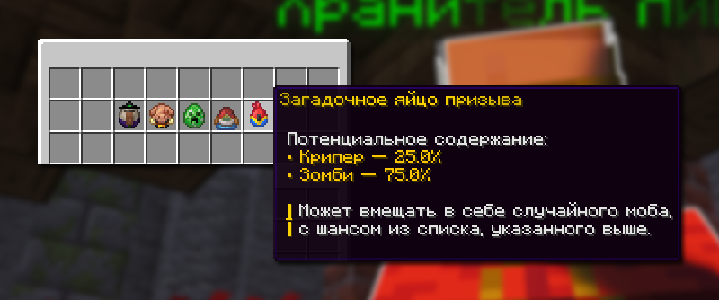
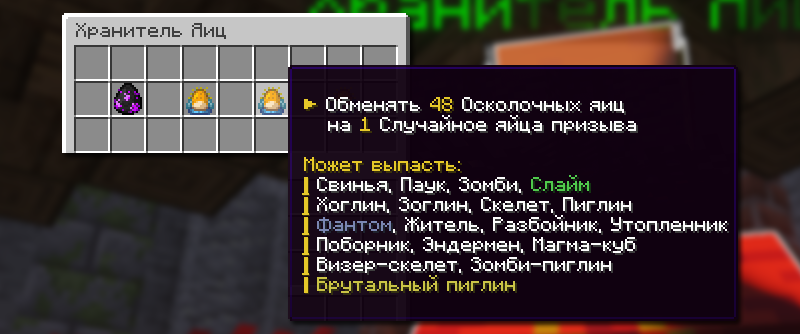

# 🥚 Яйца призыва

## Загадочные яйца призыва

### Как получить Загадочные яйца призыва

<figure><figcaption></figcaption></figure>

Получить Загадочные яйца можно на ивентах, в магазине Скупщика `/b shop`, а также, если у вас уже есть одно из яиц, то вы можете улучшить его в `/create`.

### Для чего нужны Загадочные яйца призыва

При активации по спавнеру загадочным яйцом, то моб поменяется на случайный от выбранного загадочного яйца. Всего есть 6 видов загадочных яиц, у которых есть повышенный шанс на спавн определенного моба. Вы также можете просто заспавнить моба, кликнув по блоку.


Виды загадочных яиц

1. Загадочное яйцо призыва ведьмы\
   Шансы на призыв моба:\
   — Брутальный пиглин 25%\
   — **Ведьма 7%**\
   — Блейз 20%\
   — Зомби 18%\
   — Скелет 30%
2. Загадочное яйцо призыва пиглина\
   Шансы на призыв моба:\
   — **Брутальный пиглин 50%**\
   — Ведьма 4%\
   — Мини-зомби 20%\
   — Крипер 1%\
   — Блейз 25%
3. Загадочное яйцо призыва крипера\
   Шансы на призыв моба:\
   — Брутальный пиглин 33%\
   — **Крипер 2%**\
   — Блейз 17.5%\
   — Зомби 17.5%\
   — Скелет 30%
4. Загадочное яйцо призыва попугая\
   Шансы на призыв моба:\
   — Крипер 25%\
   — Зомби 75%
5. Загадочное яйцо призыва лосося\
   Шансы на призыв моба:\
   — Зимогор 12.5%\
   — Брутальный пиглин 12.5%\
   — Мини-зомби 12.5%\
   — Кадавр 12.5%\
   — Блейз 12.5%\
   — Зомбифицированный пиглин 12.5\
   — Поборник 12.5%\
   — Разбойник 12.5%


## Осколочные яйца

### Как получить Осколочные яйца

Получить Осколочные яйца можно участвую в ивентах, а также при рейде сокровищниц.

### Обменять на яйца призыва мобов

<figure><figcaption>
Меню Хранителя Яиц /eggkeeper
</figcaption></figure>

Имея достаточно Осколочных яиц, вы можете их обменять на один из случайных яиц призыва в меню Хранителя Яиц `/eggkeeper`.


Чем больше яиц вы обменяйте за раз, тем выше редкость яйца.

* 16 осколков – обычная редкость
* 48 осколков – повышенная редкость
* 64 осколка – высокий уровень редкости

