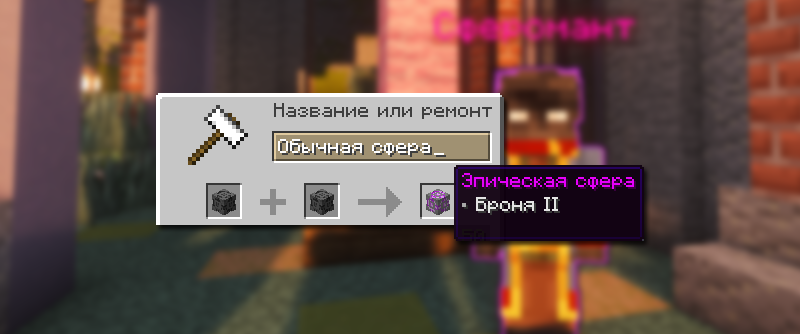
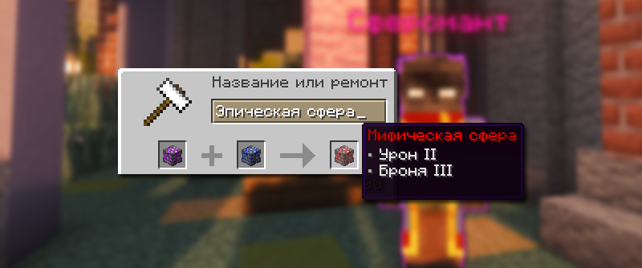
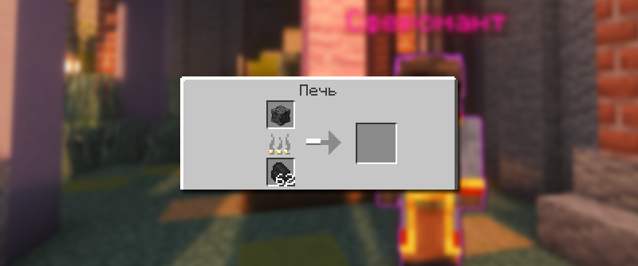
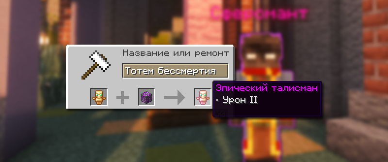

# 🔮 Сферы и Талисманы

Сферы и талисманы — особые предметы, которые активируют уникальные эффекты, если держать их во второй руке.

## Как активировать сферу или талисман

Эффекты сфер и талисманов активируются автоматически при помещении предмета во вторую руку (левая рука в интерфейсе инвентаря). Эффект действует непрерывно, пока предмет находится в указанной позиции.

## Сферы и их эффекты

### Как получать сферы

Сферы можно получить разными способами: на ивентах, в сокровищницах, при обмене осколков на готовые сферы у Сфероманта или с помощью механики объединения на наковальне (только для стандартных сфер).

#### Объединение сфер на наковальне

<figure><figcaption>
Пример, как объеденять сферы на наковальне
</figcaption></figure>

Вы можете объединить стандартные сферы (обычная, эпическая, легендарная) на наковальне, чтобы улучшить её, а также объединить эффекты.


Две обычные сферы превращаются в эпическую сферу, а две эпические сферы превращаются в легендарную сферу.


#### Мифическая сфера

<figure><figcaption>
Пример, как получать мифическую сферу
</figcaption></figure>

Мифические сферы имеют эффект второго уровня от эпической сферы и эффект третьего уровня от легендарной сферы. Создаются они путем комбинирования эпической и легендарной сферы в наковальне.


Имеют следующие возможные комбинации эффектов:

* Сфера на Урон 3 уровня и Броня 2 уровня, необходимо: эпическая сфера на урон и легендарная сфера на урон.
* Урон 2 уровня и Броня 3 уровня, необходимо: эпическая сфера на урон и легендарня сфера на броню.
* Скорость 3 уровня и Броня 2 уровня, необходимо: эпическая сфера на броню и легендарная сфера на скорость


#### Уникальные сферы

Уникальные сферы —  специальные сферы, имеющие улучшенные эффекты, нельзя создать, их можно только найти.

| Сфера           | Эффекты                                       | Особенности      |
| --------------- | --------------------------------------------- | ---------------- |
| **Цербера**     | Урон 5, Скорость атаки 1                      | Проклятье утраты |
| **Флеша**       | Броня 1, Скорость 3                           | Нет              |
| **Армоталити**  | Урон 2, Броня 2, Макс. здоровье 2             | Нет              |
| **Имморталити** | Урон 3, Скорость 2                            | Нет              |
| **Инфинити**    | Урон 2, Броня 2, Скорость 2, Макс. здоровье 2 | Нет              |
| **Этернити**    | Урон 2, Броня 2                               | Скорость +50%    |
| **Стингера**    | Урон 2, Броня 2                               | Скорость +25%    |
| **Сатиры**      | Урон 3, Скорость атаки 2                      | Нет              |

### Виды эффектов

| Эффект                    | Описание                                    |
| ------------------------- | ------------------------------------------- |
| Урон                      | Увеличивает наносимый урон                  |
| **Броня**                 | Повышает защиту от входящего урона          |
| **Скорость передвижения** | Ускоряет перемещение персонажа              |
| **Максимальное здоровье** | Увеличивает общее количество очков здоровья |
| **Спешка**                | Повышает скорость разрушения блока          |
| **Скорость атаки**        | Повышает скорость атаки                     |

### Редкости сфер

| Редкость    | Максимальный уровень эффекта | Стоимость преобразования |
| ----------- | ---------------------------- | ------------------------ |
| Обычная     | 1 уровень                    | 30 уровень               |
| Эпическая   | 2 уровень                    | 50 уровень               |
| Легендарная | 3 уровень                    | 60 уровень               |
| Мифическая  |                              | 100 уровень              |

### Сферомант

#### Где найти Сфероманта

Специализированный торговец находится по варпу `/warp spheres` или доступен через команду `/spheres`. Сферомант принимает осколки сфер в обмен на новые предметы этой категории.

#### Осколки сфер

<figure><figcaption>
Переплавка сфер в печке
</figcaption></figure>

При переплавке сфер в печке, можно с шансом получить осколки сфер, количество которых зависит от редкости и эффектов уничтоженного предмета.

## Талисманы

<figure><figcaption>
Объединение Тотема бессмертия и Сферы
</figcaption></figure>

Объединив Тотем бессмертия с любой сферой, вы получите мощный талисман. Он сохранит свойства тотема и добавит эффекты выбранной сферы. Для этого потребуется значительное количество уровней.


Уникальные сферы (Цербера, Флеша, Армоталити, Имморталити, Инфинити, Этернити, Стингера, Сатиры, Мифические сферы) не могут быть преобразованы в талисманы и остаются в своем первоначальном виде.


