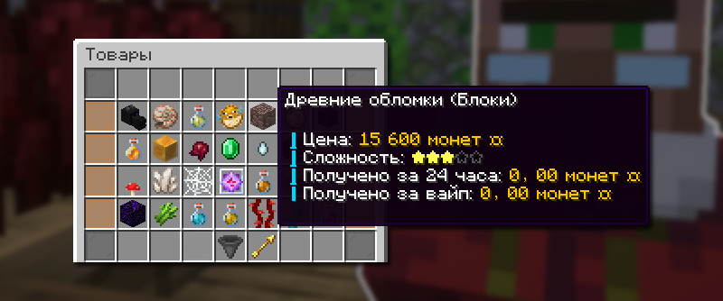
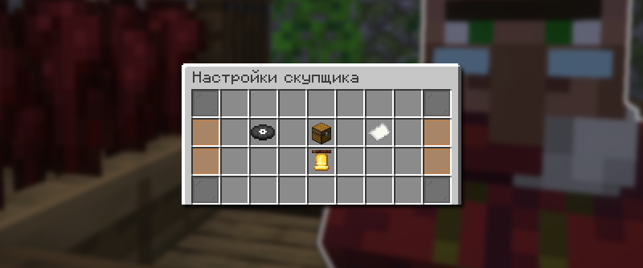

# 🧾 Скупщик

Скупщик — это система продажи ресурсов взамен на игровую валюту «монетки». Система предлагает множество интересных возможностей: от множителей коэффициента продажи до магазина скупщика, где можно обменять Очки скупщика.

## Как открыть Скупщика

Меню скупщика доступно по команде `/b` или `/buyer`, а также через NPC на спавне с именем «Скупщик».

## Как продавать ресурсы

<figure><figcaption>
Кнопка в меню Скупщика, чтобы сдать предметы
</figcaption></figure>

Ресурсы можно продать в главном меню скупщика `/buyer`. Просто переместите предметы, которые хотите продать, в любой слот меню. Затем нажмите кнопку продажи в правом нижнем углу. После этого вы получите монеты и очки скупщика.


Очки скупщика — валюта скупщика, за которую можно покупать различные вещи в магазине скупщика `/buyer shop`. Зарабатывается путем продажи ресурсов скупщику.



Чем чаще вы сдаете один и тот же предмет, тем ниже становится коэффициент на товар. И наоборот, чем реже вы сдаете этот предмет, тем выше коэффициент.


## Что можно продавать

<figure><figcaption>
Меню товаров Скупщика: /b items
</figcaption></figure>

Узнать что продает Скупщик вы можете при помощи команды `/b items`. В этом меню вы увидите полный список товаров по определенным сортировкам: горячие товары, самые дорогие и и т.д. Также доступна полная статистика по товару.

Ресурсы из шахты

| Ресурс             | Начальная цена |
| ------------------ | -------------- |
| Незерский кирпич   | 4 монеты       |
| Лазурит            | 18 монет       |
| Редстоуновая пыль  | 20 монет       |
| Уголь              | 23 монет       |
| Железный слиток    | 59 монет       |
| Золотой слиток     | 67 монет       |
| Алмаз              | 120 монет      |
| Незерский кварц    | 133 монет      |
| Изумруд            | 480 монет      |
| Незеритовый слиток | 1731 монет     |
| Незеритовый лом    | 4211 монет     |

Лут с мобов

| Шерсть (любой цвет) | 96 монеты  |
| ------------------- | ---------- |
| Гнилая плоть        | 32 монеты  |
| Сахар               | 96 монеты  |
| Перо                | 120 монет  |
| Нить                | 40 монет   |
| Жаренная свинина    | 144 монет  |
| Стрела              | 48 монет   |
| Стейк               | 144 монет  |
| Эндер-жемчуг        | 140 монеты |
| Кость               | 60 монет   |
| Паучий глаз         | 90 монет   |
| Порох               | 100 монет  |
| Кожа                | 300 монет  |
| Сгусток слизи       | 320 монет  |
| Сгусток магмы       | 400 монет  |
| Огненный стержень   | 600 монет  |
| Слеза гаста         | 1274 монет |
| Через визер-скелета | 2748 монет |

Растительность

| Сладкие ягоды      | 40 монет   |
| ------------------ | ---------- |
| Бамбук             | 40 монет   |
| Незерский нарост   | 27 монет   |
| Картофель          | 48 монет   |
| Ядовитый картофель | 48 монет   |
| Кактус             | 72 монет   |
| Морковь            | 48 монет   |
| Искаженный корни   | 60 монет   |
| Багровые корни     | 60 монет   |
| Какао-бобы         | 48 монеты  |
| Ламинария          | 108 монеты |
| Ломтик арбуза      | 80 монет   |
| Сахарный тростник  | 100 монет  |
| Плод хоруса        | 500 монет  |
| Плакучая лоза      | 120 монет  |
| Вьющаяся лоза      | 180 монет  |
| Багровый гриб      | 200 монет  |
| Искаженный гриб    | 200 монет  |
| Свёкла             | 360 монет  |
| Пшеница            | 360 монет  |
| Коричневый гриб    | 107 монет  |
| Красный гриб       | 107 монет  |
| Арбуз              | 400 монет  |
| Тыква              | 400 монет  |

Блоки

| Булыжник                          | 4 монеты   |
| --------------------------------- | ---------- |
| Камень                            | 4 монеты   |
| Андезит                           | 4 монеты   |
| Диорит                            | 4 монеты   |
| Гранит                            | 4 монеты   |
| Дёрн                              | 12 монеты  |
| Земля                             | 12 монеты  |
| Каменистая земля                  | 12 монеты  |
| Подзол                            | 12 монеты  |
| Гравий                            | 12 монеты  |
| Песок                             | 12 монеты  |
| Красный песок                     | 12 монеты  |
| Эндерняк                          | 12 монет   |
| Песок душ                         | 60 монет   |
| Лёд                               | 120 монет  |
| Синий лёд                         | 120 монет  |
| Магма                             | 120 монет  |
| Обсидиан                          | 160 монеты |
| Тёмный дуб (все вариации)         | 140 монет  |
| Дуб (все вариации)                | 240 монет  |
| Берёза (все вариации)             | 240 монет  |
| Ель (все вариации)                | 180 монет  |
| Багровый стебель (все вариации)   | 300 монет  |
| Искаженный стебель (все вариации) | 300 монет  |
| Тропическое дерево (все вариации) | 200 монет  |
| Акация (все вариации)             | 320 монет  |
| Светокамень                       | 938 монет  |
| Грибосвет                         | 1072 монет |
| Пурпур                            | 679 монет  |
| Цветок хоруса                     | 938 монет  |
| Плачущий обсидиан                 | 841 монет  |
| Блок сушеной ламинарии            | 1135 монет |
| Блок мёда                         | 3734 монет |
| Древние обломки                   | 2208 монет |

Разное

| Сушеная ламинария                             | 180 монет     |
| --------------------------------------------- | ------------- |
| Стержень Энда                                 | 400 монет     |
| Зелье (огнестойкость 1 уровня на 8 минут)     | 690 монет     |
| Зелье (сила 2 уровня на полторы минуты)       | 938 монет     |
| Зелье (скорость 2 уровня на полторы минуты)   | 993 монет     |
| Бутылочка меда                                | 1625 монет    |
| Маринованный паучий глаз                      | 841 монет     |
| Зелье (плавное падение 1 уровня на 4 минуты)  | 841 монет     |
| Зелье (невидимость 1 уровня на 8 минут)       | 938 монет     |
| Зелье (регенерация 2 уровня на 22 секунды)    | 993 монет     |
| Паутина                                       | 1625 монет    |
| Кристалл Энда                                 | 1721 монет    |
| Иглобрюх                                      | 3734 монет    |
| Черепашье яйцо                                | 2463 монет    |
| Зелье (прыгучесть 2 уровня на полторы минуты) | 5073 монет    |
| Раковина наутилуса                            | 7218 монет    |
| Голова дракона                                | 133333 монеты |

## Авто-скупщик

<figure><figcaption>
Кнопка в меню Скупщика, чтобы включать/выключить авто-скупщика
</figcaption></figure>

Меню авто-скупщика доступно по команде `/buyer auto`, а также в главном меню скупщика.

При помощи авто-скупщика вы можете автоматически продавать накопленные ресурсы из вашего инвентаря. Вы можете настраивать, какие ресурсы будут продаваться, или выбрать все ресурсы при помощи соответствующих кнопок в меню.

## Настройки Скупщика

<figure><figcaption>
Меню настроек Скупщика по команде /b settings
</figcaption></figure>

Вы можете настроить работу авто-скупщика так, как вы хотите. Вам доступны 4 настраиваемых параметра для удобной игры:

* Быстрая продажа — продавать предметы до попадания в инвентарь.
* Игнорирование слотов — вы можете запретить продавать предметы их хотбара или из руки.
* Режим подсказки цен — добавляет в описании каждого предмета его стоимость у Скупщика.
* Сообщение при авто-продаже — вы можете отключить сообщения в чате, что вы продали предметы Скупщику.

## Глобальные множители монеток

### Базовый множитель

Общий множитель монеток формируется за полученные Очки скупщика при продаже ресурсов. Текущий множитель отображается в главном меню скупщика в левом углу.


**Насколько повышается общий множитель?**

* Базовое повышение: +0.01 к множителю
* Для обладателей привилегии Stinger: +0.02 к множителю


### Бонус за категорию

Категория, которая заработала вам больше всего очков Скупщика, дает вам небольшой бонус к продаже.

### Бустер Скупщика

<figure><figcaption>
Кнопка в меню /boosters, чтобы купить за сапфиры бустер Скупщика
</figcaption></figure>

Имея при себе достаточно Сапфиров, вы можете улучшить свой бустер Скупщика в Премиум-магазине при помощи команды `/boosters`.

Цены прокачки бустера Скупщика

| 1 ур.  | 100 сапфиров  | +2%  |
| ------ | ------------- | ---- |
| 2 ур.  | 138 сапфиров  | +4%  |
| 3 ур.  | 185 сапфиров  | +6%  |
| 4 ур.  | 244 сапфира   | +8%  |
| 5 ур.  | 318 сапфиров  | +10% |
| 6 ур.  | 410 сапфиров  | +12% |
| 7 ур.  | 525 сапфиров  | +14% |
| 8 ур.  | 669 сапфиров  | +16% |
| 9 ур.  | 849 сапфиров  | +18% |
| 10 ур. | 1074 сапфира  | +20% |
| 11 ур. | 1355 сапфиров | +22% |
| 12 ур. | 1707 сапфиров | +24% |
| 13 ур. | 2147 сапфиров | +26% |
| 14 ур. | 2697 сапфиров | +28% |
| 15 ур. | 3384 сапфира  | +30% |
| 16 ур. | 4243 сапфира  | +32% |
| 17 ур. | 5317 сапфиров | +34% |
| 18 ур. | 6659 сапфиров | +36% |
| 19 ур. | 8337 сапфиров | +38% |
| 20 ур. | 10434 сапфира | +40% |


Приобретенный бустер действует до конца вайпа, на котором вы купили бустер.


### «Ульта Скупщика»

<figure><figcaption>
Кнопка в меню Магазин скупщика, чтобы купить Ульту Скупщика
</figcaption></figure>

Имея достаточно накопленных очков скупщика, вы можете активировать за них «Ульту Скупщика» сроком на 1 час в магазине Скупщика `/buyer shop`. Вы будете получать на 10% больше с продажи ресурсов.


Стартовая цена «Ульты Скупщика» – 14.999 Очков скупщика


## Множители монеток на один ресурс

### Через инвестиции

<figure><figcaption>
Кнопка в меню Инвестиций /invest, чтобы вложить деньги в Товары скупщика
</figcaption></figure>

Имея достаточно монеток, вы можете пожертвовать их в инвестицию «Товар скупщика» при помощи команды `/invest`. Данный множитель действует на всех игроков режима до конца вайпа.


Стартовая цена для пожертвования в инвестицию – 10.000 монеток



Каждый новый уровень инвестиции повышает стоимость одного случайного ресурса. Выбрать определенный ресурс нельзя.


### За Боевые фрагменты

<figure><figcaption>
Кнопка в меню Авто-скупщика, чтобы повысить локальный бонус за Боевые фрагменты
</figcaption></figure>

Имея у себя боевые фрагменты , вы можете повысить локальный бонус, стоимость одного случайного предмета у скупщика в выбранной категории, в меню авто-скупщика `/buyer auto` на нижней строчке.


Боевые фрагменты от 12 шт. – добавляют +20% к случайному ресурсу в выбранной категории.


Количество необходимых боевых фрагментов в зависимости от попытки

| Попытка | Число боевых фрагментов |
| ------- | ----------------------- |
| 1       | 12                      |
| 2       | 24                      |
| 3       | 44                      |
| 4       | 72                      |
| 5       | 108                     |
| 6       | 152                     |
| 7       | 204                     |
| 8       | 264                     |
| 9       | 332                     |
| 10      | 408                     |
| 11      | 492                     |
| 12      | 584                     |
| 13      | 684                     |
| 14      | 792                     |
| 15      | 908                     |
| 16      | 1032                    |
| 17      | 1164                    |
| 18      | 1304                    |
| 19      | 1452                    |
| 20      | 1608                    |
| 21      | 1772                    |
| 22      | 1944                    |
| 23      | 2124                    |
| 24      | 2312                    |

## Магазин Скупщика

<figure><figcaption>
Магазин скупщика
</figcaption></figure>

Имея достаточно много очков скупщика, вы можете потратить их в магазине скупщика `/buyer shop`. Скупщик продает очень редкие и интересные вещи для вашей игры.


Первые 24 часа после вайпа Магазин скупщика не работает. После 24 часов он открывается для всех игроков.


Товары магазина Скупщика

| Бустер скупщика +10% на 60 минут  | 10.000 очков Скупщика  |
| --------------------------------- | ---------------------- |
| Бустер скупщика +15% на 60 минут  |                        |
| Бустер скупщика +20% на 60 минут  |                        |
| Опыт (х 1000 единиц)              |                        |
| Опыт (х 500 единиц)               |                        |
| Опыт (х 2500 единиц)              |                        |
| Элитры                            |                        |
| Рассадник                         |                        |
| Фермер II Книга                   |                        |
| Кирка Stinger                     | 40.000 очков Скупщика  |
| Кирка Eternity                    |                        |
| Топор Eternity                    |                        |
| Лопата Eternity                   |                        |
| Золотая кирка Джейка              |                        |
| Загадочное яйцо призыва ведьма    | 100.000 очков Скупщика |
| Загадочное яйцо призыва пиглин    | 150.000 очков Скупщика |
| Загадочное яйцо призыва крипер    |                        |
| Боевой фрагмент                   |                        |
| Контейнер                         |                        |


Цена на вышеперечисленные товары сбрасывается 3 раза в день. Эти товары нельзя купить все сразу, они меняются местами 1 раз в день в случайное время.


Но также есть редкие товары, которые не меняются и не сбрасывают свою цену в течение вайпа:

| Товар                               | Начальная цена         |
| ----------------------------------- | ---------------------- |
| Меч на Фармер II                    | 100.000 очков Скупщика |
| Книга на Фермер II                  | 100.000 очков Скупщика |
| Ботинки Солнца (Нерушимые)          | 250.000 очков Скупщика |
| Крушитель X (+100% урона по боссам) | 250.000 очков Скупщика |
| Тнт-пушка (выстрел динамитом)       | 125.000 очков Скупщика |

