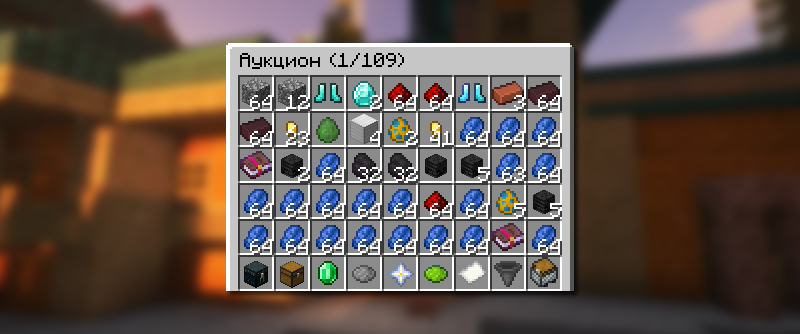
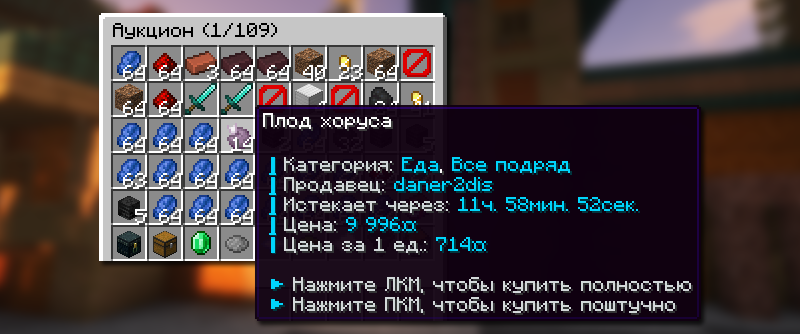
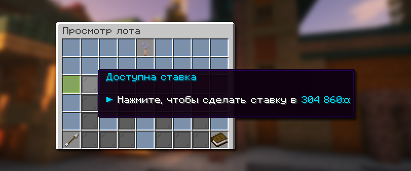

# 🔨 Аукцион

Аукцион — это торговая площадка для продажи и покупки игровых предметов.

## Как открыть аукцион

<figure><figcaption></figcaption></figure>

Меню аукциона доступно по команде `/ah` или `/auc`.

## Как купить предмет

### Покупка в режиме: Торги

<figure><figcaption></figcaption></figure>

Чтобы приобрести предмет в режиме торгов «Торги», сначала выберите желаемый лот в меню аукциона `/ah`, при этом выбрав режим торгов «Торги». Нажмите на иконку вашего лота. Если у вас достаточно монеток, покупка будет успешной.

### Покупка в режиме: Ставки

<figure><figcaption></figcaption></figure>

Чтобы приобрести предмет в режиме торгов «Ставки», сначала выберите желаемый лот в меню аукциона `/ah`, при этом выбрав режим торгов «Ставки». Нажмите на иконку вашего лота. Далее у вас откроется меню просмотра лота, где вам необходимо перебить ставку на этот лот. Если вашу ставку никто не перебьет, то покупка будет успешной.

## Как продать предмет

### Продажа в режиме: Торги

Чтобы продать предмет в режиме торгов «Торги», сначала возьмите продаваемый предмет в руку, далее пропишите команду `/ah sell <цена>`.


Если вы желаете, чтобы ваш товар купили полностью, вы можете указать в конце `full`. Пропишите команду `/ah sell <цена> full`. Все товары, которые можно купить только полностью, помечаются специальной строчкой в описании лота.



При наличии у вас [PREMIUM подписки](https://holyworld.ru/payment/lite/premium-pass) вы можете продавать предметы автоматически по рыночной цене `/ah sell auto`.


### Продажа в режиме: Ставки

Чтобы выставить предмет в режиме «Ставки», сначала возьмите продаваемый предмет в руку, далее пропишите команду `/ah sell <начальная цена> <цена шага> <время>`.


Дабы упростить указание цены за товар, вы можете использовать следующие способы:

* Указание цены при помощи букв: 1k — 1000, 1kk — 1 000 000, 1m — 1 000 000.\
  Пример: /ah sell 5kk — вы выставите предмет за 5 000 000 монеток;
* Указание цены, разделяя запятыми: 1,000 или 1,000,000.\
  Пример: /ah sell 1,500,000 — вы выставите предмет за 1 500 000 монеток.

Все способы работает во всех режимах торгов.


### Как снять предмет с продажи

Чтобы убрать предмет с продажи, откройте меню аукциона `/ah`, далее нажмите по иконке «Товары на продаже». В открывшемся меню будут отображаться все товары, которые вы продаете сейчас.


Предметы в данном меню отображаются по выбранному режиму торгов. Чтобы видеть предметы, которые продаются на ставках, сначала выберите режим торгов «Ставки».


## Поиск нужного предмета

### Поиск по названию

Чтобы найти на аукционе `/ah` нужный вам предмет, вы можете указать его название при помощи команды `/ah search <название>`.

### Поиск по игрокам

Чтобы узнать, какие предметы продает игрок на аукционе `/ah`, вы можете прописать его ник при помощи команды `/ah player <никнейм>`.
