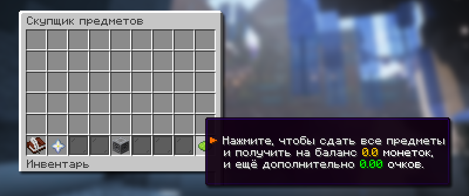
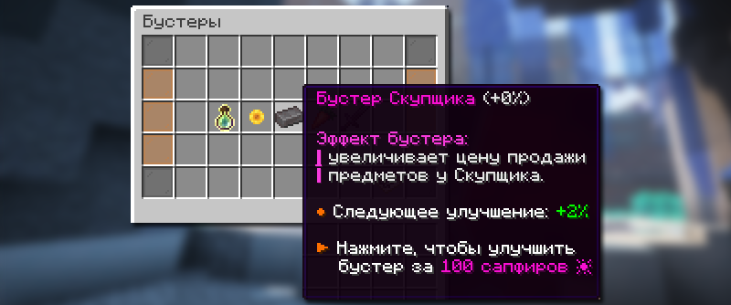
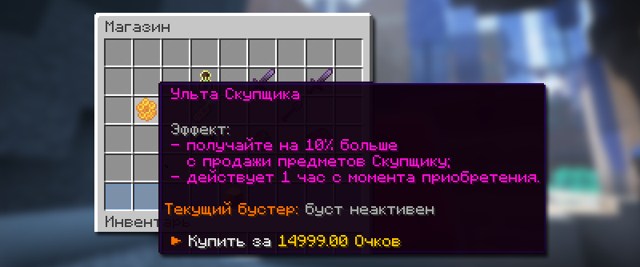
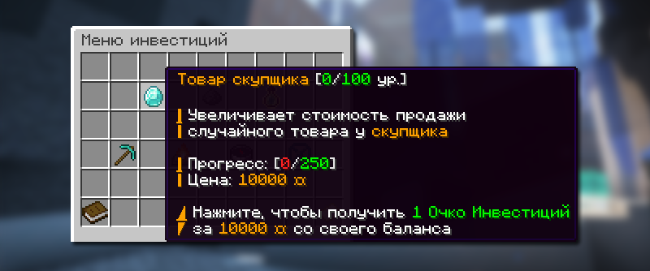
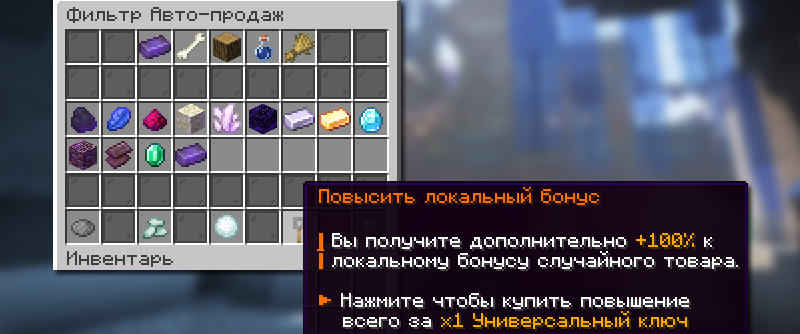
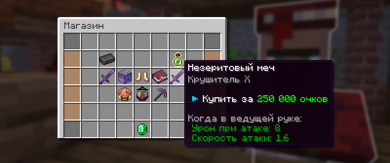

# 💰 Скупщик

Скупщик — это система продажи ресурсов взамен на игровую валюту «монетки». Система предлагает множество интересных возможностей: от множителей коэффициента продажи до магазина скупщика, где можно обменять Очки скупщика.

## Как открыть Скупщика

Меню скупщика доступно по команде `/b` или `/buyer`, а также через NPC на спавне с именем «Скупщик».

## Как продавать ресурсы

<figure><figcaption></figcaption></figure>

Ресурсы можно продать в главном меню скупщика `/buyer`. Просто переместите предметы, которые хотите продать, в любой слот меню. Затем нажмите кнопку продажи в правом нижнем углу. После этого вы получите монеты и очки скупщика.


Очки скупщика — валюта скупщика, за которую можно покупать различные вещи в магазине скупщика `/buyer shop`. Зарабатывается путем продажи ресурсов скупщику.


## Что можно продавать

Ресурсы из шахты

| Ресурс             | Начальная цена |
| ------------------ | -------------- |
| Уголь              | 4 монеток      |
| Лазурит            | 5 монеток      |
| Редстоун           | 5 монеток      |
| Эндерняк           | 8 монеток      |
| Кварц              | 30 монеток     |
| Обсидиан           | 75 монеток     |
| Железный слиток    | 100 монеток    |
| Золотой слиток     | 150 монеток    |
| Алмаз              | 300 монеток    |
| Древний обломок    | 1400 монеток   |
| Незеритовый лом    | 1500 монеток   |
| Изумруд            | 2500 монеток   |
| Незеритовый слиток | 6500 монеток   |

Ресурсы с мобов

| **Ресурс**               | **Начальная цена** |
| ------------------------ | ------------------ |
| Гнилая плоть             | 1 монеток          |
| Стрела                   | 1.5 монеток        |
| Кость                    | 1.5 монеток        |
| Нить                     | 2 монеток          |
| Паучий глаз              | 4 монеток          |
| Стержень ифрита          | 10 монеток         |
| Слизь                    | 40 монеток         |
| Шерсть                   | 40 монеток         |
| Сгусток магмы            | 50 монеток         |
| Жареная баранина         | 50 монеток         |
| Жареная свинина          | 50 монеток         |
| Кожа                     | 75 монеток         |
| Эндер-жемчуг             | 75 монеток         |
| Порох                    | 125 монеток        |
| Светокаменная пыль       | 250 монеток        |
| Череп визер-скелета      | 250 монеток        |
| Маринованный паучий глаз | 500 монеток        |
| Слеза гаста              | 750 монеток        |

Древесина

| Ель                | 40 монеток  |
| ------------------ | ----------- |
| Тёмный дуб         | 40 монеток  |
| Дуб                | 60 монеток  |
| Берёза             | 60 монеток  |
| Акация             | 60 монеток  |
| Багровый стебель   | 70 монеток  |
| Искажённый стебель | 70 монеток  |
| Тропическое дерево | 125 монеток |

Зелья

| Зелье силы 2 ур.     | 250 монеток |
| -------------------- | ----------- |
| Зелье скорости 2 ур. | 300 монеток |
| Зелье огнестойкости  | 330 монеток |
| Зелье невидимости    | 500 монеток |

Культуры

| **Ресурс**    | **Начальная цена** |
| ------------- | ------------------ |
| Сладкие ягоды | 8 монеток          |
| Нарост        | 8 монеток          |
| Бабмук        | 12 монеток         |
| Ломтик арбуза | 15 монеток         |
| Какао-бобы    | 15 монеток         |
| Картофель     | 15 монеток         |
| Морковь       | 15 монеток         |
| Плод хоруса   | 24 монеток         |
| Ламинария     | 25 монеток         |
| Пшеница       | 40 монеток         |
| Свекла        | 40 монеток         |
| Тростник      | 100 монеток        |
| Арбуз         | 125 монеток        |
| Тыква         | 125 монеток        |
| Кактус        | 125 монеток        |

## Авто-скупщик

<figure><figcaption></figcaption></figure>

Меню авто-скупщика доступно по команде `/buyer auto`, а также в главном меню скупщика.

При помощи авто-скупщика вы можете автоматически продавать накопленные ресурсы из вашего инвентаря. Вы можете настраивать, какие ресурсы будут продаваться, или выбрать все ресурсы при помощи соответствующих кнопок в меню.

## Глобальные множители монеток

### Общий множитель

Общий множитель монеток формируется за полученные Очки скупщика при продаже ресурсов. Текущий множитель отображается в главном меню скупщика в левом углу.


**Насколько повышается общий множитель?**

* Базовое повышение: +0.01 к множителю
* Для обладателей привилегии Stinger: +0.02 к множителю


### Бустер Скупщика

<figure><figcaption></figcaption></figure>

Имея при себе достаточно Сапфиров, вы можете улучшить свой бустер Скупщика в Премиум-магазине при помощи команды `/boosters`.

Цены прокачки бустера Скупщика

| 1 ур.  | 100 сапфиров  | +2%  |
| ------ | ------------- | ---- |
| 2 ур.  | 138 сапфиров  | +4%  |
| 3 ур.  | 185 сапфиров  | +6%  |
| 4 ур.  | 244 сапфира   | +8%  |
| 5 ур.  | 318 сапфиров  | +10% |
| 6 ур.  | 410 сапфиров  | +12% |
| 7 ур.  | 525 сапфиров  | +14% |
| 8 ур.  | 669 сапфиров  | +16% |
| 9 ур.  | 849 сапфиров  | +18% |
| 10 ур. | 1074 сапфира  | +20% |
| 11 ур. | 1355 сапфиров | +22% |
| 12 ур. | 1707 сапфиров | +24% |
| 13 ур. | 2147 сапфиров | +26% |
| 14 ур. | 2697 сапфиров | +28% |
| 15 ур. | 3384 сапфира  | +30% |
| 16 ур. | 4243 сапфира  | +32% |
| 17 ур. | 5317 сапфиров | +34% |
| 18 ур. | 6659 сапфиров | +36% |
| 19 ур. | 8337 сапфиров | +38% |
| 20 ур. | 10434 сапфира | +40% |


Приобретенный бустер действует до конца вайпа, на котором вы купили бустер.


### «Ульта Скупщика»

<figure><figcaption></figcaption></figure>

Имея достаточно накопленных очков скупщика, вы можете активировать за них «Ульту Скупщика» сроком на 1 час в магазине Скупщика `/buyer shop`. Вы будете получать на 10% больше с продажи ресурсов.


Стартовая цена «Ульты Скупщика» – 14.999 Очков скупщика


## Множители монеток на один ресурс

### Через инвестиции

<figure><figcaption></figcaption></figure>

Имея достаточно монеток, вы можете пожертвовать их в инвестицию «Товар скупщика» при помощи команды `/invest`. Данный множитель действует на всех игроков режима до конца вайпа.


Стартовая цена для пожертвования в инвестицию – 10.000 монеток



Каждый новый уровень инвестиции повышает стоимость одного случайного ресурса. Выбрать определенный ресурс нельзя.


### За Боевые фрагменты или Универсальный ключ

<figure><figcaption></figcaption></figure>

Имея у себя боевые фрагменты или универсальный ключ, вы можете повысить локальный бонус, стоимость одного случайного предмета у скупщика, в меню авто-скупщика /buyer auto на нижней строчке.


Боевые фрагменты 32 шт. – добавляет 20% к случайному ресурсу.

Универсальный ключ 1 шт. – добавляет 100% к случайному ресурсу.


## Магазин Скупщика

<figure><figcaption></figcaption></figure>

Имея достаточно много очков скупщика, вы можете потратить их в магазине скупщика `/buyer shop`. Скупщик продает очень редкие и интересные вещи для вашей игры.

Товары магазина Скупщика

| «Ульта скупщика»                                | 14.999 Очков скупщика     |
| ----------------------------------------------- | ------------------------- |
| 1000 Очков опыта                                | 501 Очков скупщика        |
| Жетон на создание личного титула                | 25.000.013 Очков скупщика |
| Донат-кейс                                      | 4.500.002 Очков скупщика  |
| Незеритовый меч (Добыча 6 ур.)                  | 121.002 Очков скупщика    |
| Незеритовый меч (Крушитель 10 ур.)              | 82.500 Очков скупщика     |
| Незеритовая лопата (Прочность 8 ур.)            | 110.001 Очков скупщика    |
| Загадочное яйцо призыва (Крипер 25%, Зомби 75%) | 120.792 Очков скупщика    |
| Книга зачарований (Фермер 2 ур.)                | 1.100.000 Очков скупщика  |


С каждой повторной покупкой товара, цена на данный товар увеличивается.

