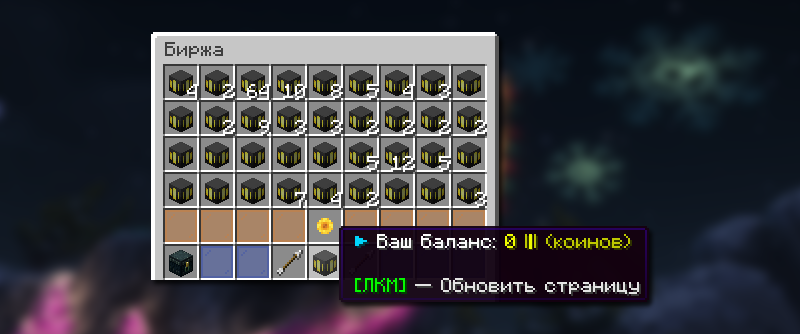
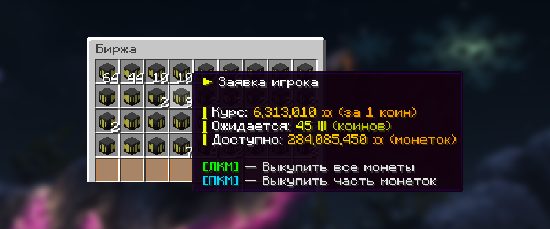

# 📊 Биржа

Биржа — это торговая площадка для обмена монеток на коины, которые приобретаются за реальную валюту на официальном сайте сервера. Система позволяет игрокам торговать между собой игровой валютой.


Коины — это донат-валюта, с её помощью можно купить расплачиваться за покупки на сайте HolyWorld или обменять на монетки через биржу.


## Как открыть биржу

<figure><figcaption></figcaption></figure>

Меню биржи доступно по команде `/exchange`.

## Как обменять коины на монетки

<figure><figcaption></figcaption></figure>

Обменять коины на монетки можно в главном меню биржи `/exchange`. Выберите желаемую заявку и нажмите по иконке заявки. Вы можете выкупить как все сразу монетки, так и выкупить только часть монеток.


В главном меню биржи заявки сортируются по выгодности. Сначала показываются те, где за один коин предлагается больше всего монеток.


## Как обменять монетки на коины

<figure><figcaption></figcaption></figure>

Обменять монетки на коины можно в главном меню биржи `/exchange`. Для этого нужно создать заявку на продажу монет, нажав на специальную иконку в меню. У вас откроется меню с выбором, сколько вы хотите получить коинов.
