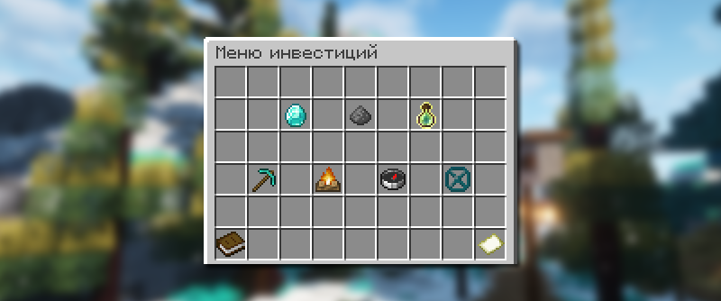
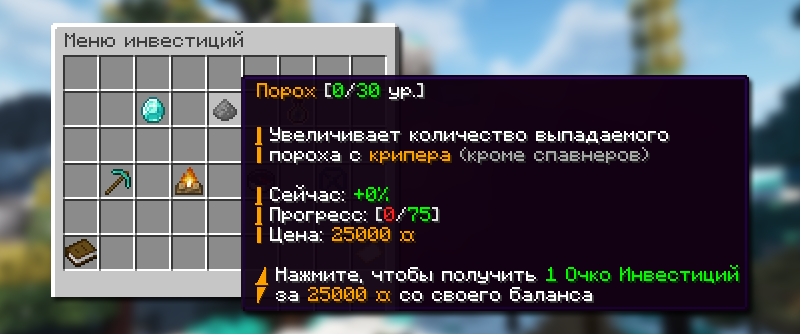

# 📈 Инвестиции

Инвестиции — это вложение внутриигровой валюты в глобальные улучшения, которые улучшают определенные аспекты игрового процесса для всех игроков на сервере (до вайпа).

## Как открыть инвестиции

<figure><figcaption></figcaption></figure>

Меню инвестиций доступно только по команде `/invest`.

## Как улучшать инвестиции

<figure><figcaption></figcaption></figure>

Имея при себе достаточно монеток, вы можете вложить их в абсолютно любую инвестицию. Сначала выберите, в какую инвестицию вы хотите вложить монетки через меню инвестиций `/invest`, далее просто нажмите на кнопку желаемой инвестиции.


Каждая инвестиция имеет свой уровень и прогресс уровня. Чтобы повысить уровень инвестиции, вам надо вложить монетки определенное число раз.


## Во что вложить монетки

Список инвестиций и их описание

| Товар скупщика | Увеличивает стоимость продажи случайного товара у скупщика            | +0% к продажи                                                   | 10.000 монеток  | 100 уровеней |
| -------------- | --------------------------------------------------------------------- | --------------------------------------------------------------- | --------------- | ------------ |
| Порох          | Увеличивает количество выпадаемого пороха с крипера (кроме спавнеров) | +0% к выпадению                                                 | 25.000 монеток  | 30 уровеней  |
| Опыт           | Увеличивает количество выпадаемого опыта со всех мобов на карте       | +0% к получению                                                 | 50.000 монеток  | 50 уровеней  |
| Автошахта      | Уменьшает время обновления всех Автошахт на спавне                    | 10 минут                                                        | 25.000 монеток  | 70 уровней   |
| Голосование    | Уменьшает время, требуемое для старта нового голосования за ивенты    | 50 минут                                                        | 25.000 монеток  | 30 уровней   |
| Сокровища      | Ускоряет спавн всех сокровищ появляемых в игровком мире               | 100 минут                                                       | 50.000 монеток  | 50 уровней   |
| Границы миров  | Расширяет радиус границ мира                                          | 
Адский мир: 1000 Обычный мир: 1750 Эндер-мир: 2500
 | 400.000 монеток | 20 уровней   |

## Вознаграждение за инвестиции

### Как получать Очки инвестиций


Очки инвестиций — это баллы, которые игроки получают за вложение монеток в инвестиции.


Очки инвестиций получаются при каждом вложении монеток в какую-нибудь инвестицию. За одно вложение вы получите одно очко инвестиции.

### Как формируется топ и какая награда

Каждый день в 00:00 по МСК топ 10 игроков с наибольшим количеством очков опыта получают свою награду в виде сапфиров.

Награда формируется по следующей формуле: Каждый игрок из Топа получает 2500 \* (его ОИ / сумма ОИ топ-10). Пример: Игрок №1 имеет 50 ОИ, сумма топ-10 = 100 ОИ → он получит 2500 \* (50/100) = 1250 сапфиров.


Каждый понедельник в 00:00 по МСК вся статистика Очков инвестиции обновляется у всех игроков.

