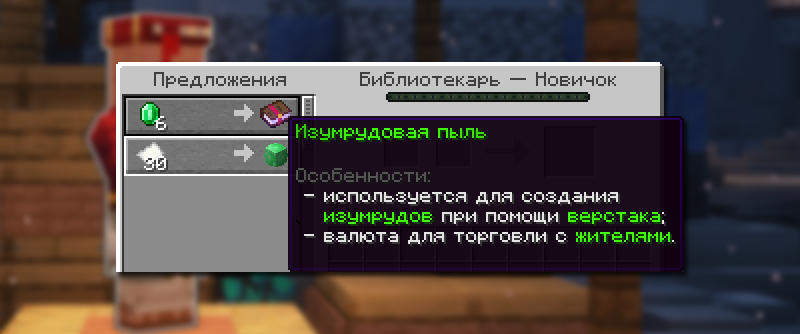
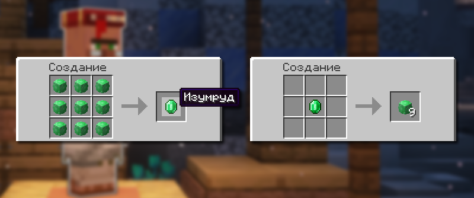

# 🛒 Жители

Торговля с жителями на HolyWorld отличается от стандартной. Появилась новая валюта — Изумрудная пыль. Также в продаже доступны уникальные предметы.

## Особенности новой торговли с жителями

1. Жители с кастомными торгами предлагают уникальные товары, недоступные через стандартную систему торговли.
2. Цены и ассортимент отличаются от базовой игры.
3. **Скидки нельзя получить** заражением жителя в зомби-жителя и последующим лечением.
4. Кастомные торги могут иметь ограниченное количество использований и требовать времени для обновления

## Список профессий жителей

Жители, чья торговля изменена

| Профессия    | Блок            |
| ------------ | --------------- |
| Фермер       | Компостница     |
| Рыбак        | Бочка           |
| Библиотекарь | Кафедра         |
| Бронник      | Плавильная печь |
| Священник    | Зельеварка      |
| Лучник       | Стол лучника    |
| Мясник       | Коптильня       |

Жители, чья торговля осталась прежней

<table><thead><tr><th>Профессия</th><th>Блок<select></select></th></tr></thead><tbody><tr><td>Инструментальщик</td><td></td></tr><tr><td>Оружейник</td><td></td></tr><tr><td>Каменьщик</td><td></td></tr><tr><td>Картограф</td><td></td></tr><tr><td>Пастух</td><td></td></tr><tr><td>Кожевник</td><td></td></tr></tbody></table>

## Изумрудовая пыль

<figure><figcaption></figcaption></figure>

При торговле с жителями, которым изменили свои предметы, вы увидите новую валюту — Изумрудовую пыль. С её помощью можно продолжать торговлю и получать уникальные вещи.

### Создание изумрудовой пыли

<figure><figcaption></figcaption></figure>

Чтобы создать Изумрудовую пыль, положите один изумруд в верстак. Вы получите девять единиц Изумрудовой пыли. Если вам нужно вернуть изумруд, просто разместите девять единиц Изумрудовой пыли в верстаке.

### Способы получения изумрудовой пыли

| Источник                | Описание                                             |
| ----------------------- | ---------------------------------------------------- |
| **Разборка изумрудов**  | 1 изумруд = 9 единиц пыли                            |
| **Ивенты сервера**      | Награды за участие в различных активностях           |
| **Торговля с жителями** | Некоторые жители могут давать пыль в обмен на товары |
