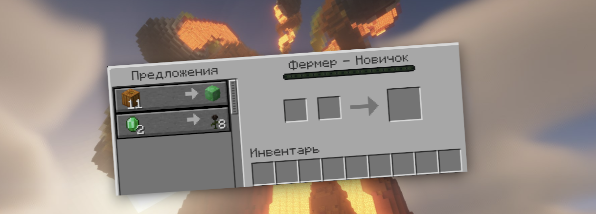

# Торги с жителями

## Торговая система

### Жители БЕЗ кастомных торгов:

1. Инструментальщик
2. Оружейник
3. Каменьщик
4. Картограф
5. Пастух
6. Кожевник

_Эти профессии не имеют торгов_

## Особенности системы:

1. Только определенные профессии имеют кастомные торги
### Профессии крестьян с кастомными торгами

- Фермер

- Рыбак

- Библиотекарь

- Бронник

- Священник

- Лучник

- Мясник

## Изумрудная пыль (кастомная валюта)

### Свойства:

- Основная валюта для кастомных торгов
- 9 пыли = 1 изумруд (крафт в верстаке)
- Можно получить:
  - При разборе изумрудов
  - С ивентов сервера

