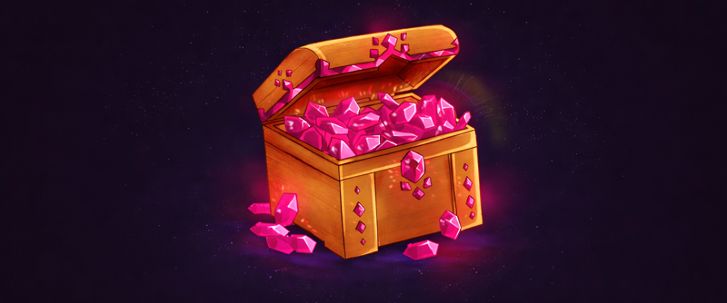

# 💎 Сапфиры и коины

На режиме Лайт есть два вида донат-валюты: Сапфиры и Коины. С их помощью можно покупать донат-предметы и бонусы на сервере, а также расплачиваться на сайте.

## Коины

<figure><figcaption></figcaption></figure>


Коины — это особая валюта для донатов, эквивалентная рублю. Один рубль равен одному коину. Эта валюта используется для покупок, обычно оплачиваемых реальными деньгами.


### Оплата Коинами

<figure><figcaption>
Выбран способ оплаты Коинами
</figcaption></figure>

Если на вашем балансе достаточно Коинов, вы можете оплатить почти любую покупку на [holyworld.me](https://holyworld.me). Просто выберите способ оплаты «Оплата коинами» и подтвердите покупку, введя специальную команду на сервере.


Любой игрок может оплатить вашу покупку своими Коинами. Для этого достаточно передать команду другому игроку.


### Обмен на монетки

Вы можете обменять свои коины на монетки на [бирже](../money/exchange.md#kak-obmenyat-koiny-na-monetki). Курс коина к монеткам меняется каждый день.

***

## Сапфиры

<figure><figcaption></figcaption></figure>


Сапфиры — это особая донат-валюта, используемая для покупок на сервере в премиум-магазинах, где используются сапфиры.


### Где можно потратить сапфиры

* Заглянуть в премиум-магазин и приобрести что-то особенное:
  * Ценные и уникальные предметы по команде `/shop`
  * Киты Stinger можно приобрести за 999 сапфиров, Eternity — за 1499, а Infinity — за 1999 сапфиров. Для игроков, участвующих в PvP, доступны Lite за 1999 сапфиров и Toper за 2499. Все это можно купить через команду `/kit shop`.
  * Постоянные бустеры до конца вайпа по команде `/boosters`
* Купить какой-нибудь кейс с вещами на спавне /warp case:
  * Кейс с книгами за 99 сапфиров
  * Кейс с броней за 49 сапфиров
  * Кейс с оружием за 39 сапфиров
  * Кейс с талисманами за 199 сапфиров
  * Кейс с ресурсами за 29 сапфиров
  * Кейс со сферами за 149 сапфиров
  * Кейс с инструментами за 49 сапфиров


Способов потратить Сапфиры много. Задайте вопрос в поиске, и ИИ даст ответ, опираясь на данные из Википедии

<button type="button" class="button primary" data-action="ask" data-query="Все способы, куда можно потратить сапфиры на лайт анархии: покупки, улучшения и т.д." data-icon="gitbook-assistant">Где можно потратить сапфиры?</button>


### Как заработать Сапфиры

* **Покупка за реальные деньги** — Приобрести желаемое количество на сайте [holyworld.me](https://holyworld.ru/payment/lite/22).
* **Вознаграждения за игру —** В полностью автоматическом режиме вы получаете Сапфиры и Монеты. Количество зависит от уровня доната. Для этого необходимо просто играть на сервере.


Способов заработать Сапфиры достаточно. Задайте вопрос в поиске, и ИИ даст ответ, опираясь на данные из Википедии

<button type="button" class="button primary" data-action="ask" data-query="Все способы, которые есть по заработку сапфиров на лайт анархии" data-icon="gitbook-assistant">Как заработать Сапфиры</button>

