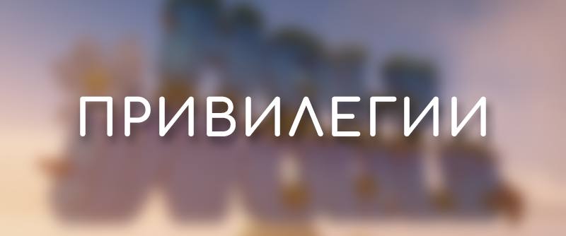
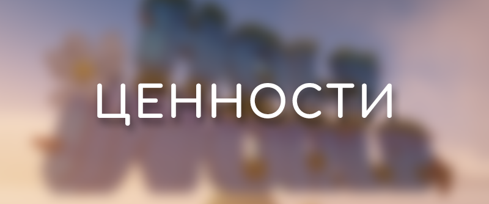
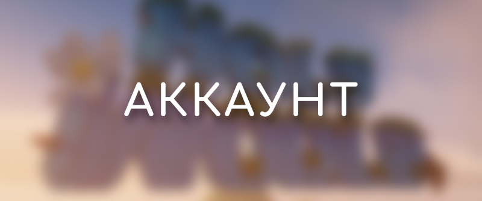

# 🛒 Описание товаров

<figure><figcaption></figcaption></figure>

Кастомный донат

## Важно

* Инструкция и правила создания кастомной привилегии - [holyworld.ru/custom-privilege](https://holyworld.ru/custom-privilege)
* Создай дизайн своего кастомного доната здесь - [rgb.holyworld.me/custom](https://rgb.holyworld.me/custom.html)
* После покупки, обратитесь в [поддержку сервера](https://vk.me/howorlddev)

## Особенности

* Личная, полностью уникальная привилегия
* Цвет сообщений в чате и их дизайн на выбор
* Отображение выше всех в списке игроков
* Личная роль в ДС сервере
* Уникальный набор: `/kit infinity`

## Доп. возможности

* Количество приватов: `10`
* Точек дома: `6`
* Множитель опыта: `x2`
* Множитель монет: `x2.25`
* Слотов на аукционе: `32`
* Множитель сапфиров с боссов: `x1.6`
* Вход на заполненный сервер
* Нет задержки при обычных телепортациях

Стажёр (Хелпер)

## Важно

* После покупки, обратитесь в [поддержку сервера](https://vk.me/howorlddev)

## Команды

* Выдать мут игроку на время: `/mute`
* Выгнать нарушителя с сервера: `/kick`
* Проверить бан игрока: `/checkban`
* Проверить мут игрока: `/checkmute`
* История наказаний игрока: `/history`

## Доп. возможности

* Оповещение о кике/варне/муте/бане
* Нет задержки в чате между сообщениями
* Особый титул — `Хранитель`
* Возможность повышения в должности до Админа
* Множитель монет с мобов: `x2.5`

ETERNITY

## Команды

* Уникальный набор: `/kit eternity`
* Подарить донат игроку: `/grant`
* Сменить псевдоним в игре: `/nick`
* Узнать реальный никнейм игрока: `/realname`
* Телепортация к игрокам: `/rtp player`
* Заблокировать чат игроку: `/mute`
* Улучшить снаряжение: `/smithingtable`
* Виртуальная наковальня: `/anvil`

## Доп. возможности

* Количество приватов: `8`
* Точек дома: `5`
* Множитель опыта: `x2`
* Множитель монет: `x2.2`
* Слотов на аукционе: `25`
* Множитель сапфиров с боссов: `x1.5`
* Вход на заполненный сервер
* Нет задержки при обычных телепортациях

STINGER

## Команды

* Уникальный набор: `/kit stinger`
* Размутить игрока: `/unmute`
* Открыть эндер-сундук игрока: `/ec`
* Отключить сообщения: `/msgtoggle`
* Найти игроков рядом: `/near`
* Починка и снятие чар: `/grindstone`
* Телепортация к сокровищу: `/rtp treasure`
* Возможность писать подчеркнутым[^1]
* Возможность писать [~~зачеркнутым~~](#user-content-fn-2)[^2]
* Возможность писать [**жирным**](#user-content-fn-3)[^3]

## Доп. возможности

* Количество приватов: `7`
* Точек дома: `4`
* Множитель опыта: `x1.8`
* Множитель монет: `x2.0`
* Слотов на аукционе: `18`
* Множитель сапфиров с боссов: `x1.4`
* Вход на заполненный сервер
* Нет задержки при обычных телепортациях

DRAGON

## Команды

* Уникальный набор: `/kit dragon`
* Доступ к чужому инвентарю: `/invsee`
* Телепортация к базам игроков: `/rtp base`
* Возможность писать объявления: `/broadcast`
* Возможность редактирования книг: `/book`
* Виртуальная мусорка: `/trash`
* Автопринятие запросов телепортации: `/tpauto`

## Доп. возможности

* Количество приватов: `7`
* Точек дома: `4`
* Множитель опыта: `x1.6`
* Множитель монет: `x1.75`
* Слотов на аукционе: `15`
* Множитель сапфиров с боссов: `x1.35`
* Вход на заполненный сервер

KRAKEN

## Команды

* Уникальный набор: `/kit kraken`
* Починить все предметы: `/fix all`
* Выдать мут игроку: `/tempmute`
* Узнать ID предмета: `/dura`
* Переключение глобального чата: `/chattoggle`
* Телепортация к мероприятию: `/rtp event`
* Виртуальный камнерез: `/stonecutter`

## Доп. возможности

* Количество приватов: `6`
* Точек дома: `3`
* Множитель опыта: `x1.4`
* Множитель монет: `x1.6`
* Слотов на аукционе: `12`
* Множитель сапфиров с боссов: `x1.3`
* Вход на заполненный сервер

WITHER

## Команды

* Уникальный набор: `/kit wither`
* Пополнить здоровье: `/heal`
* Виртуальный эндер-сундук: `/ec`
* Установить личное время суток: `/ptime`
* Починить один предмет: `/fix`
* Узнать высоту над уровнем моря: `/depth`

## Доп. возможности

* Количество приватов: `6`
* Точек дома: `3`
* Множитель опыта: `x1.2`
* Множитель монет: `x1.5`
* Слотов на аукционе: `10`
* Множитель сапфиров с боссов: `x1.2`

GHAST

## Команды

* Уникальный набор: `/kit ghast`
* Далекая телепортация: `/rtp long`
* Потушить себя: `/ext`
* Игнорировать игрока: `/ignore`
* Очистить себе инвентарь: `/clear`
* Стол картографа: `/cartographytable`

## Доп. возможности

* Количество приватов: `5`
* Точек дома: `3`
* Множитель опыта: `x1.2`
* Множитель монет: `x1.3`
* Слотов на аукционе: `8`

MUSTANG

## Команды

* Уникальный набор: `/kit mustang`
* Сделать себя сытым: `/feed`
* Надеть блок на голову: `/hat`
* Узнать ID предмета: `/itemdb`
* Виртуальный ткацкий станок: `/loom`

## Доп. возможности

* Количество приватов: `5`
* Точек дома: `2`
* Множитель опыта: `x1.1`
* Множитель монет: `x1.2`
* Слотов на аукционе: `7`

GRIEFER

## Команды

* Уникальный набор: `/kit griefer`
* Виртуальный верстак: `/craft`
* Отключить телепортации: `/tptoggle`

## Доп. возможности

* Количество приватов: `4`
* Точек дома: `2`
* Множитель опыта: `x1.1`
* Множитель монет: `x1.1`
* Слотов на аукционе: `6`

***

<figure><figcaption></figcaption></figure>

Кейс с донатом

Из кейса с привилегиями ты гарантировано получаешь одну из следующих привилегий:

* ETERNITY
* STINGER
* DRAGON
* KRAKEN
* WITHER
* GHAST
* MUSTANG
* GRIEFER


Все привилегии выдаются на срок от 30 дней



Открыть данный кейс `/warp donatcase`


Кейс с сапфирами

* После открытия данного кейса, вы гарантированно получаете сапфиры


Подробнее про сапфиры в статье [Сапфиры и коины](donat-currency.md#koiny)



Открыть данный кейс `/warp donatcase`


Контейнеры

* После открытия контейнера, игрок гарантировано получает набор внутриигровых предметов.


Открыть контейнер можно в игре `/container`


Коины

* Покупай или продавай монетки за коины на [внутриигровой бирже](../money/exchange.md) `/exchange`
* Расплачивайся за покупки на сайте HolyWorld


Подробнее про коины в статье [Сапфиры и коины](donat-currency.md#koiny)


Сапфиры

* Сапфиры — это драгоценная валюта мира HolyWorld Лайт анархии!
* С её помощью ты можешь закупаться в магазине `/shop`, прокачивать свои способности и открывать доступ к действительно мощным улучшениям.


Подробнее про сапфиры в статье [Сапфиры и коины](donat-currency.md#koiny)


PREMIUM+

## Особенности

* Ежедневные награды: x2
* Выбор цвета ника
* 12 скинов на Трапки и Станы
* Фрагменты, контейнеры, яйца дракона: `/bpshop`
* +2 слота на аукционе
* +2 голоса за ивенты
* Повышенный приоритет репортов
* +25% к очкам Скупщика и БП
* Каждый месяц: 1 донат-кейс (30% удачи), 100 коинов


Подробнее про PREMIUM+ в статье [Премиум статус](premium-status.md)


***

<figure><figcaption></figcaption></figure>

Восстановление аккаунта

## Важно

* Перед приобретением товара обязательно ознакомьтесь с правилами сервера
* Обратите внимание, что если Вы не сможете подтвердить принадлежность аккаунта, то средства возвращены не будут.

## Описание услуги

* Если Ваш аккаунт взломали, то после приобретения данного товара Вам необходимо обратиться в тех. поддержку сервера - [ЛС группы](https://vk.com/howorlddev).

Перенос доната

## Описание услуги

* После приобретения данного товара Вам необходимо обратиться в тех. поддержку сервера - [ЛС группы](https://vk.com/howorlddev).
* Перед приобретением обязательно ознакомьтесь с правилами переноса доната в [правилах сервера!](https://vk.com/topic-205337728_47892516)

Разбан

## Важно

* Стоимость разбана зависит от времени бана
* Если бан меньше 14 дней, цена - 199 руб, если выше, то за каждый доп. день +20 руб. Если бан по IP, то +100 руб к цене

## Описание услуги

* Разбанивает игрока на сервере.
* Перед покупкой обязательно ознакомьтесь [правилами сервера!](https://vk.com/topic-205337728_47892516)

Размут

## Важно

* Стоимость размут зависит от времени мута
* Если мут меньше 14 дней, цена - 99 руб, если выше, то за каждый доп. день +10 руб. Если мут по IP, то +100 руб к цене

[^1]: \&n <сообщение>

[^2]: \&m <сообщение>

[^3]: \&l <сообщение>
