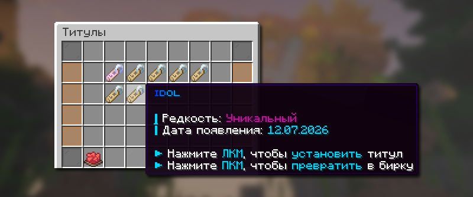

# 🏆 Титулы

Титулы — это косметическая система, которая добавляет красивую приписку к вашему никнейму в чате и над головой.

<figure><figcaption></figcaption></figure>

## Как открыть меню титулов

Меню управления своими титулами доступно по команде `/tituls`

## Как получить титул

Количество титулов на режиме Лайт анархии ограничено, вот способы их получения:

* Купить титул на аукционе `/ah search титул` в виде предмета и активировать его.
* Новые титулы изредка появляются в премиум-магазине `/shop` и магазине Скупщика `/b shop`
* Участвуя в ивентах, конкурсах от администрации проекта.


Если вы имели титул до вайпа от 14.07.26, то вы можете пользоваться им, как со всеми титулами.


## Как предать титул другому игроку

Чтобы передать титул другому игроку, откройте меню титулов `/tituls`, найдите желаемый титул и нажмите по нему ПКМ, чтобы превратить его в предмет (бирку). Далее вы можете передать предмет другу, и он активирует его.
