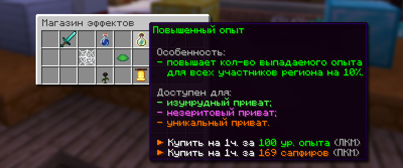
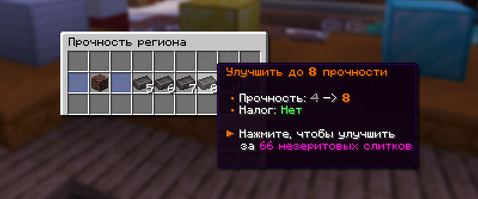

# 🗺️ Приваты

Приваты (регионы) — способ защиты территории от посторонних лиц с использованием специальных блоков. Каждый блок создает защищенную зону вокруг себя, где только владелец и его друзья могут строить и ломать блоки.

## Как заприватить территорию

Чтобы заприватить территорию, возьмите любой блок для привата и разместите его на свободной земле. Если в этой области не окажется других приватов, ваша территория будет защищена.


После успешной установки привата область выделяется частицами, и над блоком привата появляется голограмма с данными о владельце и его типе.


## Типы приватов

| Блок привата                        | Радиус | Прочность | Взрывается от               |
| ----------------------------------- | ------ | --------- | --------------------------- |
| Железный блок                       | 5x5    | 1         | Любого динамита             |
| Золотой блок                        | 7x7    | 1         | Любого динамита             |
| Алмазный блок                       | 11x11  | 1         | Любого динамита             |
| Изумрудная руда                     | 21x21  | 1         | Любого динамита             |
| Незеритовый блок                    | 31x31  | от 1      | Только С4 и Разрывной волны |
| Уникальный приват (Древние обломки) | 31x31  | от 4      | Только С4 и Разрывной волны |


Уникальный приват можно только найти на ивентах или купить за сапфиры в премиум-магазине `/shop`.


## Улучшение привата

### Магазин эффектов

<figure><figcaption></figcaption></figure>

Имея достаточно уровней опыта или сапфиров, вы можете купить эффекты, которые будут действовать на территории вашего привата. Чтобы открыть магазин эффектов, нажмите правой кнопкой мыши по вашему блоку привата.

Список эффектов от привата и их описание

| Эффект              | Описание                                                                           | Доступен для                                               | Цена на 1 час            |
| ------------------- | ---------------------------------------------------------------------------------- | ---------------------------------------------------------- | ------------------------ |
| Повышенный урон     | Увеличивает урон всех участников региона на 10%                                    | Всех типов приватов                                        | 50 ур. или 25 сапфиров   |
| **Невидимость**     | Дает невидимость на 7 секунд всем участникам региона                               | Алмазный, Изумрудный, Незеритовый и Уникальный тип привата | 100 ур. или 169 сапфиров |
| **Повышенный опыт** | Увеличивает количество получаемого опыта для всех участников региона на 10%        | Изумрудный, Незеритовый и Уникальный тип привата           | 100 ур. или 169 сапфиров |
| **Спешка**          | Дает эффект спешки 2 на 7 секунд всем участникам региона                           | Изумрудный, Незеритовый и Уникальный тип привата           | 100 ур. или 169 сапфиров |
| **Замедление**      | Замедляет на 7 секунд всех врагов в регионе (участники не затрагиваются)           | Незеритовый и Уникальный тип привата                       | 100 ур. или 169 сапфиров |
| **Сопротивление**   | Дает эффект сопротивления 1 всем участникам региона                                | Незеритовый и Уникальный тип привата                       | 75 ур. или 99 сапфиров   |
| **Прилив здоровья** | Дает дополнительные сердца на 7 секунд всем участникам региона                     | Незеритовый и Уникальный тип привата                       | 100 ур. или 169 сапфиров |
| **Иссушение**       | Накладывает иссушение на 7 секунд на врагов в регионе (участники не затрагиваются) | Уникальный тип приват                                      | 150 ур. или 299 сапфиров |
| **Оповещение**      | Присылает уведомление в чат, когда кто-то входит в ваш регион                      | Уникальный тип приват                                      | 150 ур. или 299 сапфиров |

### Прочность привата

У каждого привата есть своя прочность. Обычные приваты выдерживают один обычный динамит, а Защищенный и Уникальный приваты ломаются только от С4 или Разрывной волны.

<figure><figcaption></figcaption></figure>

Если у вас достаточно незеритовых слитков, вы можете увеличить прочность вашего приватного блока. Чтобы открыть меню улучшения, подойдите к вашему блоку привата и введите команду `/ps upgrade`.


Увеличить прочность привата можно только для Защищенного или Уникального привата.


## Команды приватов

| Команда              | Описание                                        |
| -------------------- | ----------------------------------------------- |
| /ps                  | Помощь по приватам                              |
| /ps info             | Информация об привате                           |
| /ps add <никнейм>    | Добавить игрока в приват                        |
| /ps remove <никнейм> | Убрать игрока из привата                        |
| /ps list <игрок>     | Посмотреть сколькими регионами владеете вы      |
| /ps unhide           | Восстоновить блок привата, если он был разрушен |
| /ps upgrade          | Открыть меню улучшения прочности привата        |
