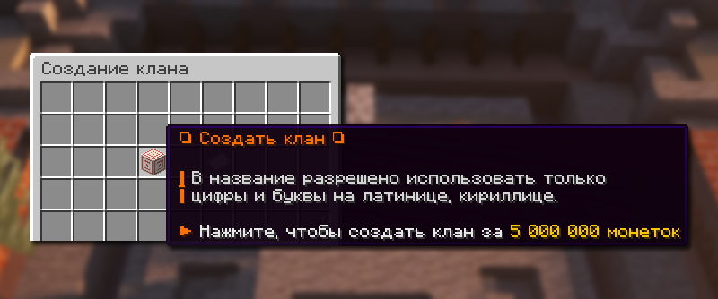
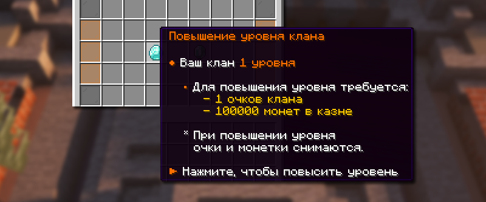
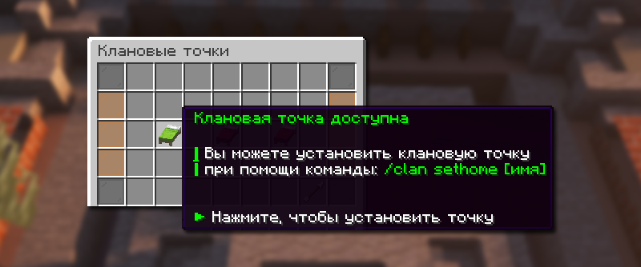
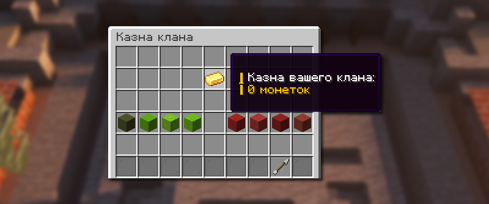
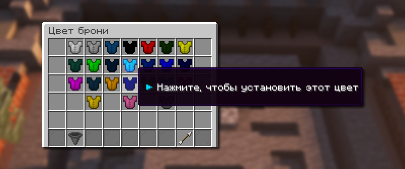

# 🛡️ Кланы

**Кланы** — это объединения игроков на сервере, которые позволяют создавать команды, совместно играть и получать дополнительные преимущества.

## Как создать клан

<figure><figcaption>
Кнопка создания клана
</figcaption></figure>

Имея 5000000 монет, а также при этом не состоя в никаком клане, вы можете создать свой собственный клан. Создание клана доступно по команде `/clan`, далее нажмите на кнопку создания клана и действуйте инструкциям в чате.

## Настройка клана

### Прокачка клана

<figure><figcaption></figcaption></figure>

Повышения уровня клана доступно за очки клана и монеты. Очки клана можно купить за 15000 монет в меню Прокачки клана.

### Клановые точки

<figure><figcaption></figcaption></figure>

Каждый клан может установить клановую точку на определенном сервере Анархии. Любой соклановец может телепортироваться на точку.

Клановых точек можно установить до трех. Но чтобы открыть для клана вторую и третью клановую точку, лидеру клана необходимо отыграть некоторое время.

| Команда                    | Описание                            |
| -------------------------- | ----------------------------------- |
| /clan sethome <название>   | Установить клановую точку           |
| /clan home <название>      | Телепортироваться на клановую точку |
| /clan homes                | Открыть меню клановых точек         |
| /clan clearhome <название> | Удалить клановую точку              |

### Казна клана

<figure><figcaption></figcaption></figure>

Вы можете свободно распоряжаться казной клана: пополнять её и снимать деньги.

| Команда              | Описание                       |
| -------------------- | ------------------------------ |
| /clan money          | Узнать баланс казны клана      |
| /clan invest <число> | Положить в казну клана монетки |
| /clan take <число>   | Снять с казны клана монетки    |

### Цвет брони

<figure><figcaption></figcaption></figure>

Изменить цвет брони у членов клана можно с помощью команды `/clan glow`. Выберите нужный оттенок и активируйте эту функцию.

### Управление кланом

| Команда                   | Описание                                |
| ------------------------- | --------------------------------------- |
| /clan invite <никнейм>    | Пригласить игрока в клан                |
| /clan kick <никнейм>      | Выгнать игрока из клана                 |
| /clan members             | Меню с списком участников клана         |
| /clan delete              | Удалить клан                            |
| /clan newleader <никнейм> | Передать лидерство над кланом           |
| /clan pvp                 | Переключить урон по соклановцам         |
| /clan chat <сообщение>    | Написать в клановый чат (доступно всем) |
| /clan list                | Список всех кланов на Лайт анархии      |
