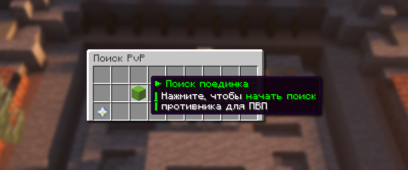

# ⚔️ Дуэли

**PvP дуэли** — это система организованных поединков между игроками с выбором режима сражения.

## Начать поиск дуэли

<figure><figcaption></figcaption></figure>

Начать поиск дуэли вы можете при помощи команды `/pvp`. В открывшемся меню выберите «Поиск поединка» или «Поиск смертельной схватки». Далее ожидайте оппонента.


Чтобы начать поиск дуэли, нужно иметь в инвентаре минимум **15 золотых яблок** и полный сет **незеритовой брони**.


## Типы дуэлей

### Поединок

Стандартный режим дуэли с возможностью отступления.


Правила обычного поединка

* Оба игрока телепортируются в верхний мир через `/rtp long`
* Телепортация происходит на удаленное расстояние от других игроков
* Участникам активируется режим боя
* После окончания кулдауна режима боя возможен выход из поединка


### Смертельная схватка

Бой до смерти одного из участников без возможности отступления.


Правила смертельной схватки

* Игроки телепортируются в специальный мир размером 3×3 чанка
* Арена окружена непроходимой границей и защищенным регионом
* Режим боя активируется постоянно
* Поединок продолжается до смерти одного из участников
* Покинуть арену без завершения поединка невозможно


## Награда за победу

Победителем становится тот игрок, который убил соперника. В награду он получает все его ресурсы, которые были в инвентаре на момент смерти.
