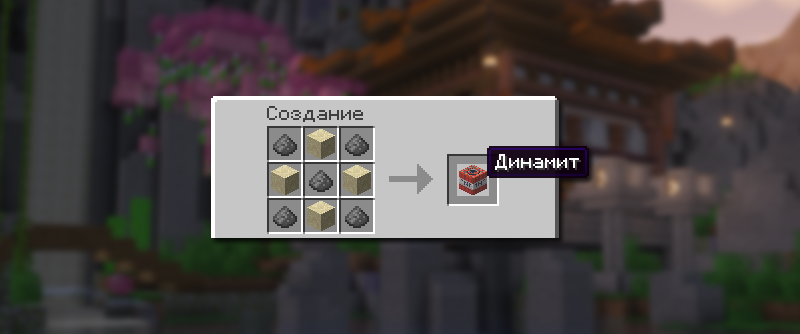
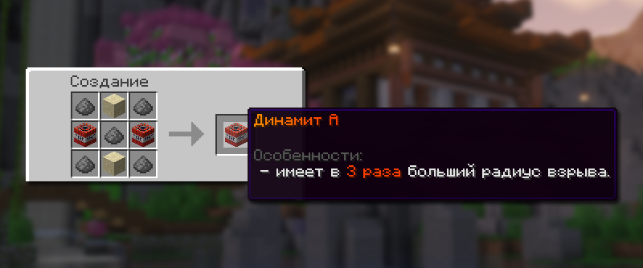
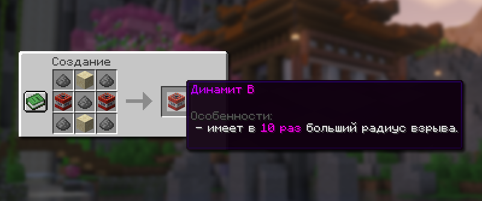
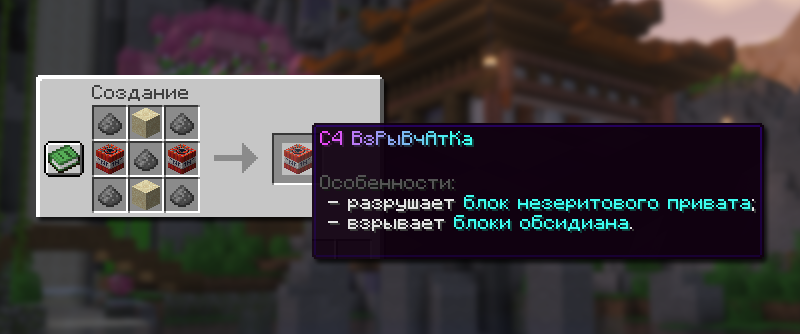
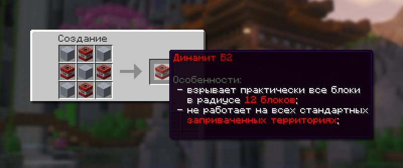
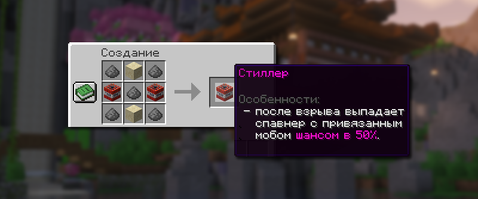
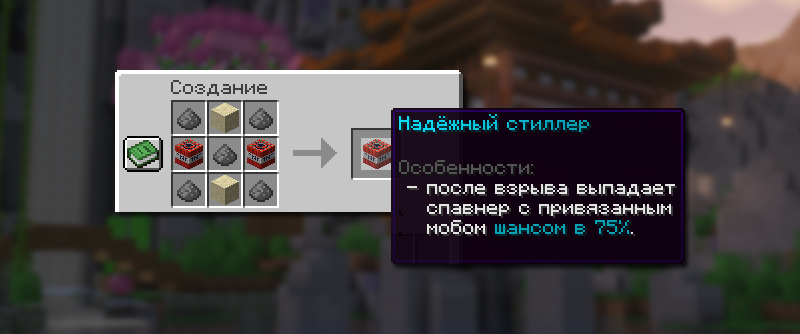
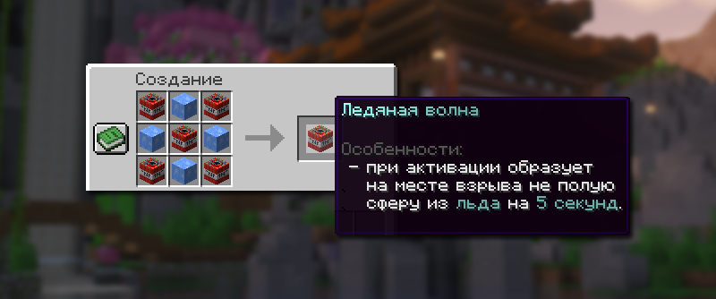
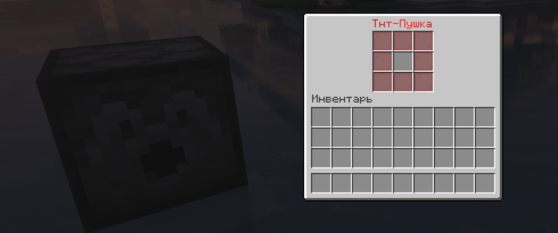

# 💣 Динамит

Кастомный динамит — это особенный динамит на режиме Лайт анархия, который отличается уникальными характеристиками разрушения, радиусом действия и особыми эффектами.

## Динамит для уничтожения

### Динамит

<figure><figcaption>
Крафт обычного динамита
</figcaption></figure>

| Особенность                                            | Ингредиенты для крафта | Как получить            |
| ------------------------------------------------------ | ---------------------- | ----------------------- |
| Обычный ванильный динамит, не имеет новых особенностей | 5 пороха и 4 песка     | Скрафтить, найти в мире |

### Динамит A

<figure><figcaption>
Крафт — Динамита A
</figcaption></figure>

| Особенность                                           | Ингредиенты для крафта                 | Как получить                                                                                               |
| ----------------------------------------------------- | -------------------------------------- | ---------------------------------------------------------------------------------------------------------- |
| Имеет в 3 раза больше радиус взрыва обычного динамита | 5 пороха, 2 песка и 2 обычных динамита | Получить с ивентов, найти в сокровищницах по миру, выбить из уникального шалкера `/warp unique`, скрафтить |

### Динамит B

<figure><figcaption>
Крафт — Динамит B
</figcaption></figure>

| Особенность                                            | Ингредиенты для крафта            | Как получить                                                                                               |
| ------------------------------------------------------ | --------------------------------- | ---------------------------------------------------------------------------------------------------------- |
| Имеет в 10 раза больше радиус взрыва обычного динамита | 5 пороха, 2 песка и 2 «Динамит A» | Получить с ивентов, найти в сокровищницах по миру, выбить из уникального шалкера `/warp unique`, скрафтить |

### C4 Взрывчатка

<figure><figcaption>
Крафт — С4 Взрывчатка
</figcaption></figure>

| Особенность                                                                                                                     | Ингредиенты для крафта            | Как получить                                                                                                                                  |
| ------------------------------------------------------------------------------------------------------------------------------- | --------------------------------- | --------------------------------------------------------------------------------------------------------------------------------------------- |
| <ul><li>Радиус взрыва как у обычного динамита</li><li>Взрыв позволяет уничтожать обсидиан и блок незеритового привата</li></ul> | 5 пороха, 2 песка и 2 «Динамит В» | Получить с ивентов, найти в сокровищницах по миру, выбить из уникального шалкера `/warp unique`, скрафтить, купить в премиум-магазине `/shop` |

### Разрывная волна

| Особенность                                                                                                                                                                                                                                                                                                                                                | Ингредиенты для крафта | Как получить                                                                                                                       |
| ---------------------------------------------------------------------------------------------------------------------------------------------------------------------------------------------------------------------------------------------------------------------------------------------------------------------------------------------------------- | ---------------------- | ---------------------------------------------------------------------------------------------------------------------------------- |
| <ul><li>Радиус взрыва как у обычного динамита</li><li>Взрыв позволяет уничтожать блоки в воде</li><li>Взрыв позволяет уничтожать обсидиан и блок незеритового привата</li><li>Сносит 2 единицы прочности привату</li><li>Если обсидиан или плачущий обсидиан взрывается этим динамитом, то на сломанные блоки накладывается рейд блок на 5 минут</li></ul> | Нельзя скрафтить       | Получить с ивентов, найти в сокровищницах по миру, выбить из уникального шалкера `/warp unique`, купить в премиум-магазине `/shop` |

### Динамит Б2

<figure><figcaption>
Крафт — Динамит Б2
</figcaption></figure>

| Особенность                                                                                                      | Ингредиенты для крафта                 | Как получить                                                                                                                                  |
| ---------------------------------------------------------------------------------------------------------------- | -------------------------------------- | --------------------------------------------------------------------------------------------------------------------------------------------- |
| <ul><li>Взрывает ровный куб 25х25х25</li><li>Не работает на всех стандартных заприваченных территориях</li></ul> | 5 взрывчатого вещества и 4 «Динамит А» | Получить с ивентов, найти в сокровищницах по миру, выбить из уникального шалкера `/warp unique`, скрафтить, купить в премиум-магазине `/shop` |

## Специальный динамит

### Стиллер

<figure><figcaption>
Крафт — Стиллер
</figcaption></figure>

| Особенность                                                                                                                    | Ингредиенты для крафта                | Как получить                                                                                                                                  |
| ------------------------------------------------------------------------------------------------------------------------------ | ------------------------------------- | --------------------------------------------------------------------------------------------------------------------------------------------- |
| <ul><li>Не взрывает территорию вокруг себя</li><li>Если взорвать рядом со спавнером, то с 50% шансом спавнер выпадет</li></ul> | 5 пороха, 2 песка и 2 «С4 Взрывчатка» | Получить с ивентов, найти в сокровищницах по миру, выбить из уникального шалкера `/warp unique`, скрафтить, купить в премиум-магазине `/shop` |

### Надёжный стиллер

<figure><figcaption>
Крафт — Надёжный стиллер
</figcaption></figure>

| Особенность                                                                                                                    | Ингредиенты для крафта          | Как получить                                                                                                                                  |
| ------------------------------------------------------------------------------------------------------------------------------ | ------------------------------- | --------------------------------------------------------------------------------------------------------------------------------------------- |
| <ul><li>Не взрывает территорию вокруг себя</li><li>Если взорвать рядом со спавнером, то с 75% шансом спавнер выпадет</li></ul> | 5 пороха, 2 песка и 2 «Стиллер» | Получить с ивентов, найти в сокровищницах по миру, выбить из уникального шалкера `/warp unique`, скрафтить, купить в премиум-магазине `/shop` |

### Ледяная волна

<figure><figcaption>
Крафт — Ледяная волна
</figcaption></figure>

| Особенность                                                                                                                 | Ингредиенты для крафта              | Как получить                                                                                                                                  |
| --------------------------------------------------------------------------------------------------------------------------- | ----------------------------------- | --------------------------------------------------------------------------------------------------------------------------------------------- |
| <ul><li>Не взрывает территорию вокруг себя</li><li>При взрыве образует сферу из льда на 5 секунд радиусом 2 блока</li></ul> | 5 обычного динамита и 4 синего льда | Получить с ивентов, найти в сокровищницах по миру, выбить из уникального шалкера `/warp unique`, скрафтить, купить в премиум-магазине `/shop` |

## Особые предметы и&#x20;

### Взрывчатое вещество

<figure><figcaption>
Крафт — Взрывчатое вещество
</figcaption></figure>

| Особенность                                                                                                               | Ингредиенты для крафта | Как получить                                                                                                                                                       |
| ------------------------------------------------------------------------------------------------------------------------- | ---------------------- | ------------------------------------------------------------------------------------------------------------------------------------------------------------------ |
| <ul><li>Компонент для продвинутых рецептов взрывчаток</li><li>Может быть преобразован обратно в 9 единиц пороха</li></ul> | 9 пороха               | Ивенты, найти в сокровищницах по миру, выбить из уникального шалкера `/warp unique`, добыть на легендарной автошахте, скрафтить, купить в премиум-магазине `/shop` |

### Тнт-Пушка

<figure><figcaption>
Меню Тнт-Пушки
</figcaption></figure>

| Особенность                                                                                                                                                                             | Ингредиенты для крафта | Как получить                      |
| --------------------------------------------------------------------------------------------------------------------------------------------------------------------------------------- | ---------------------- | --------------------------------- |
| <ul><li>Запускает динамит на расстояние до 5 блоков в секунду</li><li>Запущенный динамит сохраняет все свои первоначальные свойства</li><li>Активируется по сигналу редстоуна</li></ul> | Нельзя скрафтить       | Купить в премиум-магазине `/shop` |

### Рейд блок

<figure><figcaption></figcaption></figure>

Если обсидиан или плачущий обсидиан взрывается благодаря С4 Взрывчатке или Разрывной волне, то на сломанные блоки накладывается Рейд блок.

Рейд блок запрещает устанавливать любые "обсидиановые" блоки в месте, где действует рейд блок. Распространяется на обсидиан, эндер-сундуки, плачущий обсидиан, древние обломки, столик зачарований и якорь возрождения.


Рейд блок не нужно активировать, он накладывается автоматически. Рейд блок распространяется на всех игроков: как рейдера, так и участников региона.

