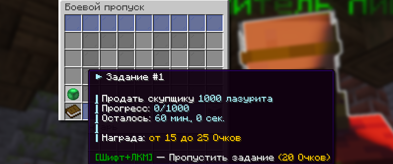
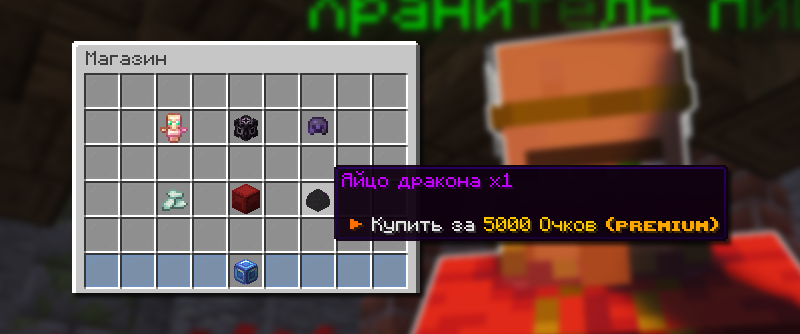

# 🎫 Боевой пропуск

**Боевой пропуск —** это система заданий, которая позволяет игрокам получать ценные награды за выполнение различных активностей.

## Как открыть Боевой пропуск

Меню Боевого пропуска доступно по команде `/battlepass` или `/bp`.

## Задания Боевого пропуска

<figure><figcaption></figcaption></figure>

Чтобы начать выполнять задание, нажмите на кнопку с заданием в меню боевого пропуска `/bp`. Цель задания появляется только тогда, когда вы активируете задание. Соответственно, чем тяжелее задание, тем выше награда.


Задания боевого пропуска можно выполнять сразу после выполнения предыдущего.



Чем больше заданий выполнено, тем выше коэффициент и тем больше очков можно заработать за последующие задания.


## Очки Боевого пропуска

Очки можно получить за выполнение заданий боевого пропуска. Дополнительные очки можно получить за высокий коэффициент и Премиум множитель (+25%). В день можно получить ограниченное количество очков за задания.


Ежедневно в 00:00 по московскому времени у вас сгорает 5% очков.


## Магазин Боевого пропуска

<figure><figcaption></figcaption></figure>

Имея достаточно очков Боевого пропуска, вы можете их вложить в покупку редких предметов. Магазин Боевого пропуска доступен по команде `/bpshop`.

Товары магазина Боевого пропуска

| Товар                                                                                                                                                                                                                                                                                                                                                                                                                                               | Цена                                           |
| --------------------------------------------------------------------------------------------------------------------------------------------------------------------------------------------------------------------------------------------------------------------------------------------------------------------------------------------------------------------------------------------------------------------------------------------------- | ---------------------------------------------- |
| 
<strong>Случайный талисман:</strong>
<ol><li>Талисман Satir</li><li>Талисман Infinity</li><li>Талисман Stinger</li><li>Талисман Eternity</li><li>Талисман Eternity</li><li>Легендарный талисман на урон 3 уровня</li><li>Легендарный талисман на броню 3 уровня</li><li>Легендарный талисман на броню 2 и урон 2 уровня</li></ol>                                                                                                             | 450 очков Боевого пропуска                     |
| 
<strong>Случайная сфера:</strong>
<ol><li>Сфера Cerber</li><li>Сфера Flash</li><li>Сфера Eternity</li><li>Сфера Stinger</li><li>Легендарная сфера на урон 3 уровня</li><li>Легендарная сфера на броню 3 уровня</li><li>Легендарная сфера на броню 2 и урон 2 уровня</li><li>Мифическая сфера на урон 3 и броню 2 уровня</li><li>Мифическая сфера на урон 2 и броню 3 уровня</li><li>Мифическая сфера на скорость 2 и броню 3 уровня</li></ol> | 450 очков Боевого пропуска                     |
| 
<strong>Случайная часть брони:</strong>
<ol><li>Шлем, нагрудник, штаны, ботинки Infinity</li><li>Шлем, нагрудник, штаны, ботинки Eternity</li><li>Шлем солнца</li><li>Меч Eternity</li></ol>                                                                                                                                                                                                                                                  | 400 очков Боевого пропуска                     |
| Боевой фрагмент                                                                                                                                                                                                                                                                                                                                                                                                                                     | 15 очков Боевого пропуска                      |
| Контейнер                                                                                                                                                                                                                                                                                                                                                                                                                                           | 5000 очков Боевого пропуска (только с Premium) |
| Яйцо дракона                                                                                                                                                                                                                                                                                                                                                                                                                                        | 5000 очков Боевого пропуска (только с Premium) |

