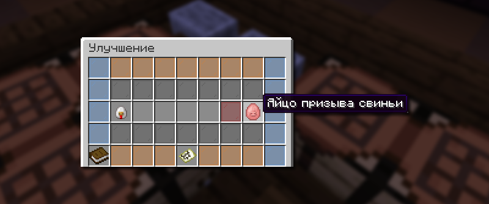

# ♻️ Улучшение предметов

Улучшения — особое меню, позволяющее превращать предметы в предметы буквально уровнем выше за боевые фрагменты.

## Как открыть меню улучшений

Меню улучшений предметов доступно по команде `/create`.

## Как работает улучшение

<figure><figcaption></figcaption></figure>

Имея достаточно много Боевых фрагментов, вы можете улучшить почти любой предмет, который у вас есть. В открытом меню улучшений `/create` положите желаемый предмет для улучшения в специальный слот. Далее, если у вас достаточно боевых фрагментов, подтвердите свою попытку на улучшение.


Для повышения шансов на успешное улучшение вы можете добавить до пяти таких же предметов.


## Что можно улучшить

Каждый предмет улучшается поэтапно. Например, Stinger становится в Eternity, а затем в Infinity.

Этапы улучшения Снаряжения

* Меч Griefer ⭢ Меч Mustang ⭢ Меч Ghast ⭢ Меч Wither ⭢ Меч Kraken ⭢ Меч Kraken ⭢ Меч Stinger ⭢ Меч Eternity.
* Лук Griefer ⭢ Лук Mustang ⭢ Лук Ghast ⭢ Лук Wither ⭢ Лук Kraken ⭢ Лук Kraken ⭢ Лук Stinger ⭢ Лук Eternity.
* Арбалет Dragon ⭢ Арбалет Stinger ⭢ Арбалет Eternity.

Этапы улучшения Брони

* Броня Griefer ⭢ Броня Mustang ⭢ Броня Ghast ⭢ Броня Wither ⭢ Броня Kraken ⭢ Броня Kraken ⭢ Броня Stinger ⭢ Броня Eternity ⭢ Броня Infinity.


Любую часть брони: ботинки, поножи, нагрудник и шлем, можно улучшить.


Этапы улучшения Инструментов

* Инструмент Griefer ⭢ Инструмент Mustang ⭢ Инструмент Ghast ⭢ Инструмент Wither ⭢ Инструмент Kraken ⭢ Инструмент Kraken ⭢ Инструмент Stinger ⭢ Инструмент Eternity.


Любой инструмент: кирка, топор и лопата, можно улучшить.


Этапы улучшения Особых предметов

* Меч "Выгодный фарми" 2 ур. ⭢ 3 ур. ⭢ 4 ур. ⭢ 5 ур. ⭢ 6 ур. ⭢ 7 ур. ⭢ 8 ур. ⭢ 9 ур. ⭢ 10 ур. ⭢ 11 ур. ⭢ 12 ур. ⭢ 13 ур.
* Чародейская книга "Фермер" 2 ур. ⭢ 3 ур. ⭢ 4 ур. ⭢ 5 ур.
* C4 Взрывчатка ⭢ Разрывная волна.
* Шлем Infinity  ⭢ Шлем Солнца.
* Талисман Stinger ⭢ Талисман Eternity ⭢ Талисман Infinity.
* Мечта Шахтера (Прочность 10 ур.) ⭢ Нерушимая кирка.

Этапы улучшения Яиц призыва

* Курица ⭢ Свинья ⭢ Корова ⭢ Черепаха.
* Черепаха⭢ Пещерный паук ⭢ Зомби ⭢ Скелет ⭢ Пиглин ⭢ Визер-скелет ⭢ Эндермен ⭢ Слизень ⭢ Магмовый куб ⭢ Разбойник ⭢ Поборник ⭢ Заклинатель ⭢ Всполх ⭢ Брутальный пиглин ⭢ Гаст.
* Гаст ⭢ Гагадочное яйцо призыва.

