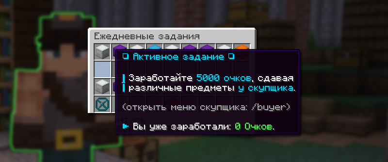

# 🕐 Ежедневные задания

Ежедневные задания — это небольшие задания, которые можно выполнять один раз в день и получать хорошую награду за выполнение.

## Как открыть ежедневные задания

Меню ежедневных заданий доступно по команде `/daily`

## Как выполнять задания

Текущие задания видны в меню (между иконками с наградами). Внимательно прочитайте задания и выполните их.

<figure><figcaption>
Одно из ежедневных заданий /daily
</figcaption></figure>

## Награда за выполнение заданий

Награда за задание зависит от его редкости. В открытом меню сразу видно, какой уровень редкости вас ждет. Забрать награду можно там, где была иконка лута.


Обладатели PREMIUM-статуса могут получить дополнительную награду за выполненный день.



Виды редкостей лута:

* Ценный лут
* Редкий лут
* Уникальный лут
* Мифический лут

