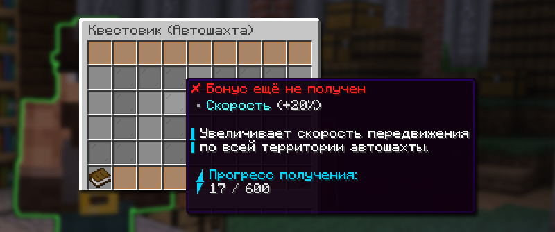

# 📜 Квестовик на автошахте

Квестовик на автошахте — это система прокачки, которая позволяет развиваться, просто копаясь на автошахте.

## Как открыть квестовика

Квестовик расположен рядом с автошахтами. А также можно открыть его меню при помощи команды `/mineskills`.

<figure><figcaption>
Меню квестовика по команде <code>/mineskills</code>
</figcaption></figure>

## Как получать опыт квестовика

Получение опыта у квестовика работает автоматически, вам достаточно просто проводить время на автошахте, а именно копать ресурсы. Бонусы будут автоматически активироваться при заходе на автошахту.

### Получение опыта квестовика

Количество опыта за добычу определенного ресурса

| Блок                              | Опыт |
| --------------------------------- | ---- |
| Камень                            | 0    |
| Незерак                           | 0    |
| Незерские кирпичи                 | 0    |
| Эндерняк                          | 0.1  |
| Угольная руда                     | 0.2  |
| Лазуритовая руда                  | 0.25 |
| Редстоуновая руда                 | 0.25 |
| Незерская золотая руда            | 0.3  |
| Кварцевая руда                    | 0.3  |
| Железная руда                     | 0.5  |
| Золотая руда                      | 0.6  |
| Обсидиан                          | 0.75 |
| Пурпур                            | 1    |
| Фиолетовая глазурованная керамика | 1    |
| Алмазная руда                     | 2.5  |
| Древний обломок                   | 25   |
| Взрывчатое вещество               | 100  |

### Эффекты за уровни квестовика

| Эффект                 | Описание                                                                                                                                             |
| ---------------------- | ---------------------------------------------------------------------------------------------------------------------------------------------------- |
| **Удача**              | Увеличивает количество выпадаемых при добыче ресурсов. Складывается с другими бонусами                                                               |
| **Опыт квестовика**    | С определенным шансом увеличивает получаемый опыт квестовика за добычу руд                                                                           |
| **Скорость**           | Увеличивает скорость передвижения игрока в регионе автошахты                                                                                         |
| **Ярость**             | Шанс при добыче блока получить Спешку II и удвоение ресурсов на 10 секунд                                                                            |
| **Изумрудизация**      | Шанс заменить выпавшие алмазы на изумруды в том же количестве                                                                                        |
| **Универсальный ключ** | Шанс получить универсальный ключ при добыче блоков. Ключ при получении попадает в инвентарь игрока, если в инвентаре места нет, выпадает под игроком |
| **Авто-плавка**        | Автоматически переплавляет ресурсы на автошахте без необходимости зачарования                                                                        |
| **Восстановление**     | Шанс восстановить прочность кирки при добыче блоков                                                                                                  |


Все эффекты действуют исключительно на территории автошахты.

