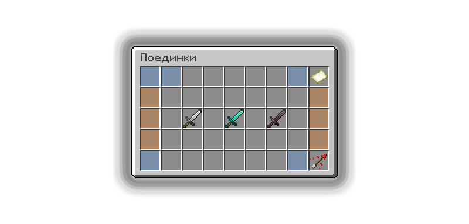

# Поединки

## Как открыть меню поединков

<figure><figcaption></figcaption></figure>

Открыть меню поединков можно при помощи команды `/pvp`.

## Как начать поединок

В открытом меню поединков `/pvp` выберите желаемую категорию поединка и начните поиск соперника в своей категории.

## Категории поединков

1. Схватка средь мира — сражение проходит на случайной локации в мире со случайным противником.
2. Бой насмерть — cражение происходит на специальной арене, только смерть определит победителя поединка.
3. Рейтинговый поединок — сражение происходит по правилам боя на смерить, а именно на отдельной арене, и только смерить определит победителя, но важным элементом данного поединка является рейтинг.
