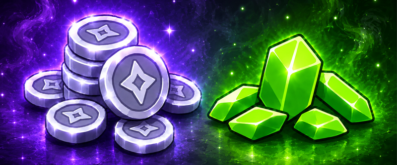

# Гемы и Жетоны

На режиме Прайм Анархия есть несколько разных валют: гемы, жетоны и монеты. Каждая валюта выполняет свою роль и очень важна для развития на режиме.

<figure><figcaption></figcaption></figure>

## Гемы

Гемы — это донат-валюта режима Прайм Анархии. С её помощью ты можешь закупаться в магазине `/shop`, прокачивать свои способности и открывать доступ к действительно мощным улучшениям.

### Как заработать гемы?

* **Участвуйте в ивентах «Боссы»** — один из основных способов получения гемов. Количество заработанных гемов учитывается в отдельном топе. На итоговое количество также влияют множители Боевого пропуска и привилегий.
* **Выполняйте задания на рассадниках** — в зависимости от типа рассадника и моба в качестве валютной награды могут встречаться гемы. В более редких рассадниках вероятность получения гемов выше.
* **Участвуйте в ивенте «Древний город»** — за призовые места можно получить гемы: 1 место — **100–125 гемов,** 2 место — **75–100 гемов,** 3 место — **50–75 гемов.**
* **Приобретайте гемы в донат-магазине** — гемы являются донатной валютой сервера и используются для покупки различных товаров и возможностей.

### Что можно купить за гемы?

* **Донат-магазин** `/shop` — покупка различных предметов и товаров.
* **Необычные предметы** `/shop` — сомнительные книги, зелья, Заряд Ветра, булава, Рог Легендарного Барана и другие редкие предметы.
* **Особые ключи** `/shop` — Особый Ключ Испытаний и Особый Зловещий Ключ Испытаний.
* **Приваты** `/shop` — Особый приват и Огромный приват.
* **Дальняя телепортация** `/rtp` — можно оплатить использование без необходимой привилегии или пропустить кулдаун за **29 гемов**.
* **Рассадники** — смена задания или требуемого предмета в меню рассадника за гемы. Стоимость зависит от части: **99–159 гемов**

## Жетоны

Жетоны — это особая донат-валюта режима Прайм Анархия, с помощью которой можно оплачивать покупки на сайте, а также обменивать их на игровую валюту Монетки прямо на сервере на бирже `/exchange`.

### Как оплатить жетонами на сайте?



#### Выберите желаемый товар на сайте


Оплатить любую покупку жетонами можно только на Прайм Анархии, за исключением разбана, размута и самих жетонов.




#### Введите свой никнейм и почту



#### Выберите «Оплата жетонами»




#### Зайдите на режим и пропишите команду

После подтверждения оплаты Жетонами вам будет выдана специальная команда `/payment ваш_никнейм-xxxxxxxxx`, пропишите эту команду, и покупка с использованием Жетонов произойдет успешно.




На оплату жетонами зачастую не действуют скидки, соответственно, вы оплатите полную сумму за товар.


## Монетки

Монетки — это основная игровая валюта на HolyWorld, при помощи которой можно покупать вещи у игроков на аукционе, покупать или продавать вещи, а также соревноваться в топе по балансу.


Узнать баланс своих монеток можно по команде `/balance`

