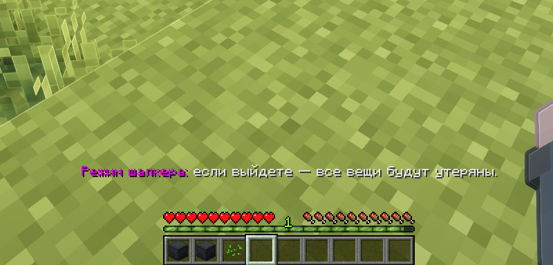

# Режим шалкера

На Прайм Анархии присутствует особая механика, которая заставляет хранить все шалкеры строго в сундуках.

## Как активируется режим шалкера

Режим шалкера активируется очень просто, вам достаточно хранить в инвентаре шалкеры. При наличии хотя бы двух шалкеров у вас в инвентаре активируется режим шалкера.

<figure><figcaption></figcaption></figure>


Индикатором того, что режим шалкера активирован, у вас будет над инвентарём отображаться уведомление, что включен режим шалкера.


## Особенности режима шалкера

Основное усложнение при активном режиме шалкера в том, что если вы выйдете с сервера с лежащими в инвентаре шалкерами, то они попросту выпадут из вас после вашего выхода.


Перед выходом с сервера обязательно где-то выложите шалкеры. Иначе абсолютно все шалкеры попросту выпадут.


