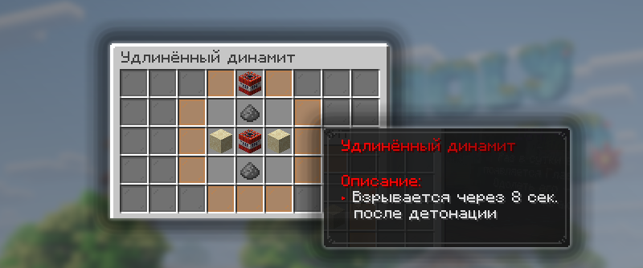

# Кастомные предметы

Кастомные предметы — это особые предметы с уникальными свойствами, они помогают, облегчают игру и дают полезные эффекты.

## Ключи к событиям

| Предмет                 | Описание                                                                                                                                                                                                                                    | Как получить                                                                                                                                                                       |
| ----------------------- | ------------------------------------------------------------------------------------------------------------------------------------------------------------------------------------------------------------------------------------------- | ---------------------------------------------------------------------------------------------------------------------------------------------------------------------------------- |
| Рог легендарного барана | При использовании запускает небольшое событие, которое спавнит особого моба, создающего локацию с шалкерами лута. В зависимости от мира, событие может отличаться. Для активации необходимо свободное место. Нельзя активировать в привате. | Купить в магазине ценностей `/shop` за 699 гемов, найти в сундуках ванильных данжей.                                                                                               |
| Зловещая бутылочка      | При использовании дает эффект Дурного знамения, что позволяет вызвать рейд на деревню или вызвать особую битву у Рассадника испытаний.                                                                                                      | Купить в магазине ценностей `/shop` за 99 гемов, найти в вазах в «Камерах испытаний», с шансом получить за убийство «Зловещего Вардена», выдается за достижения 12 этапа у Скупца. |

## Динамиты

| Предмет            | Описание                                                                                                                                                                          | Как получить                                                                                                                                                                |
| ------------------ | --------------------------------------------------------------------------------------------------------------------------------------------------------------------------------- | --------------------------------------------------------------------------------------------------------------------------------------------------------------------------- |
| Удлиненный динамит | Это модифицированная версия обычного динамита. Главное отличие — увеличенное время до детонации: он взрывается через 8 секунд после поджига, тогда как обычный — через 4 секунды. | 
Для создания требуется:

1 × обычный динамит 2 × порох 2 × песок

 |
| Динамитный бур     | —                                                                                                                                                                                 | —                                                                                                                                                                           |

## Необычные предметы

| Предмет                        | Описание                                                                                                                                                                                                                                                                                                                                                                                                                                              | Как получить                                                                                                                                                                    |
| ------------------------------ | ----------------------------------------------------------------------------------------------------------------------------------------------------------------------------------------------------------------------------------------------------------------------------------------------------------------------------------------------------------------------------------------------------------------------------------------------------- | ------------------------------------------------------------------------------------------------------------------------------------------------------------------------------- |
| Прочнейшая Булава              | 
Это необычайный предмет, являющийся усиленной версией обычной булавы.  - Обычная булава имеет 12 единиц прочности, а Прочнейшая — 48 единиц. При этом все остальные ограничения обычной булавы для неё сохраняются. - На булаву разрешены все зачарования, кроме Починки. - Прочнейшую Булаву нельзя ремонтировать:

через /fix; в наковальне с использованием Стержня вихря.
                                                 | Купить в магазине ценностей `/shop` за 499 гемов, найти в особой вазе в Камерах испытаний, выдается за достижение 27 этапа у Скупца.                                            |
| Ультимативное зелье            | При использовании зелья вы получите эффекты: сила 2 уровня на 2 минуты, скорость 2 уровня на 2 минуты, регенерация на 2 минуты и огестойкость на 10 минут.                                                                                                                                                                                                                                                                                            | Купить в магазине ценностей `/shop` за 69 гемов, найти в особой вазе в Камерах испытаний, выдается за первое место на ивентах, выдается за достижение 3 этапа у Скупца          |
| Особый заряд ветра             | Это усиленная версия обычного Заряда Ветра, которая не требует перезарядки после использования.                                                                                                                                                                                                                                                                                                                                                       | Купить 16 шт. в магазине ценностей `/shop` за 49 гемов, найти в особой вазе в Камерах испытаний, выдается за достижение 6 этапа у Скупца, можно получить на ивентах с боссами   |
| Незеритовое улучшение          | Это предмет, который используется для создания незеритовых предметов на столе кузнеца.                                                                                                                                                                                                                                                                                                                                                                | Купить в магазине ценностей `/shop` за 69 гемов, выдается за достижение 14 этапа у Скупца, можно получить в качестве награды после ивента «Древний город».                      |
| Укрепленный глубинный сланец   | 
Это особый блок, который по задумке работает почти как бедрок, но его можно сломать киркой. При этом его нельзя разрушить динамитом или даже визером, а сам блок является недобываемым.
<ul><li>Его нельзя устанавливать: на Y -60 и ниже в обычном мире; на Y 123–127 в обычном мире; на Y 4 и ниже в аду.</li><li>Можно устанавливать только внутри регионов: в маленьком только 2, в среднем 3, в большом 4, огромном 5, особом 6.</li></ul> | Купить в магазине ценностей /shop за 499 гемов, найти в особых вазах в Камерах испытаний, получить за первое место на ивенте, выдается за достижение 4 этапа у Скупца.          |
| Особый ключ Испытаний          | Необычный Ключ, с помощью которого на /warp key можно обзавестись целыми горами редких и необычных вещичек                                                                                                                                                                                                                                                                                                                                            | Купить в магазине ценностей `/shop` за 99 гемов, обменять ванильный «Ключ Испытаний» и 2 элемента у Ключника `/warp key`                                                        |
| Особый Зловещий ключ испытаний | Необычайнейший ключ, применив который на /warp key можно заполучить ценнейшие и могущественнейшие предметы!                                                                                                                                                                                                                                                                                                                                           | Купить в магазине ценностей `/shop` за 249 гемов, обменять ванильный «Зловещий ключ испытаний» и 5 элементов у Ключника `/warp key`                                             |
