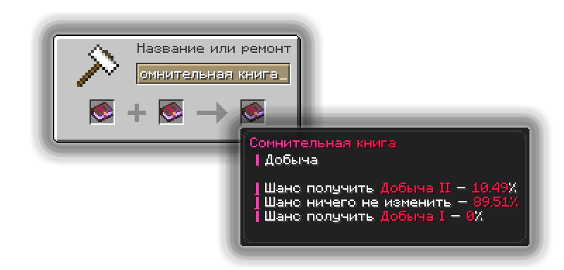

# Сомнительные зачарования

Сомнительные зачарования — это причудливые книги зачарования, которые имеют возможность зачаровать ваш инструмент вплоть до 10 уровня зачарования.

## Применение сомнительных зачарований

### Перенос  зачарования с сомнительной книги

<figure><figcaption></figcaption></figure>

Наложить зачарование при помощи сомнительной книги можно на наковальне, объединив незачарованный инструмент с сомнительной книгой.


После переноса Сомнительного зачарования на предмет повысить его уровень путём объединения предметов уже не получится. Поэтому рекомендуется сначала прокачать саму книгу до желаемого уровня, а затем перенести её на предмет..


### Повышение уровня сомнительной книги

<figure><figcaption></figcaption></figure>

Чтобы попытаться повысить уровень, объедините на наковальне две одинаковые Сомнительные книги одного уровня. Например, две книги «Сомнительная добыча III».

При объединении возможны три результата: уровень книги повысится на один, останется прежним или понизится. На I уровне понижение невозможно, поскольку нулевого уровня зачарования не существует.



Повысить шанс успешного улучшения можно при помощи Элементов. Каждый вложенный Элемент увеличивает шанс повышения уровня, однако каждый следующий Элемент даёт меньшую прибавку, а на высоких уровнях книги действует ограничение максимального шанса.



## Типы сомнительных книг

Сомнительные книги прикрепляются к какому-то зачарованию ванильному, но не все зачарования могут быть сомнительными. На данный момент сомнительным зачарованием может быть только:

1. Добыча
2. Эффективность
3. Удача
4. Разящий клинок


Разные типы Сомнительных зачарований соединять нельзя. Например, Добычу нельзя объединить с Эффективностью. Нельзя также объединять Сомнительную книгу с какой-либо обычной зачарованной книгой.



Каждая Сомнительная книга имеет собственный шанс успешного повышения. Если объединяются две книги с разными шансами, итоговый шанс рассчитывается как среднее значение между ними. Например, при объединении книг с шансами 90% и 10% итоговый шанс составит 50%.


## Как добыть сомнительную книгу

Найти сомнительную книгу не так уж и просто, вот способы получения:

* Купить в магазине ценностей /shop за 69 гемов желаемую сомнительную книгу.
* При достижении новых этапов торговли у Скупца вы можете одноразово получить в качестве награды Сомнительные книги:
  * 5 этап — сомнительная добыча
  * 10 этап — сомнительная эффективность
  * 15 этап — сомнительная удача
  * 20 этап — сомнительный разящий клинок

