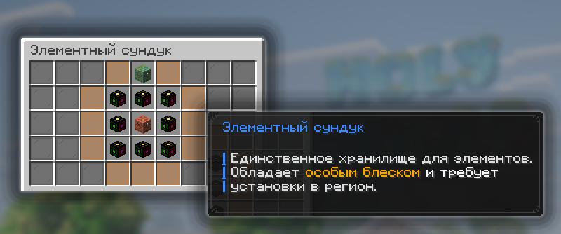

# Элементы

Элементы — это не просто валюта, а ключевой ресурс Прайм Анархии на котором держится значительная часть игровых механик.


Этот особый ресурс нельзя хранить обычным способом, вам понадобится Элементная бочка.


## Как получить Элементы

Элементы можно найти, заработать или же скрафтить, способов получения множество.


Когда у игрока есть хотя бы один Элемент, включается Элементный режим:

1. Игрок подсвечивается
2. Появляется боссбар и предупреждение.
3. Если выйти с сервера с Элементами, они выпадут.


### Основные способы получения

* Скрафтить из Крупиц — собрать 9 Крупиц и соединить их в верстаке → получится 1 Элемент.
* Ивент «Древний город» — занять 1-е место по нанесённому Зловещему Вардену урону. Победитель получает 2–4 дополнительных награды; среди них с шансом 90% могут выпасть 24–56 Элементов.
* Камеры испытаний — Элементы и Крупицы можно получать из определённых ваз. Например, «Награда» даёт 4–8 Элементов, особенная «Награда» — 16–32, а за убийство мобов из ваз «Череп», «Угроза» и т. п. можно получить 2–4 Элемента или 32–48 Крупиц.
* Гриферство — находить и грабить Элементные бочки других игроков.
* Другие игроки — покупать Элементы на аукционе либо подбирать выпавшие Элементы.

### Дополнительные способы получения

* Скупец — за достижение 2-го этапа торговли выдаётся 64 Крупицы, из которых затем можно скрафтить Элементы.

## Для чего нужны Элементы

* **Работа Рассадников** — Элементы служат топливом для Рассадников Испытаний и Зловещих Рассадников. 1 Элемент позволяет призвать 1000 мобов.
* **Создание Особых ключей** — за Элементы обычные ключи можно превратить в Особые для открытия Особых Хранилищ. Обычный ключ — 2 Элемента, Зловещий — 5 Элементов.
* **Улучшение Сомнительных чар** — Элементы позволяют повышать шанс успешного улучшения зачарования в наковальне.
* **Улучшения торговли с Скупцом** `/buyer`
  * Обновление товаров у Скупца `/buyer` — можно досрочно обновить ассортимент: обычные товары — от 1 Элемента, особые — от 4 Элементов. При повторных обновлениях цена увеличивается.
  * Случайный множитель — за 24 Элемента можно получить случайный множитель для более выгодной торговли со Скупцом `/buyer`.
  * Множитель дня — стоит 32 Элемента и позволяет выгоднее продавать определённую категорию товаров в течение дня Скупцу `/buyer`.
  * МегаМножитель — стоит 48 Элементов и случайно даёт либо множитель I уровня на большой объём товаров, либо III уровня на меньший.\
    Множитель недели — стоит 128 Элементов, работает аналогично дневному, но позволяет выгоднее продать значительно больше товаров у Скупца `/buyer`.

## Элементная бочка

Элементная бочка — это особое хранилище где можно хранить Элементы. Использовать обычные сундуки или другие хранилища для Элементов нельзя.

| Крафт           | 

1 медный сундук + 8 Элементов
 |
| --------------- | ----------------------------------------------------------------------------------------------------------------------- |
| Внешний признак | У бочки есть характерный блеск, поэтому её можно отличить от обычной бочки.                                             |
| Ограничение     | Элементы нельзя хранить в Аду и Энде.                                                                                   |


Бочка специально сделана заметной и ограниченной по размещению, чтобы хранение Элементов было рискованным и другие игроки могли охотиться за ними.


