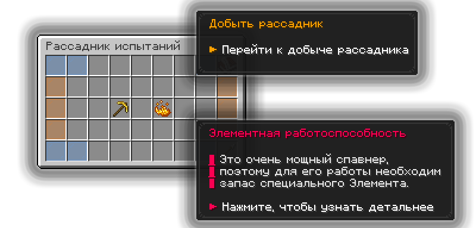
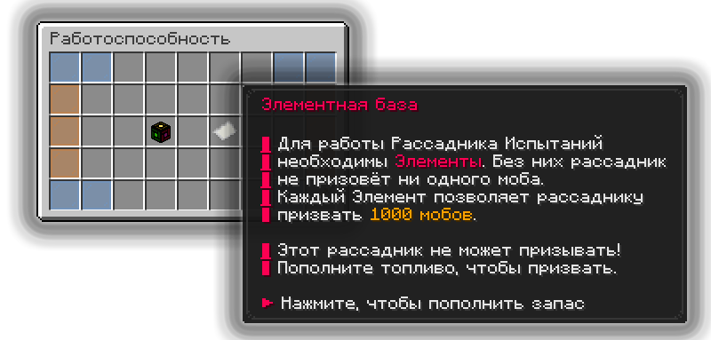
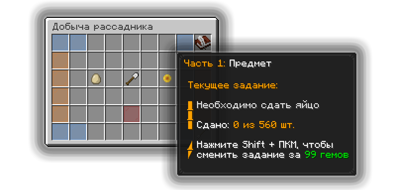
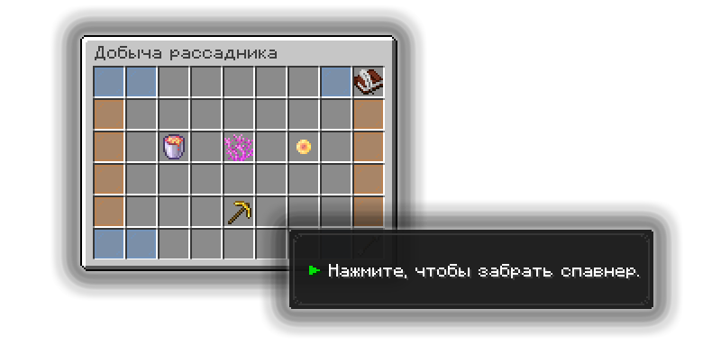

# Рассадники

Рассадники (или "спавнеры") — это ванильный блок спавнера из майнкрафта, который спавнит мобов вокруг себя, но изменен под реалии Прайм Анархии.

## Типы рассадников

| Тип                          | Радиус призыва | Количество мобов |
| ---------------------------- | -------------- | ---------------- |
| Обыкновенный рассадник       | 4 блока        | 1–4              |
| Рассадник испытаний          | 5 блоков       | 1–7              |
| Зловещий рассадник испытаний | 6 блоков       | 1–10             |

## Для чего нужны рассадники

Рассадники призывают мобов вокруг себя, которых можно убить и получить с них ресурсы, радиус появления и количество мобов зависит от типа рассадника.

### Как открыть меню рассадника

<figure><figcaption></figcaption></figure>

Открыть меню рассадника (спавнера) можно нажатием правой кнопки мыши по стоящему рассаднику.

### Элементная работоспособность

<figure><figcaption></figcaption></figure>

Рассадник испытаний и Зловещий рассадник испытаний для своей работы требуют подпитку в виде Элементов. 1 Элемент равен 1000 спавнов мобов, то есть за 1 Элемент рассадник заспавнит 1000 мобов.


Без подпитки в виде Элементов рассадник работать не будет.


## Как добыть рассадник

### Выполнить задания на его получение

<figure><figcaption></figcaption></figure>

Абсолютно любой рассадник, стоящий где-то в мире можно преобразовать в  предмет, то есть переместить его в инвентарь.



#### Откройте меню рассадника и выберите категорию «Добыть рассадник»




#### Выполните задания, которые необходимы для добычи рассадникам

У каждого типа рассадникам свое количество задания для выполнения:

1. Обычный рассадник — 3 задания
2. Рассадник испытаний — 5 заданий
3. Зловещий рассадник испытаний — 8 заданий


Мобы делятся на обычных, редких, эпических и легендарных. Задания и предметы могут быть лёгкими, средними или тяжёлыми.




#### По выполнению всех заданий вам будет доступно забрать спавнер

<figure><figcaption></figcaption></figure>




### Найти рассадник в мире

В ванильных данжах «Камерах испытаний» спавнятся рассадники испытаний, которые вы можете спокойно добыть при помощи механики добычи рассадника.


Чтобы добыть данный рассадник испытаний, вам потребуется гораздо больше усилий, чем для обычного рассадника.


