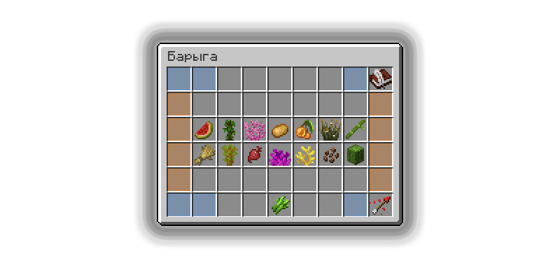

# Барыга

Барыга — один из дополнительных способов заработка монеток на Прайм Анархии, вы продаете ресурсы Барыге, которые он предлагает, и зарабатываете монетки.

## Где найти Барыгу

Барыга находится радом со Скупцом по варпу /warp buyer

## Продажа ресурсов Барыге

<figure><figcaption></figcaption></figure>

Барыга предлагает 4 категории лута: растительность, лут из мобов, блоки и драгоценности, и в каждой из этих категорий на выбор можно продавать 14 товаров.


Эти товары раз в неделю полностью обновляются, но ключевое здесь вовсе не это: каждый из этих товаров можно продавать в неограниченном количестве!

